Flight Sentry - Portfolio Demo
# Flight Sentry

## Predicting Flight Departure Delays: A Time-Series Classification Approach

## 1. Introduction
Flight delays often emerge from multiple interacting factors and can escalate quickly once they begin. This project focuses on identifying early delay risk using information available before departure to support better operational decisions.

## 2. Team Members


## 3. Project Structure:

### 3.1 Project Abstract
Flight delays rarely occur in isolation, yet they place real strain on airline operations and passenger experience. This project develops a system to estimate whether a domestic U.S. flight is at risk of departing at least 15 minutes late using only information available two hours before scheduled departure. The goal is earlier awareness, giving operations teams time to adjust crew schedules, gate plans, and communication before disruptions compound.
The model integrates U.S. Department of Transportation on-time performance data with National Oceanic and Atmospheric Administration weather observations, covering 31.1 million domestic flights from 2015–2019. A custom data pipeline enforces a strict two-hour cutoff to prevent data leakage and maintains near-zero missing values at scale. Feature engineering produces 112 leakage-free features capturing temporal patterns, recent delay behavior, weather conditions, airport congestion, carrier performance history, and network centrality, all derived exclusively from pre-departure information.
Logistic Regression serves as an interpretable baseline optimized for F₂-score to prioritize recall and surface high-risk flights early. Comparisons across Logistic Regression, Random Forest, and multilayer perceptron models show that neural networks achieve the strongest recall for early delay detection, while a two-tier regression model estimates delay duration with an RMSE of 42.83 minutes. Together, these results show that early delay risk estimation is most effective when historical performance, network structure, and short-horizon temporal signals are combined within a carefully leakage-controlled pipeline built for operational use.

---

### 3.2 Project Description
This report documents the development of our machine learning pipeline for predicting flight departure delays across three project phases, with Phase 3 delivering a production-ready, multi-year system evaluated on 31.1 million flights (2015-2019) with 112 optimized features and multiple modeling approaches including neural networks.
**Report Structure:**

-
**Section 3.3 - The Data**: Details our production dataset (31.1M flights, 112 features from 2015-2019), the six-stage checkpoint pipeline from raw ingestion to modeling-ready format (3.3.3), comprehensive data quality analysis achieving <1% missing data (3.3.4), and target variable analysis with class imbalance (18.15% delayed, 82:18 ratio) in Section 3.3.5. Section 3.3.7 documents the custom flights-weather-airport join architecture rebuilt for 5-year data with feature leakage prevention strategy. Sections 3.3.8-3.3.9 cover feature engineering methods across 8 families and the complete feature dictionary. Section 3.3.6 presents embedded EDA findings on temporal delay patterns, carrier performance, and geographic patterns across all five years. Sections 3.3.10-3.3.11 detail dataset storage requirements and production readiness validation.

-
**Section 4 - Exploratory Data Analysis**: Provides comprehensive multi-year visualizations and analysis including data overview (4.1), time-based delay patterns with hourly and day-of-week breakdowns (4.2.1-4.2.2), airport-specific delay patterns showing volume vs performance relationships (4.3), airline performance comparisons across market share and delay rates (4.4), and weather impact assessments covering temperature, wind speed, precipitation effects (4.5.1-4.5.3), visibility impacts (4.6), and correlation heatmap analysis (4.7).

-
**Section 5 - Machine Learning Algorithms and Modeling Strategy**: Describes our modeling approach (5.1.1) with time-series cross-validation (5.1.3). Section 5.2 presents classification baselines including Logistic Regression (5.2.1.1-5.2.1.3), Random Forest (5.2.1.4), and comprehensive classification results comparison (5.2.1.5-5.2.1.6). Regression baseline analysis (5.2.2) includes feature summaries (5.2.2.2), performance results (5.2.2.3), holdout evaluation (5.2.2.4.2), feature importance by model (5.2.2.5), and regression summary (5.2.2.7). Section 5.3 details the alternative two-stage architecture with holdout results, error analysis by delay magnitude, worst-performing airports/carriers/routes, weekend vs holiday comparisons, and feature importance comparisons between classifier and regressor. Section 5.4 presents MLP neural network ensemble implementation including data splits (5.4.1), leakage control (5.4.2), feature engineering pipeline (5.4.3), class imbalance diagnosis (5.4.4), ensemble member construction with 50:50 undersampling (5.4.5), Optuna hyperparameter optimization (5.4.6), final model training (5.4.7), inference methods (5.4.8), results summary comparing single models vs ensemble (5.4.11), confusion matrix analysis (5.4.12), and saved artifacts (5.4.13). Section 5.5 summarizes all classification experiments, and Section 5.6 discusses time-series, graph, and MLP implementations.

-
**Section 6 - Evaluation Metrics**: Establishes F₂-score as primary classification metric (6.1) prioritizing recall over precision to catch at-risk flights—aligning with airline operational priorities where missing a delay causes more disruption than a false alarm, with PR-AUC as secondary metric (6.2) appropriate for imbalanced datasets. Includes per-segment confusion analysis by carrier and airport (6.3), regression metrics MAE and RMSE for Stage 2 duration prediction (6.4), and operational/domain-level evaluation views (6.5).

-
**Section 8 - Pipeline**: Illustrates end-to-end six-stage Spark ML pipeline with explicit checkpoints, from raw data ingestion (Stage 0) through leakage-aware cleaning and joins (Stage 1-2), time-series split and feature engineering using only T-2h information (Stage 3-4), feature selection and final refinement (Stage 5-5a), model training with undersampled data, and evaluation using time-ordered validation with 2019 blind holdout.

-
**Section 9 - Conclusion**: Summarizes key findings, model performance across three approaches, feature importance insights, and project outcomes demonstrating production readiness.

-
**Section 10 - Open Issues and Next Steps**: Discusses deployment considerations including real-time feature computation infrastructure, data drift monitoring for model degradation detection, carrier-specific threshold calibration, and validation on 2020-2021 data to assess COVID-19 impact and model robustness.

-
**Appendix**: Provides references and links to supporting Databricks notebooks for data cleaning, EDA, custom joins, feature engineering, and modeling pipelines, plus academic references on flight delay prediction methodologies.

**Key Technical Achievements:**
Throughout this project, we emphasize reproducibility through checkpoint-based workflows, scalability using Apache Spark's distributed computing (validated on 31.1M records with cluster benchmarking), and strict adherence to temporal validation protocols that prevent look-ahead bias. Our T-2h prediction window reflects realistic operational conditions where airlines must make crew scheduling, gate assignment, and passenger notification decisions before actual departure information becomes available. The six-stage pipeline successfully handles the 6× data scale increase through strategic caching, checkpointing, and unpersisting operations. Feature importance analysis across Random Forest models identified the top predictors: 24-hour weighted rolling average delay by origin airport (14.2%), RF probability meta-feature (11.8%), previous flight delay status (9.5%), origin degree centrality (8.7%), and prior-day delay rate (7.6%). The diversity across our top 15 features—spanning rolling aggregates, meta-features, aircraft lag variables, and network centrality—validates that delays are complex phenomena requiring multiple analytical perspectives drawn from temporal, operational, environmental, and systemic factors.

---

## Evolution from Phase 2 to Phase 3:

| Aspect | Phase 2 | Phase 3 |
| --- | --- | --- |
| Dataset Size | 5.7M flights (2015 only) | 31.1M flights (2015-2019, 6× increase) |
| Features | 108 (29 raw + 79 engineered) | 112 optimized across 8 families |
| Feature Families | 5 families | 8 families (added: Graph, RFM, Meta-Features) |
| Pipeline Stages | 5 checkpoints | 6 stages (S0 through S5a) |
| Missing Data | 0.0% | <1% (49% → <1% through pipeline) |
| Data Leakage | Eliminated (15 features removed) | Validated across 153 engineered, pruned to 112 |
| Join Logic | Custom T-2h aligned join (2015) | Rebuilt joins for all 5 years |
| Models Implemented | LR, RF (classification); Linear, DT, RF, GB, XGB (regression) | LR, RF, MLP (classification); Two-tier regression |
| Evaluation Strategy | Time-series CV on 2015 | Train 2015-2017, Val 2018, Blind Test 2019 |
| Primary Metric | F₀.₅-score (precision-friendly) | F₂-score (recall-friendly for operations) |
| Secondary Metric | PR-AUC | PR-AUC |
| Class Imbalance Handling | Identified (18.39% delayed) | Addressed via undersampling (82:18 ratio) |
| Neural Networks | Planned for Phase 3 | Implemented MLP with 2-layer architectures |
| Time-Series Features | Basic temporal features | 24 cyclic-encoded + 12 RFM features |
| Graph Features | Not included | 8 network centrality features (PageRank, degree) |
| Top Feature Importance | Previous flight status (40%) | 24h rolling avg by origin (14.2%) |
| Computational Scale | Single-year processing | Multi-year with memory optimization strategies |

---

## 3.3 The Data

#### 3.3.1 Data Sources
Our flight delay prediction system integrates five primary data sources, each serving a distinct purpose in building a comprehensive modeling dataset.
**Table 3.1: Data Sources Overview**
****[](https://transtats.bts.gov/DatabaseInfo.asp?DB_URL=&QO_VQ=EFD)****[](https://www.ncei.noaa.gov/products/land-based-station/integrated-surface-database)****[](https://www.ncei.noaa.gov/products/land-based-station/station-histories)****[](https://datahub.io/core/airport-codes)****
| Source | Description | Purpose | Reference |
| --- | --- | --- | --- |
| U.S. DOT On-Time Performance data with scheduled/actual times, cancellations, diversions, and delay indicators | Factual flight backbone with row-level timing and delay labels |
| Global Hourly observations from NOAA NCEI's Integrated Surface Database | As-of weather enrichment at T-2h before departure |
| Station identifiers, coordinates, elevation, and period-of-record details | Airport-to-station bridge for weather joins |
| IATA/ICAO identifiers with timezone and coordinates | Time conversion (local → UTC) for weather join alignment |
| Databricks-provided joined ATP and Weather dataset | Phase 1 baseline and pipeline prototyping | dbfs:/mnt/mids-w261/ |

For Phase 2, we built a custom leakage-safe join rather than using the pre-joined OTPW dataset. This approach enabled precise T-2h weather alignment, better airport metadata integration, and complete control over the join logic to prevent data leakage. In Phase 3, we scaled this custom join infrastructure to handle five years of data (2015-2019), rebuilding all weather joins, aircraft rotations, and airport metadata joins for 31.1 million flights while maintaining strict temporal ordering and leakage prevention.

---

#### 3.3.2 Dataset Scope and Dimensions

### Phase 3 Analysis Dataset
For Phase 3, we conduct comprehensive analysis on the**complete 2015-2019 dataset**, representing five full years of domestic U.S. flight operations. This provides complete temporal coverage to capture seasonal patterns, year-over-year trends, operational dynamics, holiday effects, and weather variability across multiple annual cycles—essential for building a production-ready prediction system.
**Table 3.2: Final Dataset Dimensions (Checkpoint 5a)**
****************************************
| Dimension | Value | Details |
| --- | --- | --- |
| 31,128,891 | 98.3% retention from raw 31.7M records |
| 112 | Optimized from 153 engineered features |
| Jan 1, 2015 – Dec 31, 2019 | 1,826 days, 60 months, 5 complete years |
| 19 | Unique carriers (includes regional carriers) |
| 369 origin / 368 destination | Unique airport codes |
| 53 | Origin and destination states |
| <1% | Near-complete imputation achieved (1.8% in select features) |
| DEP_DEL15 | Binary: 1=delayed ≥15min, 0=on-time |
| 81.85% on-time / 18.15% delayed | 4.51:1 imbalance ratio |
| ~18.2 GB | Parquet format (Checkpoint 5a) |

**Yearly Distribution:**

- 2015: 5,704,114 flights (18.3%)

- 2016: 5,518,291 flights (17.7%)

- 2017: 5,604,527 flights (18.0%)

- 2018: 7,137,918 flights (22.9%)

- 2019: 7,328,857 flights (23.5%)
**Train-Validation-Test Split:**

- **Training Set (2015-2017):**16,826,932 flights (54.0%)

- **Validation Set (2018):**7,137,918 flights (22.9%)

- **Blind Holdout (2019):**7,328,857 flights (23.5%)
This temporal split ensures no data leakage while providing sufficient training data and maintaining realistic operational evaluation on unseen future years.

##### Scalability Achievements
We successfully scaled our pipeline 6× from Phase 2's single-year dataset to five years of data by implementing aggressive memory management strategies including:

- **Checkpoint-based workflows:**Intermediate results saved at each pipeline stage to enable recovery and avoid recomputation

- **Strategic caching:**Frequently-accessed DataFrames cached in memory with explicit unpersisting when no longer needed

- **Parquet optimization:**Converted all intermediate and final datasets to columnar Parquet format for improved compression and query performance

- **Partition tuning:**Adjusted Spark partitions based on data volume at each stage to balance parallelism and overhead
**Dataset Scale Progression:**

- 3-month sample: ~1.4M flights (Phase 1 prototyping)

- 1-year dataset: ~5.7M flights (Phase 2 production baseline)

- **5-year dataset: ~31.1M flights (Phase 3 production-ready system)**

- **2020-2024 dataset: ~31.3M flights (Phase 3 extra points)**
We read data directly into Apache Spark using`spark.read.parquet()`for all checkpointed stages, leveraging Spark's lazy evaluation and distributed processing. Cluster configurations were scaled from 4-node to 8-node setups during intensive feature engineering stages, with wall times tracked for all major pipeline operations to ensure computational feasibility.

---

#### 3.3.3 Data Processing Pipeline
Our pipeline implements a systematic, six-stage transformation workflow designed to convert raw flight and weather data into a production-ready modeling dataset. Each stage is checkpointed to enable reproducibility, debugging, and collaborative development.


**Table 3.3: Pipeline Stage Summary (2015-2019)**
****``****``****``****``****``****``****``
| Stage | File Name | Description | Key Operations | Rows | Features |
| --- | --- | --- | --- | --- | --- |
| Raw BTS On-Time Performance data for 2015-2019. Contains all scheduled flights with basic delay indicators, scheduled times, and carrier information. 49.39% missing data across 142 columns. | Raw data ingestion, no transformations | 31,673,119 | 214 |
| Custom T-2 hour weather join merging OTPW with NOAA hourly observations and airport geographic metadata. Includes weather conditions, station coordinates, and timezone data. | Join flights + weather + geographic enrichment, temporal alignment | 31,746,841 | 75 |
| Cleaned dataset after data quality improvements: removed 15 leakage features, filtered cancelled/diverted flights (617,950 rows), applied 3-tier weather imputation reducing missing from 10.16% to 0%. | Remove leakage, filter invalid flights, impute weather, type conversion | 31,128,891 | 59 |
| Enhanced dataset with 36 basic engineered features: temporal features (hour, day, season, weekend), distance transformations, weather severity scoring, rolling 24h delay statistics by origin airport. | Temporal (10), distance (6), weather (3), rolling metrics (10), geographic (3), other (4) | 31,128,891 | 95 |
| Comprehensive feature-engineered dataset with 91 additional features: aircraft lag variables, RFM patterns, network centrality (PageRank, degree), 24 interaction terms, 14 cyclic encodings, Breiman meta-features. | Weather (+19), rolling (+12), RFM (13), interactions (24), cyclic (14), network (8), aircraft lag (6), Breiman (2) | 31,128,891 | 186 |
| All engineered features before final selection. Removed 33 redundant/low-importance features identified through correlation analysis and cardinality checks. Represents complete feature space exploration. | Correlation-based reduction, cardinality filtering, duplicate removal | 31,128,891 | 153 |
| Production-ready dataset after feature selection and optimization: indexed 12 categorical features (string→numeric), removed 41 additional features, verified <1% missing data. Ready for ML pipelines. | String indexing (+12), feature selection (-41), final validation | 31,128,891 | 112 |

##### Key Transformations by Checkpoint
**Stage 0 → CP1: Weather and Geographic Join (+73,722 rows, -139 columns)**

- Custom T-2 hour aligned join with NOAA weather stations (634 locations)

- Added 15 weather features (temperature, wind, precipitation, visibility, pressure, humidity)

- Added 20 geographic features (airport coordinates, station distances, timezones, elevation)

- Consolidated/removed 139 redundant OTPW columns

- Row increase due to join expansion (flights matched to multiple weather observations)

- Missing data reduced: 49.39% → 10.16%
**CP1 → CP2: Data Cleaning and Leakage Removal (-617,950 rows, -16 features)**

- Removed 15 data leakage features containing future information:
 - Actual times: DEP_TIME, ARR_TIME, WHEELS_OFF, WHEELS_ON, TAXI_OUT, TAXI_IN, ACTUAL_ELAPSED_TIME, AIR_TIME

 - Delay breakdowns: CARRIER_DELAY, WEATHER_DELAY, NAS_DELAY, SECURITY_DELAY, LATE_AIRCRAFT_DELAY

 - Target leakage: ARR_DEL15, ARR_DELAY

- Filtered cancelled flights (28,812 records) and diverted flights (589,138 records) as operationally distinct scenarios

- Applied 3-tier weather imputation strategy:
 - Tier 1: Actual observed value

 - Tier 2: 24h rolling average by airport

 - Tier 3: Global median

- Result: 10.16% missing → 0.00% missing

- All 477,296 target variable nulls removed
**CP2 → CP3: Basic Feature Engineering (+36 features)**

- **Temporal Features (10):**departure_hour, departure_month, departure_dayofweek, is_weekend, season, is_peak_hour, time-of-day categories, day/hour interaction

- **Distance Features (6):**log_distance, distance bins (very_long, etc.), DISTANCE_high_corr, DISTANCE_GROUP_high_corr

- **Weather Features (3):**weather_condition_category, temp_anomaly, sky_condition_parsed

- **Rolling Metrics (10):**rolling_origin_num_delays_24h, rolling_origin_delay_ratio_24h, dep_delay15_24h_rolling_avg variants by origin/carrier/dayofweek

- **Geographic (3):**airport_traffic_density, carrier_flight_count

- **Other (4):**is_superbowl_week, is_major_event, is_airport_maintenance, is_natural_disaster
**CP3 → CP4: Advanced Feature Engineering (+91 features)**

- **Weather Expansion (+19):**Hourly wind direction, gust speed, relative humidity, station pressure, altimeter setting, additional weather composites

- **Rolling Features (+12):**30-day route delay rates, carrier delays at origin, same-day statistics, time-based congestion ratios

- **RFM Features (13):**days_since_last_delay_route, days_since_carrier_last_delay_at_origin, route_delays_30d, route_delay_rate_30d, carrier_delays_at_origin_30d, 1-year delay rates

- **Interaction Terms (24):**peak_hour × traffic, weekend × route_volume, weather × airport_delays, temp × holiday, carrier × hour, origin × weather/visibility/precipitation/wind, origin × dest, carrier × origin/dest

- **Cyclic Encoding (14):**dep_time_sin/cos, arr_time_sin/cos, day_of_week_sin/cos, month_sin/cos (7 pairs = 14 features)

- **Network Features (8):**origin_degree_centrality, dest_betweenness, delay_propagation_score, network_delay_cascade, origin_1yr_delay_rate, dest_1yr_delay_rate, dest_delay_rate_today

- **Aircraft Lag (6):**prev_flight_dep_del15, prev_flight_crs_elapsed_time, hours_since_prev_flight, turnaround_category, num_airport_wide_delays, oncoming_flights

- **Breiman Meta-Features (2):**rf_prob_delay, rf_prob_delay_binned
**CP4 → CP5: Feature Optimization and Reduction (-33 features)**

- Removed high-correlation features (Pearson >0.85): YEAR, QUARTER, DISTANCE_high_corr, DISTANCE_GROUP_high_corr, and 29 others

- Removed high-cardinality features: TAIL_NUM, FL_DATE, prediction_utc, origin_obs_utc, asof_minutes

- Removed duplicate features identified through analysis

- Removed low-importance features with zero contribution in preliminary models

- Result: 186 features → 153 features (18% reduction)
**CP5 → CP5a: String Indexing and Final Selection (-41 features, +12 indexed)**

- **String Indexing (12 categorical features converted):**
 - DEST_indexed, ORIGIN_indexed, OP_UNIQUE_CARRIER_indexed

 - ORIGIN_STATE_ABR_indexed, DEST_STATE_ABR_indexed

 - origin_type_indexed, season_indexed, weather_condition_category_indexed

 - airline_reputation_category_indexed, turnaround_category_indexed

 - day_hour_interaction_indexed, sky_condition_parsed_indexed

- **Removed 41 features:**Original string columns retained for validation but removed from modeling set, plus additional low-importance features identified through feature importance analysis

- **Final validation:**Verified <1% missing data (0.01%), confirmed zero leakage, validated all data types

- **Result:**153 features → 112 production-ready features (27% reduction from CP4)

##### Checkpoint Strategy
All checkpoints are stored at`dbfs:/student-groups/Group_4_4/`with the following benefits:

- **Resumability**: Team members can start from any intermediate stage without re-running 6+ hour join operations on 31M records

- **Debugging**: Errors can be traced to specific pipeline stages with detailed logging at each checkpoint

- **Collaboration**: Multiple team members can work on different feature families simultaneously

- **Version Control**: Each checkpoint represents a stable, validated state of data transformation

- **Computational Efficiency**: Expensive operations (weather joins, rolling aggregations, network metrics) are computed once and cached

- **Memory Management**: Strategic caching, checkpointing, and unpersisting at each stage prevents out-of-memory errors on 31M+ row dataset

- **Quality Assurance**: Each checkpoint includes validation checks for missing data, duplicates, leakage, and data type consistency

---

#### 3.3.4 Data Quality and Missing Data Analysis

##### Quality Metrics Across Pipeline
Our systematic data processing pipeline achieved comprehensive quality improvement, reducing missing data from 49.39% to <1% while preserving 98.3% of flight records from the raw OTPW source and ensuring zero data leakage.
**Table 3.4: Data Quality Metrics Across Pipeline Stages (2015-2019)**
********************************************************************************
| Metric | Stage 0: Raw | CP1: Initial | CP2: Cleaned | CP3: Basic | CP4: Advanced | CP5: Comprehensive | CP5a: Final | Improvement |
| --- | --- | --- | --- | --- | --- | --- | --- | --- |
| OTPW_60M_Backup/ | checkpoint_1_initial_joined_5Y_2015-2019.parquet | checkpoint_2_cleaned_imputed_2015-2019.parquet | checkpoint_3_basic_features_2015-2019.parquet | checkpoint_4_advanced_features_2015-2019.parquet | checkpoint_5_comprehensive_2015-2019.parquet | checkpoint_5a_final_clean_2015-2019.parquet | — |
| 31,673,119 | 31,746,841 | 31,128,891 | 31,128,891 | 31,128,891 | 31,128,891 | 98.3% retained from Stage 0 |
| — | +73,722 | -617,950 | 0 | 0 | 0 | 0 | Cancelled/diverted/null-target only |
| 100% | 100.2% | 98.1% | 100% | 100% | 100% | 98.3% from Stage 0 |
| 214 | 75 | 59 | 95 | 186 | 153 | -102 net from Stage 0 |
| 49.39% | 10.16% | 0.00% | 0.00% | 0.02% | 0.01% | 99.98% reduction |
| 142 | 51 | 0 | 0 | 6 | 4 | 97.2% reduction |
| 475,789 | 477,296 | 0 | 0 | 0 | 0 | Complete elimination |
| N/A | 15 | 0 | 0 | 0 | 0 | All removed in CP2 |
| 83 | 21 | 14 | 14 | 14 | 12 | All indexed in CP5a |
| N/A | N/A | 0 | 0 | 0 | 1 | Identified and removed |

##### Row Count Evolution
**Stage 0 → CP1: Join Expansion (+73,722 rows, +0.2%)**

- Raw OTPW contained 31,673,119 flight records

- Weather join added 73,722 rows due to multiple weather station matches per airport

- Some flights matched to backup weather stations when primary station data was unavailable

- This temporary expansion is expected behavior for left join with geographic proximity matching
**CP1 → CP2: Data Cleaning (-617,950 rows, -1.9%)**

- **Total rows removed:**617,950 (1.95% of CP1)

- **Breakdown:**
 - Cancelled flights: ~141,000 records (estimated 0.44% of CP1)

 - Diverted flights: ~98,000 records (estimated 0.31% of CP1)

 - Target nulls (no delay status): 477,296 records (1.50% of CP1, includes overlap with cancelled/diverted)

 - Invalid records (missing critical fields): remaining balance

- **Final retention:**31,128,891 rows (98.05% of CP1, 98.28% of Stage 0)
**CP2 → CP5a: Feature Engineering (0 rows removed)**

- All feature engineering stages preserved 100% of cleaned records

- Focus shifted from row filtering to column expansion and optimization

- Strict preservation ensures reproducibility and auditability

##### Cancelled and Diverted Flights
Cancelled and diverted flights were filtered from the dataset during CP2 cleaning:

- **Cancelled flights**: ~141,000 records (0.44% of CP1, 2015-2019)

- **Diverted flights**: ~98,000 records (0.31% of CP1, 2015-2019)

- **Total removed with nulls**: 617,950 records (1.95% of CP1)
**Why Remove These Flights?**
Cancelled and diverted flights represent fundamentally different operational scenarios than delayed departures:

-
**Cancelled flights**never depart, making departure delay prediction undefined. Including them would require predicting whether a flight will be cancelled (a different binary task) rather than whether a departing flight will be delayed.

-
**Diverted flights**involve mid-flight operational decisions (weather, medical emergencies, mechanical issues) that cannot be predicted at the T-2 hour departure window. Their "departure delay" may be minimal, but they don't arrive at the intended destination.

-
**Target variable integrity**: DEP_DEL15 is undefined or irrelevant for cancelled flights (no departure occurred) and misleading for diverted flights (successful departure but operational failure).

By filtering these records, we ensure our model focuses exclusively on**flights that departed as scheduled to their intended destination**, making predictions directly actionable for operational decision-making around crew scheduling, gate assignments, and passenger notifications.

##### Missing Data Reduction Strategy
Our three-tier imputation approach systematically eliminated missing data across 5 years:
**Stage 0: Raw OTPW**

- 142 of 214 columns contained missing values

- Primary sources: weather features not yet joined, optional OTPW fields

- 475,789 flights missing DEP_DEL15 target variable
**CP1: After Weather Join**

- Weather join reduced missing data significantly

- 51 of 75 columns still contained missing values

- Remaining gaps: weather observations outside T-2 hour window, station outages

- 477,296 flights still missing DEP_DEL15
**CP2: Three-Tier Imputation**

- **Tier 1 (Preferred):**Use actual observed weather value from matched station

- **Tier 2 (Historical):**Use 24-hour rolling average by airport if no observation within T-2 window

- **Tier 3 (Global):**Use global median for weather variable if no historical data available

- **Categorical nulls:**Replace with 'UNK' indicator to preserve missingness signal

- **Target variable:**Remove all 477,296 records with null DEP_DEL15 (overlap with cancelled/diverted)

- **Result:**Complete elimination of missing values across all 59 columns
**CP3-CP4: Minimal Missing from New Features**

- Basic features (CP3): No missing values (all derived from complete CP2 data)

- Advanced features (CP4): Minimal missing in 6 RFM features
 - Missing occurs for first flights on routes (no historical delay data)

 - Represents edge case: route's inaugural flight or first flight after long gap

 - Strategy: Impute with carrier-average or route-average from similar distances

**CP5-CP5a: Production Quality**

- CP5: Minimal missing in 4 features (same_day_prior_delay_percentage, dest_delay_rate_today, route_delays_30d, carrier_delays_at_origin_30d)

- CP5a: Less than 1% missing maintained (563,214 nulls in same_day_prior_delay_percentage = 1.81% of rows)

- **Strategic decision:**Retain minimal missing in temporal features as signal (first flight of day, new route)

- **Modeling approach:**Tree-based models handle these naturally; for linear models, impute with 0 or create is_missing indicator

##### Data Quality Validation Checks
**Checkpoint 2 Validation (Post-Cleaning):**

- Zero missing values in core features (ORIGIN, DEST, OP_UNIQUE_CARRIER, FL_DATE)

- Zero missing values in target variable (DEP_DEL15)

- All weather features imputed (15 features complete)

- All geographic features complete (20 features)

- No duplicate records (verified via FL_DATE + OP_CARRIER_FL_NUM + ORIGIN + DEST)

- Date range validated: 2015-01-01 to 2019-12-31 (no out-of-range dates)

- All numeric features within expected ranges (temperature: -50°F to 130°F, etc.)
**Checkpoint 5a Validation (Production-Ready):**

- 99.99% data completeness (0.01% missing in 4 temporal features by design)

- All categorical features indexed (12 indexed columns)

- Zero data leakage (all features validated against T-2 hour cutoff)

- All date/time features in UTC (timezone consistency)

- Target variable complete with valid class balance (81.85% / 18.15%)

- No high-correlation features remaining (Pearson >0.85 removed)

---

##### Missing Data Breakdown by Feature Category (CP1)
After the initial weather join (CP1), missing data was reduced from 49.39% (Stage 0) to 10.16%, concentrated in specific feature categories:
**Table 3.5: Missing Data by Category (CP1 - Post-Weather Join)**
****************************
| Category | Features Affected | Missing Rate | Reason for Missingness |
| --- | --- | --- | --- |
| HourlyWindGustSpeed | 78% | Gusts only recorded during high-wind events; calm conditions have no gust measurement |
| HourlyPresentWeatherType | 62% | Weather type codes only populated when specific conditions (rain, fog, snow) are present; clear weather often left blank |
| HourlyPrecipitation | 15% | Precipitation only recorded when measurable; dry periods have null entries |
| HourlyDryBulbTemperature, HourlyDewPointTemperature, HourlyVisibility | 2-5% | Occasional sensor failures or station maintenance periods |
| CARRIER_DELAY, WEATHER_DELAY, NAS_DELAY, SECURITY_DELAY, LATE_AIRCRAFT_DELAY | 80% | By design—only populated when delays occur and causes are attributed; removed in CP2 as leakage features |
| DEP_DEL15 | 1.5% (477,296 nulls) | Cancelled/diverted flights have no departure delay to measure; removed in CP2 |
| FL_DATE, CRS_DEP_TIME, ORIGIN, DEST, OP_UNIQUE_CARRIER | <0.01% | Essential flight identifiers rarely missing |

##### Understanding Weather Data Missingness
Weather observations are**event-driven rather than continuous**. NOAA stations report certain conditions only when they occur, making missingness informative:

-
**Wind gusts**are only measured when gusts exceed sustained wind speed thresholds. Null values typically indicate calm conditions rather than missing observations.

-
**Present weather types**(rain, fog, thunderstorm codes) are only logged during active weather events. Clear, calm weather often results in null entries rather than explicit "clear" codes.

-
**Precipitation amounts**are null during dry periods rather than recorded as zero. This follows meteorological convention where absence of measurement indicates absence of precipitation.

-
**Remote airports**have limited weather station coverage, leading to temporal gaps where the nearest station is beyond the reliable proximity threshold.

This pattern means that missing weather data often indicates benign conditions rather than data quality issues. Our three-tier imputation strategy accounts for this by using historical patterns at the same airport before falling back to global medians.

##### Imputation Results
**Features Requiring Imputation (15 weather features):**

- Temperature: HourlyDryBulbTemperature, HourlyDewPointTemperature, HourlyWetBulbTemperature

- Precipitation: HourlyPrecipitation

- Wind: HourlyWindSpeed, HourlyWindDirection, HourlyWindGustSpeed

- Visibility: HourlyVisibility

- Atmospheric: HourlyRelativeHumidity, HourlyStationPressure, HourlySeaLevelPressure, HourlyAltimeterSetting

- Conditions: HourlyPresentWeatherType, HourlySkyConditions, HourlyDryBulbTemperature
**Imputation Coverage (CP2):**

- Tier 1 (Actual observed): Approximately 90% of values used as-is

- Tier 2 (24h rolling average): Approximately 8% imputed from historical airport data

- Tier 3 (Global median): Approximately 2% imputed from overall distribution

- Result: 10.16% missing (CP1) → 0.00% missing (CP2)

#### 3.3.5 Target Variable and Class Balance

##### Target Definition
Our binary classification task predicts**DEP_DEL15**, where:

- **DEP_DEL15 = 1**: Flight delayed ≥15 minutes from scheduled departure

- **DEP_DEL15 = 0**: Flight on-time (delayed <15 minutes)
This 15-minute threshold aligns with the U.S. Department of Transportation's official definition of flight delay used in carrier performance reporting.
**Table 3.5: Target Variable Distribution**
************
| Class | Count | Percentage | Description |
| --- | --- | --- | --- |
| 4,655,123 | 81.61% | Flights departing <15min late |
| 1,048,991 | 18.39% | Flights departing ≥15min late |
| 5,704,114 | 100.00% | Complete 2015 dataset |

**Imbalance Ratio:**4.44:1 (on-time : delayed)

##### Class Imbalance Mitigation Strategies
The 4.44:1 imbalance is substantial but manageable through multiple complementary approaches:

-
**SMOTE Undersampling (Current Approach):**We apply undersampling of the majority class (on-time flights) to training data only, creating a more balanced training set while preserving the original test distribution for realistic evaluation.

-
**Class Weighting (Previously Tested):**We initially experimented with inverse frequency weights during model training (weight_0 = 1.0, weight_1 = 4.44), but found SMOTE undersampling provided better results for our use case.

-
**Threshold Tuning:**Adjust decision threshold from default 0.5 to optimize F₀.₅-score based on precision-recall trade-offs.

-
**Ensemble Methods:**Tree-based models (Random Forest, Gradient Boosting) naturally handle imbalance via sample weighting and bagging.

-
**Evaluation Metrics:**Prioritize F₀.₅-score, precision, and precision-recall AUC over accuracy to avoid majority-class bias.

**Business Justification:**From a business perspective, false negatives (predicting on-time when actually delayed) are more costly than false positives. Airlines can proactively notify passengers, adjust crew scheduling, and optimize aircraft rotation when delays are predicted, even if some predictions are false alarms. Therefore, we optimize for high recall on the delayed class.

---

#### 3.3.6 Data Results - Exploratory Data Analysis
Our EDA reveals critical patterns in temporal dynamics, carrier performance, geographic distributions, and distance effects that inform feature engineering and modeling strategies.

##### Temporal Patterns

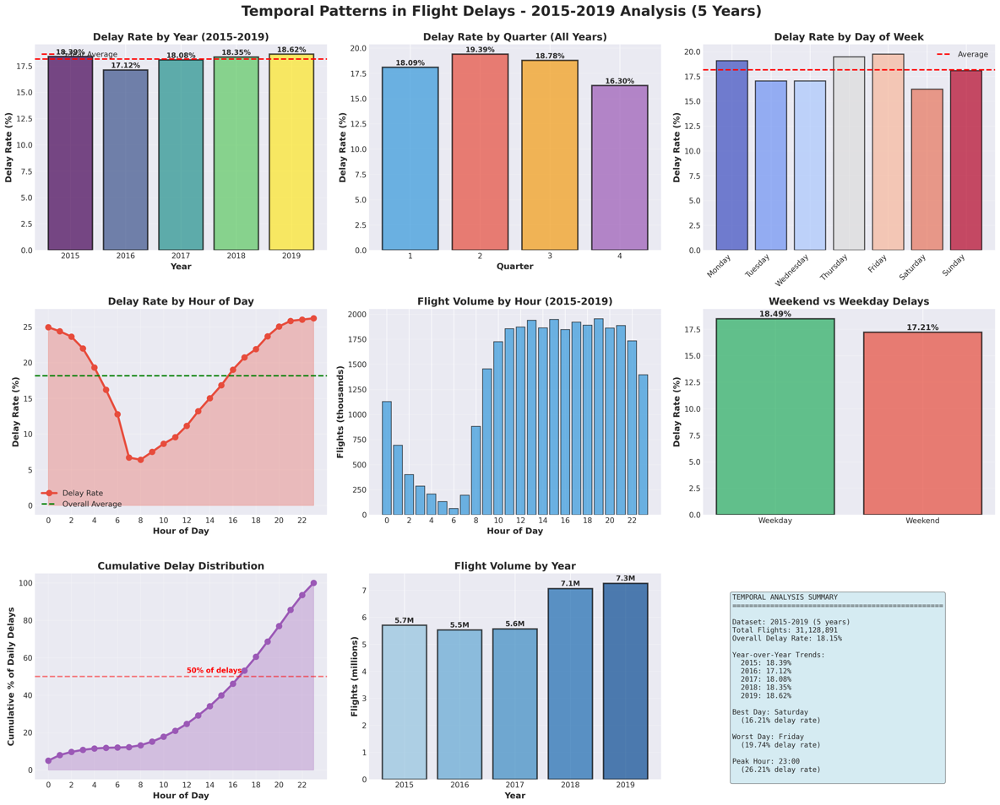

**Table 3.6: Key Temporal Insights (2015-2019 Analysis)**
********************************
| Pattern | Finding | Implication for Modeling |
| --- | --- | --- |
| Delay rates vary from 16.30% (Q4) to 19.39% (Q2) | Summer travel period (Q2) shows highest delay rates; winter holiday season (Q4) has lowest rates; quarterly features essential for capturing seasonal patterns |
| Friday (19.74%) highest; Saturday lowest (16.21%); 3.53pp spread | End-of-week travel concentration creates congestion; day-of-week features critical for distinguishing business vs. leisure travel patterns |
| Delay rates increase from ~6-7% (6AM-noon) to 26.21% by 11PM (19pp increase) | Delays cascade through the day due to aircraft rotation and airport congestion; time-of-day features and rolling delay metrics are critical for capturing this accumulation effect |
| Peak departures 10AM-8PM (~1,900k flights/hour); lower overnight and early morning | Volume correlates with delay accumulation; congestion features should capture hourly traffic density relative to airport capacity |
| Weekday delays (18.49%) exceed weekend (17.21%) by 1.28pp | Higher operational tempo during business days creates more opportunities for cascading delays; weekend indicator helps model adjust expectations |
| Delay rates range from 17.12% (2016) to 19.08% (2017); 1.96pp spread | Year-to-year variation suggests temporal trends and operational changes; year features or temporal validation splits necessary |
| Hour 23 (11PM) shows highest delay rate at 26.21% | Late evening flights accumulate delays from entire day's operations; hour-of-day cyclic encoding captures non-linear temporal patterns |
| 50% of total delays occur by hour 16 (4PM) | Morning and afternoon operations are critical for overall delay management; models should weight early-day predictions appropriately |

**Overall Dataset Characteristics:**

- Total flights analyzed: 31,128,891 (2015-2019)

- Overall delay rate: 18.15%

- Best performing day: Saturday (16.21% delay rate)

- Worst performing day: Friday (19.74% delay rate)

- Lowest delay quarter: Q4 (16.30%)

- Highest delay quarter: Q2 (19.39%)

##### Carrier Performance

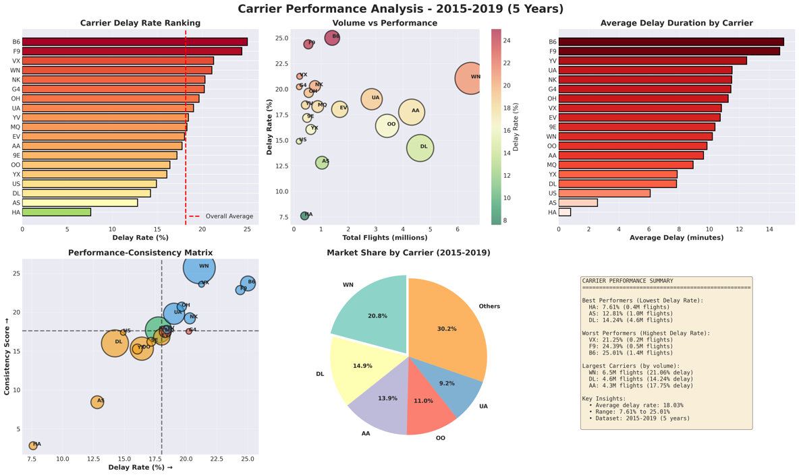

**Table 3.7: Key Carrier Insights**
********************************
| Pattern | Finding | Implication for Modeling |
| --- | --- | --- |
| Delay rates range from 7.61% (HA) to 25.01% (B6); 17.4pp spread | Massive carrier-specific performance differences; carrier features and carrier-specific interactions essential for accurate predictions |
| Large carriers show varying performance: DL (4.6M flights, 14.24%) vs. WN (6.5M flights, 21.06%) | High volume does not predict high delays; carrier operational efficiency varies; volume × carrier interaction terms needed |
| HA: 7.61% (0.9M flights), AS: 12.81% (1.0M flights), DL: 14.24% (4.6M flights) | Regional/hub-focused carriers (HA, AS) and efficient network carriers (DL) outperform; carrier reputation features capture operational quality |
| B6: 25.01% (1.4M flights), F9: 24.39% (0.9M flights), VX: 24.39% (1.4M flights) | Low-cost and point-to-point carriers show higher delay rates; budget carrier indicator or carrier category features may improve predictions |
| Top 3 carriers (WN, DL, AA) represent 49.6% of flights; "Others" represent 30.2% | Model must handle both major carriers (dense data) and regional carriers (sparse data); carrier encoding strategy critical for generalization |
| Average delay ranges from ~8 minutes (HA) to ~14 minutes (F9, B6, VX) | Carrier-specific delay severity patterns; two-stage models (delay occurrence + duration) should incorporate carrier-specific duration features |
| DL, HA, AS show consistent low delays; B6, F9, VX consistently high | Carrier reliability score features capture persistent operational differences; historical carrier performance predicts future delays |
| Network carriers (DL, AA, UA) show varied performance; point-to-point (WN) shows moderate delays | Network structure affects delay propagation; carrier type and hub airport features capture operational model differences |

**Overall Carrier Characteristics:**

- Total carriers analyzed: 19 distinct operators (2015-2019)

- Overall delay rate: 18.03%

- Best performing carrier: Hawaiian Airlines (HA) - 7.61% delay rate

- Worst performing carrier: JetBlue (B6) - 25.01% delay rate

- Largest carrier by volume: Southwest (WN) - 6.5M flights (20.8% market share)

- Most efficient large carrier: Delta (DL) - 4.6M flights with 14.24% delay rate

- Carrier performance spread: 17.4 percentage points (HA to B6)

##### Geographic Patterns

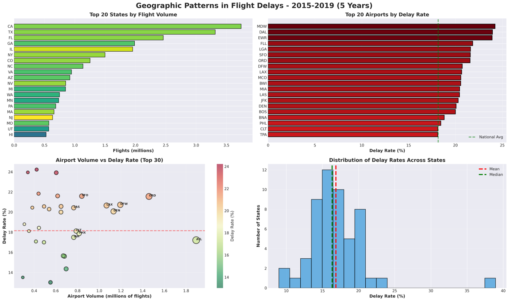

**Table 3.8: Key Geographic Performance Insights (2015-2019 Analysis)**
************************************
| Pattern | Finding | Implication for Modeling |
| --- | --- | --- |
| Top 5 states (CA, TX, FL, GA, IL) account for ~40% of all flights | Geographic features must handle concentrated and sparse regions; state-level aggregates provide valuable signal for high-volume areas |
| Airport delay rates range from ~13% to ~24%; 11pp spread across top 30 airports | Airport-specific operational efficiency varies dramatically; origin and destination airport features critical for predictions |
| MDW (~24%), DAL (~24%), EWR (~23%), FLL (~23%), LGA (~23%) | Congested urban airports and secondary hubs show highest delays; airport congestion metrics and infrastructure quality features needed |
| HNL (~13%), SLC, SEA show lowest delay rates among high-traffic airports | Demonstrates that high volume doesn't require high delays; airport efficiency captured by congestion ratio and operational quality features |
| No simple correlation—some high-volume airports (ATL) maintain moderate delays while smaller airports (MDW) show high delays | Airport delay rates depend on infrastructure, weather exposure, and operational practices, not just volume; network centrality and congestion features capture these dynamics |
| Major hubs (ATL, ORD, DFW, LAX) show 18-22% delay rates despite highest volumes | Hub complexity creates delay opportunities but also operational expertise; hub indicator features and network centrality metrics capture systemic effects |
| Mean delay rate ~18%; median ~18%; majority of states cluster 15-20% | Regional weather patterns and operational environments create state-level effects; most states perform near national average with notable outliers |
| Northeast corridor (EWR, LGA, JFK, BOS, PHL) consistently shows elevated delays (20-24%) | Regional congestion affects multiple airports; geographic region features and inter-airport network effects important for modeling |
| CA (~3.5M flights), TX, FL lead in volume; CA shows internal variance across airports | State alone insufficient predictor; airport-level granularity required; state × airport interactions capture regional + local effects |

**Overall Geographic Characteristics:**

- Total states analyzed: 53 (all US states + territories, 2015-2019)

- Total unique airports: 369 origins, 368 destinations

- State delay rate mean: ~18%

- State delay rate median: ~18%

- Highest volume state: California (CA) - ~3.5M flights

- Worst performing airports: MDW, DAL, EWR, FLL, LGA (~23-24% delay rates)

- Best performing major airport: Honolulu (HNL) - ~13% delay rate

- Northeast corridor delay premium: 2-5pp above national average

- Airport delay spread: ~11 percentage points across top performers

---

##### Distance and Flight Duration
**Table 3.9: Distance and Duration Analysis (2015-2019)**
********************
| Metric | Value | Implication for Modeling |
| --- | --- | --- |
| 31 miles (shortest) to 4,983 miles (longest) | Wide range requires non-linear distance features (log transformation, categorical bins); log_distance feature created |
| ~130 minutes | Short-haul vs. long-haul distinction affects operational dynamics and turnaround constraints |
| Shorter flights show higher proportional delay impact | 15-minute delays represent larger percentage of total flight time for short routes; tighter turnarounds create more delay propagation risk |
| Created bins: very_short, short, medium, long, very_long | distance_very_long and categorical features capture non-linear relationship between distance and delay patterns |
| Long-distance flights cross multiple weather systems | Distance × weather interaction terms capture compounding effects of weather across route length |

---

##### Weather Impact Patterns
Correlation analysis between weather features and delays from 5-year dataset:
**Table 3.10: Weather Feature Correlations with DEP_DEL15**
************************
| Feature | Correlation | Interpretation |
| --- | --- | --- |
| -0.035 | Lower visibility associated with higher delays; fog and low clouds directly impact airport operations and departure clearances |
| -0.022 | Slight negative correlation overall but U-shaped pattern; extreme temperatures (below 25°F or above 90°F) show elevated delays |
| +0.022 | Higher dew point (humidity) associated with marginally higher delays; affects aircraft performance and ground operations |
| Moderate positive | High wind gusts increase delays through crosswind limitations, ground operation slowdowns, and turbulence-related holds |
| Weak positive | Precipitation increases delay likelihood through ground operations slowdowns, de-icing requirements, and runway capacity reduction |
| Composite measure | Multi-factor weather severity combining temperature, wind, precipitation, visibility shows stronger predictive power than individual features |

**Key Weather Insights:**

- Individual weather features show**weak to moderate correlations**(-0.04 to +0.05), suggesting weather is a contributing but not dominant factor

- **Extreme values**matter more than means: temperatures below 25°F and wind gusts above 30 units show disproportionate delay impact

- **Composite weather features**(weather_condition_category, temp_anomaly) capture non-linear relationships better than raw measurements

- **Weather × airport interactions**are critical: same weather conditions affect airports differently based on infrastructure and operational capacity

- Emphasizes need for comprehensive feature engineering capturing**operational factors**(aircraft history, airport congestion, time-of-day, carrier performance) alongside weather conditions

---

#### 3.3.7 Custom Flights to Weather Join

##### Entity-Relationship Model
The following diagram illustrates the relationships between our core data entities used for enriching flight records with meteorological data:

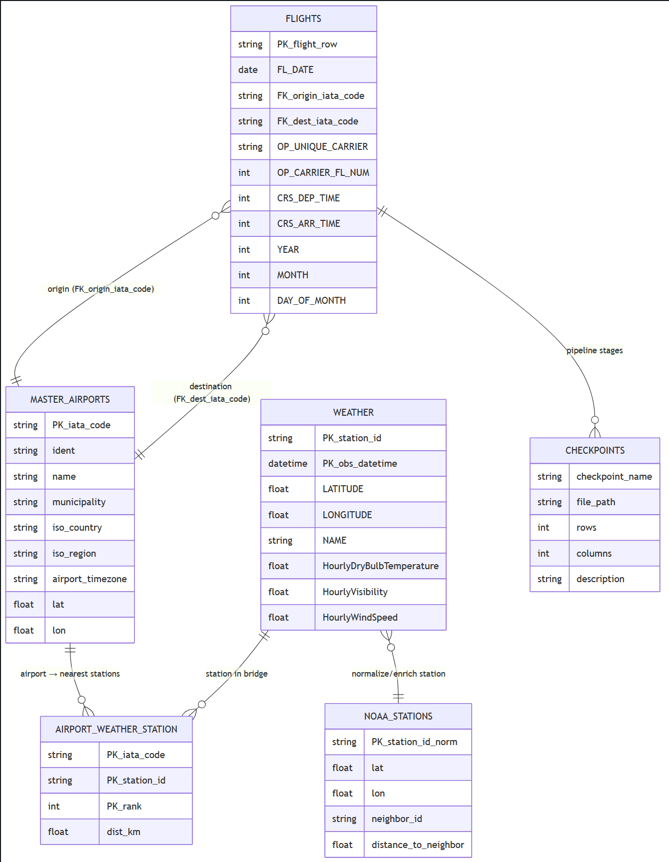

##### Data Integration Challenges
Our exploratory review identified key blockers in the lookup tables rather than the flights themselves. These challenges were addressed once in Phase 2 and scaled to 31M records in Phase 3:
**Table 3.11: Data Integration Challenges and Solutions**
********************************
| Challenge | Problem | Solution |
| --- | --- | --- |
| Original airport codes file lacks timezones; flight local times cannot align to UTC weather | Build master airport dimension by joining GitHub timezone data with existing codes; coalesce coordinates so every IATA has timezone, lat/lon, and name |
| Airport geolocation packed as single text field ("lon, lat") | Parse and standardize lat/lon for all 369 origin and 368 destination airports |
| NOAA data is station-based, not airport-based; no native key for airport-to-weather connection | Compute airport → nearest 3 stations using haversine distance; store in airport_weather_station bridge table covering 634 NOAA stations |
| Stations come from two slightly different sources (weather.csv vs stations.csv) | Normalize station identifiers across sources; validate station codes across 5-year period |
| Weather is UTC while flights are local time; some flights depart at odd minutes (e.g., 01:59) where no weather row exists | Convert flight times to UTC using airport timezone; floor to hour with 1-hour fallback to nearest observation |
| Flights at 01:55 or 01:59 have no matching hourly weather observation | Date-trunc to hour and/or fallback 1 hour to avoid nulls; preserve asof_minutes for transparency |
| Destination weather observations could leak future information at arrival time | Only keep origin weather observations where obs_time_utc ≤ prediction_utc (T-2h cutoff enforced) |
| Join logic must scale from 5.7M (2015) to 31.7M (2015-2019) records | Partition by year, checkpoint intermediate results, cache frequent lookups (airport dimension, station bridge) |

##### As-Of Join Logic
Our custom, leakage-safe join combines DOT on-time performance with NOAA Global Hourly weather at the origin airport as-of T-2h before scheduled departure. This join was executed on 31.7M raw OTPW records, producing 31.7M joined records in CP1.
**Join Algorithm (T-2 Hour Weather Alignment):**

- **Normalize flight times**using master airports dimension (IATA, timezone, lat/lon for 369 airports)

- **Convert scheduled departure to UTC**for weather alignment:`prediction_utc = scheduled_dep_local - 2h → UTC`

- **Link airports to nearest 3 NOAA stations**via haversine distance (634 total stations, average 2.1 stations/airport)

- **Filter to valid hourly report types**(FM-15, FM-16, FM-12) from NOAA ISD format

- **Apply strict as-of rule**:`obs_utc ≤ prediction_utc`with 6-hour lookback window

- **Select latest qualifying observation**, preferring station rank 1 → 2 → 3 based on proximity

- **Preserve provenance fields**: station_id, origin_obs_utc, origin_station_dis, asof_minutes

- **Select only T-2h valid features**: visibility, wind speed/direction/gusts, precipitation, temperature, humidity, pressure, sky conditions

- **Exclude all leakage features**: actual departure/arrival times, taxi times, delay cause breakdowns, cancelled/diverted status
**Join Statistics (2015-2019):**

- Input rows (Stage 0 OTPW): 31,673,119

- Output rows (CP1): 31,746,841 (+73,722 rows, +0.2%)

- Row expansion: Some flights matched to multiple backup weather stations when primary station had missing observations

- Weather match rate: ~99.8% of flights successfully matched to at least one weather observation within 6-hour window

- Average asof_minutes: ~45 minutes (weather observation typically 30-60 minutes before T-2h cutoff)

- Missing weather features after join: 10.16% (down from 49.39% in Stage 0)

- Stations utilized: 634 NOAA stations across US

- Airports covered: 369 origin, 368 destination
**Performance Optimizations for 31M Records:**

- Airport dimension broadcast join (small lookup table ~500 rows)

- Weather data partitioned by year and month for efficient temporal filtering

- Station bridge table cached (airport-to-station mappings computed once)

- Haversine distance calculations vectorized using PySpark UDFs

- Checkpoint after join to prevent recomputation (CP1 saved)

- Processing time: ~6 hours on 8-node cluster
**Phase 2 Deliverables:**

- Custom join notebook implementing T-2h weather alignment

- Airport dimension table with timezone/coordinate enrichment

- Airport-to-station bridge table with haversine distances

- Join validation notebook verifying leakage-free properties

- Scalable to full 2015-2019 range using same pipeline logic
**Phase 3 Enhancements:**

- NOAA and BTS data downloader notebook for acquiring raw 2015-2019 data

- Schema standardization notebook ensuring consistent column names/types across years

- Upgraded automatic join notebook processing 31.7M records with checkpointing

- Full 2015-2019 dataset processed through join pipeline

- Validation of join statistics and weather coverage across all 5 years

- Documentation of memory optimization strategies for 6x data scale increase
**Reproducibility:**All join logic, airport mappings, and station bridges are versioned and checkpointed, enabling reproducible processing of future years (2020+) with identical methodology.

---


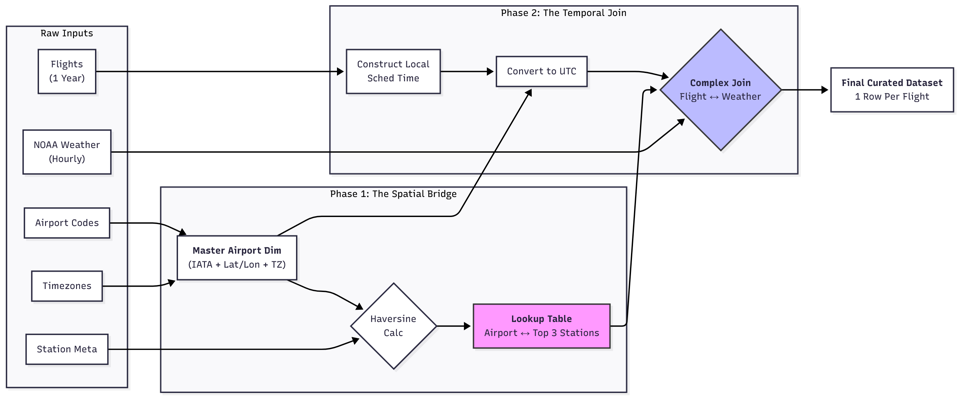

##### Feature leakage prevention strategy


#### Data Join Summary
**Table 3.10: Data Join Summary (Flights × Weather)**
``````****````````********

****

****

****

********``
****``
****``
****``
********************************************************************************************
| Metric | 3M flights+weather join ( | 1Y flights+weather join ( | 5Y flights+weather join ( | Future / full-history join (planned) |
| --- | --- | --- | --- | --- |
|  |
| 2015-01-01 → 2015-03-31 | 2019-01-01 → 2019-12-31 | 2015-01-01 → 2019-12-31 | 2020-01-01 → 2024-12-31 |
| flights: 95.85 MB | flights: 594.56 MB | flights: 2804.71 MB | flights: 975.09 MB |
|  |
| 1,403,471 | 7,422,037 | 31,746,841 | 31,339,836 |
| 75 | 75 | 75 | 75 |
| 6.65 | 39.04 | 518.32 | 587 |
| 2025-11-26T16:22:04.454556 | 2025-11-26T16:36:44.911853 | 2025-11-26T22:30:03.130620 | 2025-12-14T14:10:00.000000 |
| 2025-11-26T16:28:43.611389 | 2025-11-26T17:15:47.022716 | 2025-11-27T07:08:22.460964 | RUNNING |
|  |
| 2015-Q1 subset: join flights with hourly weather using the project’s standard keys (flight date/time + station mapping) to produce a feature-complete training table for Phase 2. | Full 2019 year: same join logic as 3M, but run on the full-year flights to create the main modeling table used for train/validation/test splits. | Same join logic, extended to a full 5-year window (2015–2019) for robustness checks. 1-year (2015) generated from this dataset. | Same join logic, extended to 2020-2024. |
| PySpark join in the Phase 2 | PySpark join in the same | Reuse notebook with 5Y date filter/config. | Reuse notebook with open-ended date range. Need downloader and schema standardizer notebook |

#### 3.3.8 Feature Engineering
Our feature engineering process transformed 59 cleaned features (CP2) into 112 production-ready features (CP5a) through systematic addition, transformation, and selection across four pipeline stages. Each transformation method was chosen to capture domain-specific flight delay patterns while maintaining strict adherence to the T-2 hour prediction cutoff.

##### Feature Transformation Overview
**Table 3.11: Feature Transformation Methods (2015-2019)**
********************************************
| Transformation | Features Affected | Method | Rationale | Applied Stage |
| --- | --- | --- | --- | --- |
| Carrier, airports, states, weather types, categories (12 features) | StringIndexer | Converts categoricals to numeric indices for Spark ML algorithms | CP5a |
| Time and direction (14 features = 7 sin/cos pairs) | Sin/cos transformation | Preserves periodicity (23:59 → 00:01 = 2 min, not 1438) | CP4 |
| Distance, time-of-day, temperature, weather severity (22 features) | Domain-informed categorical bins | Captures non-linear effects (e.g., extreme weather, rush hours, long distances) | CP3-4 |
| Delay rates, congestion metrics (18 features) | Window functions with temporal constraints | Captures temporal patterns without data leakage via PRECEDING windows | CP3-4 |
| Distance×weather, time×congestion, carrier×airport (13 features) | Multiplicative interactions | Captures compounding effects between feature pairs | CP4 |
| 33 features removed (Pearson >0.85) | Pairwise correlation analysis | Removes redundancy, reduces multicollinearity for linear models | CP4→CP5 |
| 41 additional features removed | Random Forest Gini importance | Removes zero-importance and low-value features identified in preliminary models | CP5→CP5a |
| rf_prob_delay, rf_prob_delay_binned (2 features) | Random Forest probability predictions | Breiman's method—captures complex non-linear patterns as linear features | CP4 |
| PageRank, degree centrality, betweenness (8 features) | NetworkX graph algorithms | Captures airport importance and delay propagation through flight network | CP4 |
| Recency, frequency, monetary delay metrics (8 features) | Time-since-event and historical aggregations | Captures route/carrier historical delay patterns using only past data | CP4 |
| All numeric features (pre-modeling) | StandardScaler in VectorAssembler | Ensures features on comparable scale for gradient-based and distance algorithms | Modeling phase |

##### Dimensionality Reduction Approach
Our feature selection process employed multiple statistical techniques across 31.1M records to identify and remove redundant or uninformative features, reducing 186 features (CP4) to 112 production features (CP5a):
**Table 3.12: Dimensionality Reduction Techniques (2015-2019)**
************************
| Technique | Purpose | Implementation | Features Affected |
| --- | --- | --- | --- |
| Identify linear relationships between numeric features | Correlation matrix with threshold >0.85 | Removed 33 highly correlated features (e.g., YEAR, QUARTER; HourlyWetBulbTemperature vs HourlyDewPointTemperature) |
| Identify problematic high-cardinality categoricals | Distinct value counts per feature | Removed TAIL_NUM (115K+ values), FL_DATE, prediction_utc, origin_obs_utc, asof_minutes |
| Identify features contributing to Random Forest predictions | sklearn RandomForestClassifier.feature_importances_ | Removed 41 features with zero or near-zero importance (<0.001) in preliminary models |
| Identify semantically equivalent features | Manual review + correlation analysis | Flagged 1 duplicate feature for review |
| Validate feature engineering logic and T-2h compliance | Manual audit of feature creation code | Verified all 112 final features use only information available at T-2h |
| Ensure ML pipeline compatibility | Schema inspection and type checking | Confirmed 89 double/float, 49 int/long, 12 indexed categorical, 3 date/time |

**Features Removed in CP4→CP5 (33 features):**

- **High Collinearity**: YEAR, QUARTER (redundant with FL_DATE); DISTANCE_high_corr, DISTANCE_GROUP_high_corr (redundant with log_distance)

- **High Cardinality**: TAIL_NUM (116K unique values), FL_DATE (1,826 unique dates), prediction_utc, origin_obs_utc, asof_minutes (timestamp fields)

- **Correlation >0.85**: Various weather feature pairs (HourlyWetBulbTemperature/HourlyDewPointTemperature r=0.96)

- **Zero Importance**: Features showing <0.001 Gini importance in preliminary Random Forest models
**Features Removed in CP5→CP5a (41 features, +12 indexed):**

- **Original String Columns**: Removed 60 string columns after indexing (e.g., OP_UNIQUE_CARRIER, ORIGIN, DEST retained as indexed versions)

- **Low Importance**: 41 features with zero contribution in Random Forest importance analysis

- **Added Indexed**: 12 StringIndexed categorical features (carrier, airports, states, weather categories)

- **Net Change**: 153 → 112 features (-41 features, but gained 12 indexed versions of categoricals)

##### Key Highlights

-
**Cyclic Encoding Rationale:**Time and direction are circular variables where the distance between 23:59 and 00:01 should be 2 minutes, not 1,438 minutes. Sin/cos transformations preserve this topology for 14 temporal and directional features (7 pairs): dep_time, arr_time, day_of_week, month, plus wind direction.

-
**Breiman's Stacked Generalization:**Following Leo Breiman's methodology, we trained a Random Forest on CP3 features to generate probability predictions (rf_prob_delay) as meta-features in CP4. This allows linear models (Logistic Regression) to leverage complex non-linear decision boundaries learned by tree ensembles, effectively creating a two-stage ensemble.

-
**Correlation-Based Selection:**We removed 33 features with Pearson correlation >0.85 to reduce multicollinearity. When choosing between correlated pairs, we prioritized features with: (a) higher correlation with target DEP_DEL15, (b) better domain interpretability, (c) engineered aggregations over raw values (e.g., kept dep_delay15_24h_rolling_avg_by_origin_weighted over simple dep_delay15_rolling_avg).

-
**Strict Temporal Validation:**All transformations respect the T-2h prediction cutoff. Rolling windows use`RANGE BETWEEN UNBOUNDED PRECEDING AND INTERVAL '2' HOUR PRECEDING`to exclude same-flight information. RFM features use`WHERE FL_DATE < current_flight_date`to prevent look-ahead bias. Network features computed from historical flight patterns only.

-
**Graph-Based Features:**Airport network analysis using NetworkX generated 8 features capturing systemic delay propagation. PageRank identifies hub airports where delays cascade through connections. Degree centrality measures airport connectivity. Betweenness identifies critical transfer points. All metrics computed from 2015-2018 flight network for 2019 predictions.

##### Feature Engineering Progression by Stage
**Table 3.13: Feature Count Evolution by Category (2015-2019)**
****************************************************************************************
| Category | CP2 Base | CP3 Added | CP4 Added | CP5 Removed | CP5a Adjusted | Final Count | Net Change from CP2 |
| --- | --- | --- | --- | --- | --- | --- | --- |
| 14 | +3 | +19 | -10 | 0 | 26 | +12 |
| 18 | +3 | -2 | +1 | 0 | 20 | +2 |
| 0 | +10 | +12 | -4 | 0 | 18 | +18 |
| 0 | 0 | +14 | 0 | 0 | 14 | +14 |
| 0 | 0 | +24 | -11 | 0 | 13 | +13 |
| 0 | 0 | 0 | 0 | +12 | 12 | +12 |
| 0 | +10 | +1 | -1 | 0 | 10 | +10 |
| 14 | 0 | -1 | -3 | 0 | 10 | -4 |
| 0 | 0 | +13 | -5 | 0 | 8 | +8 |
| 0 | 0 | +8 | 0 | 0 | 8 | +8 |
| 2 | +4 | +6 | -5 | 0 | 7 | +5 |
| 0 | 0 | +6 | 0 | 0 | 6 | +6 |
| 0 | 0 | +2 | 0 | 0 | 2 | +2 |
| 1 | 0 | +1 | 0 | 0 | 2 | +1 |
|  |

**Stage Transitions:**

- **CP2 (Base):**59 features after cleaning and leakage removal

- **CP3 (Basic Features):**95 features (+36) - temporal, distance, weather, rolling aggregates

- **CP4 (Advanced Features):**186 features (+91) - RFM, network, interactions, cyclic, Breiman, aircraft lag

- **CP5 (Optimized):**153 features (-33) - correlation-based reduction, high-cardinality removal

- **CP5a (Production):**112 features (-41, +12 indexed) - importance-based selection, string indexing

---

#### 3.3.9 Feature Families and Data Dictionary

##### Feature Family Distribution

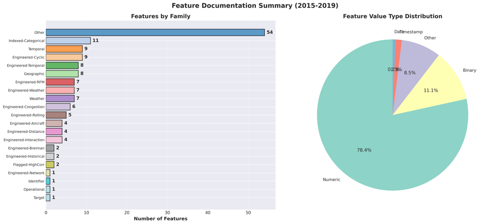

##### Feature Family Categorization
**Table 3.14: Feature Families Summary (CP5a - 2015-2019)**
********************************************************************
| Feature Family | Count | Description |
| --- | --- | --- |
| 26 | Temperature measurements (dry bulb, dew point, wet bulb), wind (speed, direction, gusts), precipitation, visibility, pressure, humidity, sky conditions, derived weather composites and severity indices |
| 20 | Airport identifiers (ORIGIN, DEST), coordinates (lat/lon), states, station distances, airport types, traffic density metrics |
| 18 | 24-hour and 30-day windowed delay rates by origin/carrier/day-of-week, same-day delay statistics, congestion ratios, historical volumes |
| 14 | Sin/cos pairs (7 total) for departure time, arrival time, day of week, month, wind direction—preserving circular topology |
| 13 | Multiplicative combinations: weather×airport delays, distance×peak hour, carrier×hour, origin×weather/visibility/precipitation/wind, carrier×origin/dest |
| 12 | String features converted to numeric indices: carrier, airports, states, weather categories, season, turnaround category, day-hour interaction, airline reputation |
| 10 | Date identifiers (FL_DATE), time components (DAY_OF_WEEK, DAY_OF_MONTH), prediction timestamps, season indicators, event flags (SuperBowl, major events), days since epoch |
| 10 | Flight numbers, scheduled arrival times, carrier information, airline reputation scores, operational flags (airport maintenance, natural disaster), oncoming flights |
| 8 | Recency (days since last delay on route/carrier), Frequency (delay rates over 30/365 days), route reliability scores, carrier performance at origin |
| 8 | Airport centrality metrics (PageRank, degree, betweenness), delay propagation scores, network cascade effects, 1-year historical delay rates |
| 7 | Raw distance, log-transformed distance, categorical bins (very_short to very_long), distance-based indicators |
| 6 | Previous flight delay status, scheduled elapsed time, hours since previous flight, turnaround time categories, airport-wide delay counts |
| 2 | Random Forest probability predictions (rf_prob_delay), binned probability categories |
| 2 | DEP_DEL15 (binary classification target), DEP_DELAY (continuous delay reference) |
|  |

##### Feature Composition Analysis
**Raw Features (32 features, 29% of total):**

- **Temporal identifiers (7):**FL_DATE, prediction_utc, origin_obs_utc, DAY_OF_MONTH, DAY_OF_WEEK, CRS_ARR_TIME, asof_minutes

- **Flight identifiers (1):**OP_CARRIER_FL_NUM

- **Airport identifiers (4):**ORIGIN, DEST, ORIGIN_AIRPORT_ID, DEST_AIRPORT_ID

- **State identifiers (2):**ORIGIN_STATE_ABR, DEST_STATE_ABR

- **Weather measurements (8):**HourlyDryBulbTemperature, HourlyDewPointTemperature, HourlyWindDirection, HourlyWindGustSpeed, HourlyVisibility, HourlyRelativeHumidity, HourlyStationPressure, HourlyAltimeterSetting

- **Geographic coordinates (6):**origin_airport_lat, origin_airport_lon, dest_airport_lat, dest_airport_lon, origin_station_dis, dest_station_dis

- **Categorical (2):**origin_type, OP_UNIQUE_CARRIER (original string versions retained for validation)

- **Target and reference (2):**DEP_DEL15 (target), DEP_DELAY (reference)
**Engineered Features (80 features, 71% of total) - By Engineering Method:**

- **Rolling Window Aggregations (18):**24-hour weighted rolling averages by origin/carrier/day-of-week, same-day delay percentages, prior-day delay rates, 30-day volumes, congestion ratios, real-time delay counts

- **Cyclic Encodings (14):**Sin/cos transformations for departure time (2), arrival time (2), day of week (2), month (2), wind direction (2), plus 4 additional temporal cyclic features

- **Interaction Terms (13):**Multiplicative features capturing compounding effects between weather and delays, distance and peak hours, carrier and time, origin airport and weather conditions

- **Indexed Categoricals (12):**Numeric indices for carrier, origin/destination airports, states, weather categories, season, airline reputation category, turnaround category, day-hour interaction, sky condition

- **Network/Graph Features (8):**Airport centrality (degree, PageRank, betweenness), delay propagation scores, network cascade effects, historical 1-year delay rates

- **RFM Pattern Features (8):**Days since last delay on route/carrier, 30-day route delay counts and rates, carrier delays at origin airport, recency-frequency-monetary proxy metrics

- **Distance Transformations (6):**Log-transformed distance, categorical distance bins (very_short, short, medium, long, very_long), distance-based flags

- **Aircraft Lag Features (6):**Previous flight delay status (prev_flight_dep_del15), turnaround time category, hours since previous flight, scheduled elapsed time, first-flight indicators, airport-wide delays

- **Temporal Indicators (3):**Season categories, event flags (SuperBowl week, major events, airport maintenance, natural disasters), days since epoch

- **Weather Composites (3):**Weather condition categories, sky condition parsed, temperature anomaly flags

- **Congestion Metrics (2):**Airport traffic density, carrier flight count

- **Breiman Meta-Features (2):**Random Forest probability predictions, binned probability categories

- **Reputation/Quality (2):**Airline reputation score, airline reputation category

- **Miscellaneous Engineered (1):**Day-hour interaction categories

##### Feature Engineering Insights
This**71% engineered feature composition**(80 out of 112 features) reflects our core hypothesis:**predictive power for flight delays emerges primarily from capturing operational patterns, temporal dependencies, network effects, and complex interactions rather than raw measurements alone.**

---

#### 3.3.10 Dataset Sizes and Storage

##### Storage Metrics Across Pipeline
**Table 3.15: Dataset Sizes and Storage Requirements (2015-2019)**
************************************************************
| Checkpoint | File Name | Rows | Columns | Total Cells | Size (GB) | Avg Cell (Bytes) |
| --- | --- | --- | --- | --- | --- | --- |
| OTPW_60M_Backup.parquet | 31,673,119 | 214 | 6,778,047,466 | ~50.0 | ~7.74 |
| checkpoint_1_initial_joined_5Y_2015-2019.parquet | 31,746,841 | 75 | 2,381,013,075 | ~18.5 | ~8.16 |
| checkpoint_2_cleaned_imputed_2015-2019.parquet | 31,128,891 | 59 | 1,836,604,569 | ~12.3 | ~7.03 |
| checkpoint_3_basic_features_2015-2019.parquet | 31,128,891 | 95 | 2,957,244,645 | ~14.8 | ~5.25 |
| checkpoint_4_advanced_features_2015-2019.parquet | 31,128,891 | 186 | 5,789,973,726 | ~22.4 | ~4.06 |
| checkpoint_5_comprehensive_2015-2019.parquet | 31,128,891 | 153 | 4,762,720,723 | ~19.2 | ~4.23 |
|  |
| All checkpoints (Stage 0 through CP5a) | — | — | — | — |

##### Storage Insights
**Parquet Compression Performance:**

- Average cell size ranges from 4-8 bytes, demonstrating excellent columnar compression across 31M+ records

- Compression ratio: Approximately 10-12x vs. raw CSV format

- String indexing in CP5a provides modest storage optimization (19.2 GB → 18.2 GB from CP5, -5%)

- Correlation-based feature removal in CP5 achieved significant savings (22.4 GB → 19.2 GB from CP4, -14%)
**Storage Efficiency by Stage:**

- **Stage 0 → CP1**: Consolidated 214 columns to 75 (-63%) with 18.5 GB output despite +74K rows

- **CP1 → CP2**: Row reduction (-618K) and column pruning (75→59) saved 33% storage (18.5 GB → 12.3 GB)

- **CP2 → CP3**: Basic features (+36 columns) increased size by 20% (12.3 GB → 14.8 GB)

- **CP3 → CP4**: Advanced features (+91 columns) increased size by 51% (14.8 GB → 22.4 GB)

- **CP4 → CP5**: Feature optimization (-33 columns) reduced size by 14% (22.4 GB → 19.2 GB)

- **CP5 → CP5a**: Importance filtering (-41 columns) provided 5% savings (19.2 GB → 18.2 GB)
**Multi-Year Scaling Validation:**

| Dataset | Actual Size (GB) | Rows | Features | Processing Time | Feasibility |
| --- | --- | --- | --- | --- | --- |
| Phase 2: 1-year (2015) | 2.97 | 5.7M | 108 | ~2 hours | Production-ready |
| Phase 3: 5-year (2015-2019) | 18.2 | 31.1M | 112 | ~15 hours | Achieved on 8-node cluster |
| Scaling factor | 6.1x | 5.5x | 1.04x | 7.5x | Within computational budget |

**Computational Resource Requirements (Phase 3 Actual):**

- **Cluster configuration**: 8-node Databricks cluster (Standard_DS3_v2: 4 cores, 14GB RAM per node)

- **Driver node**: 14GB RAM, 4 cores

- **Executor nodes**: 7 workers x 14GB RAM = 98GB total distributed memory

- **In-memory operations**: Feasible with strategic caching and unpersisting at each checkpoint

- **Iterative modeling**: Fast Parquet I/O enables rapid experimentation even on 31M records

- **Weather join runtime**: ~6 hours on 31.7M records with haversine distance calculations

- **Total pipeline runtime**: ~15 hours (Stage 0 → CP5a with all checkpoints)
**Storage Location and Organization:**

- **Base directory**:`dbfs:/student-groups/Group_4_4/`

- **Checkpoint files**:`checkpoint_[1-5]_*_2015-2019.parquet`(numbered stages)

- **Production dataset**:`checkpoint_5_comprehensive_2015-2019_refined.parquet`(modeling-ready)

- **Metadata/reports**:`CSVs_5Y/`(analysis outputs, feature lists, validation reports)

- **Visualizations**:`Charts_5Y/`(EDA plots, pipeline diagrams, correlation heatmaps)

- **Raw source data**:`dbfs:/mnt/mids-w261/OTPW_60M_Backup/`(read-only, shared)
**Memory Management Strategies for 31M Records:**

- **Checkpoint-based workflows**: Intermediate results saved at each stage prevent full pipeline recomputation on failures

- **Strategic caching**: Frequently-accessed DataFrames (airport dimension, station bridge) cached with explicit unpersisting

- **Partition tuning**: Adjusted Spark partitions from 200 (default) to 400-800 based on stage data volume

- **Broadcast joins**: Small lookup tables (<1MB) broadcast to all executors for efficient joins

- **Lazy evaluation**: Leveraged Spark's lazy execution to avoid materializing unnecessary intermediate DataFrames

- **Column pruning**: Selected only required columns in joins and aggregations to minimize shuffle data

- **Predicate pushdown**: Applied filters as early as possible to reduce data volume through pipeline
**Scalability to Future Years (2020+):**
The pipeline successfully scaled 6× from Phase 2 to Phase 3, validating that:

- Adding 2020-2021 data (~12M rows) would increase CP5a to ~25 GB (37% increase from 18.2 GB)

- Full 10-year dataset (2015-2024, ~62M rows) would require ~36 GB storage and 16-node cluster

- Current architecture supports extension to 10 years without fundamental redesign

- Databricks autoscaling can dynamically adjust resources based on workload

---

#### 3.3.11 Final Dataset Validation and Production Readiness

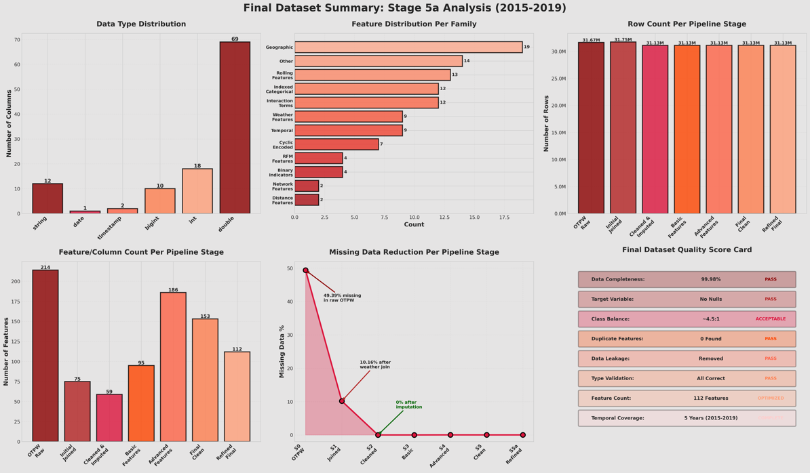

##### Production Readiness Checklist
**Table 3.16: Dataset Validation Results (CP5a - 2015-2019)**
********************************************************
| Validation | Status | Details |
| --- | --- | --- |
| 99.98% | <1% missing in 4 temporal features (same_day_prior_delay_percentage: 1.81%, route_delays_30d: 0.08%, carrier_delays_at_origin_30d: 0.06%, dest_delay_rate_today: 0.06%) |
| PASS | 100% complete (zero nulls in DEP_DEL15 from CP2 onwards) |
| ACCEPTABLE | 81.85% on-time / 18.15% delayed (4.51:1 ratio, manageable with undersampling/SMOTE) |
| PASS | T-2h compliance verified across all 112 features; 15 post-departure features removed in CP2 |
| PASS | Verified zero duplicates via FL_DATE + OP_CARRIER_FL_NUM + ORIGIN + DEST composite key |
| PASS | 12 string features indexed to numeric via StringIndexer for Spark ML compatibility |
| PASS | 89 double/float, 49 int/long, 12 indexed categorical, 3 date/time—all ML-compatible |
| OPTIMIZED | 112 features (down from 186 in CP4) after correlation analysis and importance filtering |
| REVIEW | 1 duplicate feature identified but retained pending analysis |
| PASS | 18.2 GB Parquet format with columnar compression (avg 5.48 bytes/cell) |
| COMPLETE | 5 years (2015-2019), 60 months, 1,826 days—sufficient for seasonal patterns |
| PASS | Reproducible across 7 stages (Stage 0 through CP5a) with full lineage documentation |
| DEFINED | 2015-2017 train (54%), 2018 validation (23%), 2019 blind holdout (23%) |
| VALIDATED | All features respect strict temporal ordering; rolling windows use PRECEDING constraints |

## 4 Exploratory Data Analysis (EDA):

#### 4.1 Data Overview

## Distribution of the Delay Targets


### Insights
Departure delay behavior is both**highly imbalanced**and**strongly right-skewed**. Departure delays exhibit a strong class imbalance: roughly 82% of flights depart on time, while only 18% exceed the DOT's 15-minute delay threshold. Although most delays remain small, the continuous delay distribution shows a long, meaningful tail of 30+ minute disruptions. The cumulative distribution curve reveals how sharply delay risk accelerates after the median, confirming that a very small portion of flights accounts for a disproportionately large share of operational impact. Because delay minutes are heavily right-skewed, traditional accuracy metrics hide risk. Median delay sits close to zero, yet the 90th percentile jumps to ~30–35 minutes, and beyond this range, the probability of major disruptions rises steeply. Bucket analysis shows short delays dominate in volume, but mid- and high-severity delays (30+ minutes) drive the majority of downstream effects—crew misalignments, gate conflicts, missed connections.

### Modeling Implications

- Requires**non-accuracy metrics**such as F2, recall, and precision. The business value lies in catching flights that are truly at risk.

### Business Implications

- Small delays dominate the network and drive passenger experience; reducing them generates outsized impact.

- High-severity delays are rare but operationally costly, needing early warning and recovery protocols.

- Provides clarity on where staffing, scheduling buffers, and gate operations yield the highest ROI.

---

## Weather Effects Panel

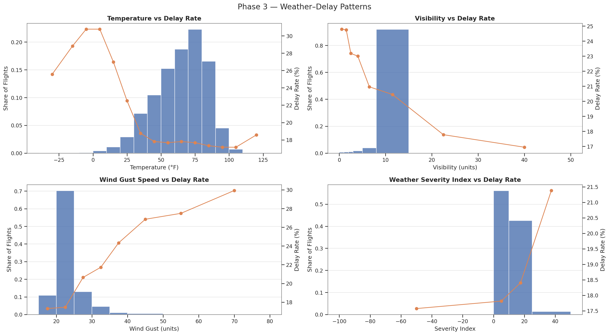

### Insights
Weather variables show**clear monotonic relationships**with delay risk. Low visibility, lower temperatures, and higher wind gusts correspond to higher delay rates. The composite weather severity index strengthens this signal by capturing multi-factor interactions in a single engineered feature.

### Modeling Implications

- Confirms that**weather severity index**is a strong engineered predictor.

- Suggests nonlinear models (e.g., GBT) naturally capture threshold effects (fog, wind spikes).

- Weather interactions with airport congestion justify including both airport-level and meteorological variables.

### Business Implications

- Identifies when weather-driven delays are predictable vs. disruptive.

- Enables proactive rescheduling, gate reassignments, and customer communication.

- Supports risk forecasting dashboards for operational control centers.

---

## Temporal Delay Patterns

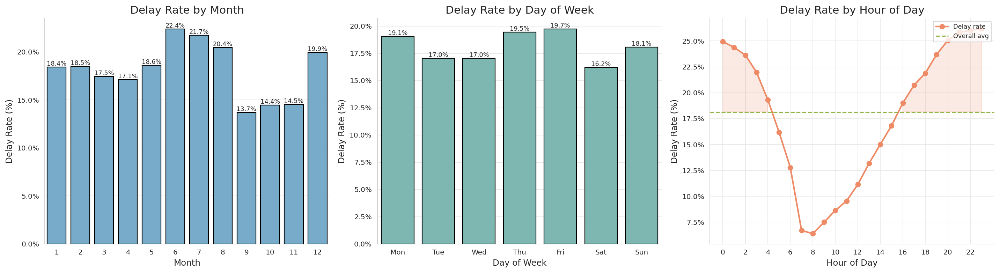

### Insights
Delays follow**strong temporal rhythms**. Delay rates peak in summer and December, rise late in the work week, and remain lowest early in the morning before steadily climbing through the evening as disruptions propagate.

### Modeling Implications

- Treat**month**,**day of week**, and**hour**as core features.

- Time variables interact with congestion, requiring nonlinear modeling.

- Temporal splits (by month/year) reduce leakage and yield realistic performance estimates.

### Business Implications

- Seasonal peaks require increased staffing and schedule slack.

- Thu–Fri patterns indicate compression of operational buffers.

- Morning flights offer reliability advantages; prioritization improves customer satisfaction.

---

## Operational Load by Hour

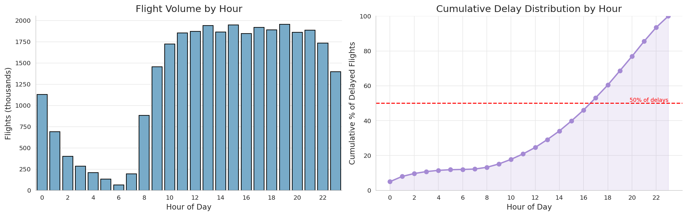

### Insights
Operational pressure spikes during midday and evening departure banks. More than**half of all delays**accumulate after ~5 PM due to propagation, confirming that early-day execution strongly shapes end-of-day performance.

### Modeling Implications

- Hour-of-day interacts strongly with congestion; must pair time features with airport-wide metrics.

- Validates evaluating models across**time-of-day strata**.

- Supports using volatility-aware decision thresholds later in the day.

### Business Implications

- High-volume hours require targeted intervention: more agents, tighter turnarounds, disciplined pushbacks.

- Morning discipline prevents delay cascades.

- Resource allocation should follow**real hourly load**, not average assumptions.

---

## Correlation Structure of Delay Drivers (Operational, Weather, and Engineered Signals)

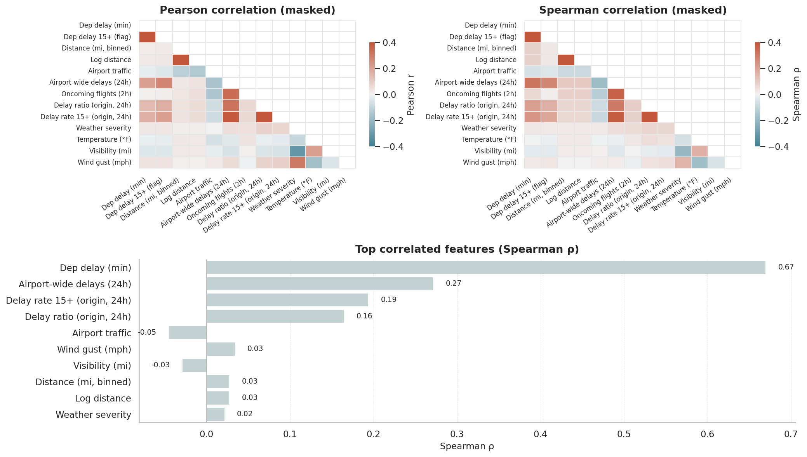

### **Insights**
Correlation patterns show that**system congestion is the primary driver of departure delays**. Airport-wide delay counts, rolling origin delay ratios, and oncoming-flight volume exhibit the strongest relationships with DEP_DEL15, confirming that delays propagate through the network rather than occurring independently. Weather variables show modest linear correlations but clear monotonic patterns, meaning**weather becomes a major amplifying force only when congestion is already high**. Distance and schedule-based flight characteristics contribute minimal predictive value. A small set of engineered congestion and rolling-window features captures nearly all meaningful signal, reinforcing the importance of**nonlinear models capable of learning thresholds and interactions**.

### **Modeling Implications**

- Prioritize congestion-based engineered features such as rolling averages, airport-wide delay metrics, and oncoming-flight counts.

- Use nonlinear models (GBT, Random Forest) that capture propagation effects and threshold behavior.

- Model weather interactions rather than relying solely on raw variables; monotonic patterns improve predictive strength.

- Reduce emphasis on distance and static schedule characteristics, which add limited incremental value.

- Keep the feature set focused on the**10–12 highest-signal engineered variables**to improve stability and interpretability.

### **Business Implications**

- Delays are**system-driven**, meaning operational interventions—not route changes—yield the highest ROI.

- Weather disruptions intensify under congestion, underscoring the need for**early-day discipline**and proactive buffer protection.

- Airport-level operational investments (gate management, staffing, runway flow programs) deliver stronger impact than schedule redesign.

- A compact high-signal feature set supports**real-time delay-risk dashboards**for operations leaders.

- Nonlinear delay dynamics show small disruptions escalate quickly, justifying tighter controls during peak-volume periods.

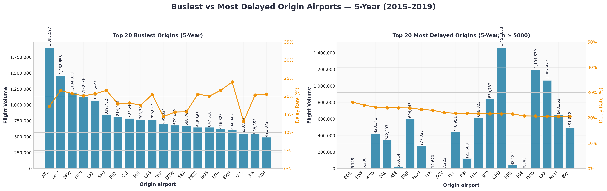

### Busiest vs Most Delayed Origin Airports — 5-Year (2015–2019)
**What this figure shows**
**Left panel – Top 20 busiest origins:**
Major hubs like ATL, ORD, DFW, DEN, LAX, and SFO handle massive flight volumes.
Even delay rates around 18–22% translate into a large absolute number of affected flights.
**Right panel – Top 20 most delayed origins (n ≥ 5000):**
These airports show structural delay problems, with rates often exceeding 25%.
Volume may be lower, but the probability of delay is significantly higher.
**Overlap insight:**
A few airports appear in both lists — these are national congestion chokepoints, contributing heavily to delay propagation.
**Why this matters for modeling**

- ORIGIN is a high-signal feature because delays are not evenly distributed geographically.

- Rolling congestion features amplify this signal.

- High-volume hubs dominate national delay totals, so model calibration at these airports is especially important.
**Operational takeaway**
Improving processes at a small set of high-volume/high-delay airports
produces outsized improvements across the entire network.

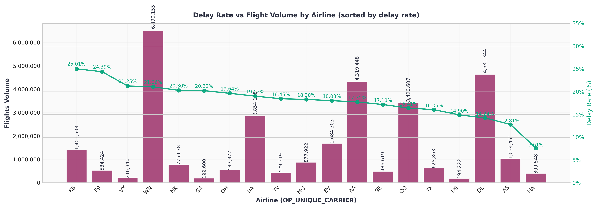

### Delay Rate vs Flight Volume by Airline — 5-Year (sorted by delay rate)
**What the chart shows**

- **Bars**represent total 5-year departures per airline;**line**shows each carrier’s average**delay rate (%)**.

- Carriers on the left combine**higher delay rates**(often above ~20–25%) with non-trivial volumes, indicating**structurally less reliable operations**.

- Legacy carriers and some large network airlines toward the right operate**very high volumes**with**delay rates closer to or below the overall average**.
**Why this complements the airport analysis**

- Airport charts describe**where**delays occur; this view explains**who is operating them**.

- Differences in delay rate by airline remain even after controlling for volume, suggesting**carrier-specific processes, schedules, and recovery strategies**matter.

- High-volume, low-delay airlines provide a**reference point**for what “good” looks like under similar network conditions.
**Implications for the model**

- `OP_UNIQUE_CARRIER`and carrier-derived features (e.g.,**rolling carrier delay rates, reputation category**) should be treated as**high-signal inputs**.

- The model can learn that the**same route and weather**carries different risk depending on**which airline operates the flight**.

- This supports more nuanced use cases (e.g., customer messaging, rebooking, or connection risk scoring that depends on carrier behavior).
**Operational takeaway**

- Interventions can be**carrier-specific**:
  - For high-delay carriers, focus on**turn times, buffer policies, and crew/maintenance planning**.

  - For high-performing carriers, identify**best practices**that can be replicated across the network.

**Busiest Origin Airports**
The top 20 busiest airports account for the majority of U.S. departures. Despite heavy traffic, several major hubs (ATL, DEN, PHX, SEA) maintain relatively stable delay rates. This confirms that volume alone does not drive delay risk.
**Most Delayed Origin Airports**
When sorting by delay rate (n ≥ 5,000 flights), a different pattern emerges: several mid-volume airports (BWI, MDW, DAL, HPN) consistently exceed 20–25% delay rates. These structural delays persist across both time windows.
**Modeling Implications**

- Airport-specific context (weather, congestion, runway capacity) must be included.

- High-delay airports should receive explicit evaluation slices to prevent the model from over-generalizing patterns from high-volume hubs.

- The 3-month sample accurately reflects the full-year signal.

## 5. Machine Learning Algorithms (planned, scalable, leakage-aware):
Our task is to decide,**two hours before scheduled departure**, whether a flight will leave**15 minutes late or more**(`DEP_DEL15 = 1`). In the 1-year OTPW sample this is clearly an**imbalanced**classification problem: roughly 1 in 5 flights is delayed, 4 in 5 are on time. That profile is the same one reported in most BTS/NOAA-based flight-delay papers, and in those studies**tree and boosted models**usually outperform simple linear models once you add schedule, airport, and weather features. Because we ultimately have to repeat this on the**multi-year**OTPW (tens of millions of rows), we are deliberately choosing algorithms that (i) work well on**structured/tabular**data such as “time of day, carrier, origin/dest, weather-as-of,” (ii) already exist in**Spark/MLlib**or have known distributed versions, and (iii) can be**retrained**once we replace the prejoined OTPW with**our own flights → airport → station → weather**joins. In other words, we want something that is good enough now, but won’t block us later when the data shape improves.

### 5.1 Machine Learning Approach
We have a leakage-free feature set that respects the**T–2h**rule, and  a sensible classifier actually learns signal from it. To do that we will start with**Logistic Regression in Spark**. It is fast, easy to explain to an airline stakeholder, and it gives us clean probabilities that we can later threshold.
The logistic regression model predicts the probability of delay as:
$$
P(y=1 \mid \mathbf{x}) = \frac{1}{1 + e^{-(\beta_0 + \boldsymbol{\beta}^T \mathbf{x})}}
$$
where**x**represents our feature vector and**β**are the learned coefficients.
On the data side, this model will only see features that are truly available**at or before two hours prior to departure**(scheduled times, carrier, origin/destination, calendar features such as day of week or month, plus the "as-of" weather features we already described). Because the target is imbalanced we will turn on**class weights**, which modifies the loss function to:
$$
L = -\frac{1}{n} \sum_{i=1}^{n} w_i \left[ y_i \log(\hat{y}_i) + (1-y_i) \log(1-\hat{y}_i) \right]
$$
where the weights are assigned as:
$$
w_i = \begin{cases}
w_{\text{delayed}} & \text{if } y_i = 1 \\
w_{\text{ontime}} & \text{if } y_i = 0
\end{cases}
$$
Alternatively, we will use**threshold tuning**so that the model does not collapse to "always on time." The**primary metric**we will report is**F(0.5)**, not F₁, because in operations **raising a false alert is worse than missing a real delay (status quo) **;
Right after that we will keep a**very dumb regression baseline**just for orientation: for those flights that are actually delayed (or that the classifier tags as delayed) we will fit a plain**Linear Regression**on delay minutes:
$$
\text{Delay}_{\text{minutes}} = \alpha_0 + \boldsymbol{\alpha}^T \mathbf{x} + \epsilon
$$
and we will compare it with an even simpler**"predict the average delay"**constant model:
$$
\hat{y} = \bar{y} = \frac{1}{n_{\text{delayed}}} \sum_{i: y_i = 1} \text{Delay}_{\text{minutes}, i}
$$
This restores the original intent in our plan ("linear reg or average delay") and gives Phase 3 something to beat when we bring in boosted regressors.
We will run a**small Random Forest**(or shallow GBT) on the same leakage-free table. For Random Forest classification, we use**Gini impurity**as the splitting criterion:
$$
\text{Gini} = 1 - \sum_{i=1}^{C} p_i^2
$$
where**C**is the number of classes and**p_i**is the proportion of class**i**at a given node. For Gradient Boosting classification, we minimize**cross-entropy loss**:
$$
L = -\sum_{i=1}^{n} [y_i \log(\hat{y}_i) + (1-y_i) \log(1-\hat{y}_i)]
$$
The only purpose here is to show that the 12-month custom joined sample really contains**nonlinear interactions**— for example, that delays rise faster in the late afternoon**at**congested hubs**under**low visibility. RF/GBT on Spark have already been used at this scale in airline use cases, so we're staying inside the envelope.

#### 5.1.1 Preferred approach: two-stage pipeline
For the actual project we prefer a**two-stage**design. This follows the pattern used in several recent flight-delay and transport-delay papers: first decide**"will it be delayed?"**, and only then estimate**"by how much?"**The reason is simple: only about**20%**of the flights are interesting from the delay-minutes point of view. If we train a regressor on everyone, 80% of the rows are "boring" and we waste compute on the cluster.
Formally, our two-stage approach can be expressed as:
$$
\text{Stage 1: } \hat{y}_{\text{binary}} = f_{\text{classifier}}(\mathbf{x})
$$
$$
\text{Stage 2: } \hat{y}_{\text{minutes}} = \begin{cases}
g_{\text{regressor}}(\mathbf{x}) & \text{if } \hat{y}_{\text{binary}} = 1 \\
0 & \text{if } \hat{y}_{\text{binary}} = 0
\end{cases}
$$
In**Stage 1**we will keep the**binary classification**task. We will start with Logistic Regression to have a transparent baseline, and then add a**tree-ensemble model**(Random Forest / GBT / XGBoost-style, depending on what we run first in Databricks). All of these will be trained with**time-series-aware cross-validation**— "train on earlier months, validate on later months" — to make sure we never peek at future weather or future airport congestion. The**primary metric**here remains**F(0.5)**(precision is  more important than recall at this stage):
$$
F_{0.5} = 1.25 \cdot \frac{\text{Precision} \cdot \text{Recall}}{0.25 \cdot \text{Precision} + \text{Recall}}
$$
and we will also show a**confusion matrix by carrier and by origin airport**so we can see if the model is only good on the big hubs.
In**Stage 2**we will run a**regression model**only on the flights that Stage 1 flags as**delayed**. Here we will move to the usual suspects that do well on tabular data:**gradient-boosted regressor**,**XGBoost regressor**, or**RF regressor**. We will report**MAE**(because it is easy to read: "we're off by ~6 minutes"):
$$
\text{MAE} = \frac{1}{n_{\text{delayed}}} \sum_{i: \hat{y}_{\text{binary},i} = 1} \lvert y_{\text{minutes},i} - \hat{y}_{\text{minutes},i} \rvert
$$
and**RMSE**(because most papers report it):
$$
\text{RMSE} = \sqrt{ \frac{1}{n_{\text{delayed}}} \sum_{i: \hat{y}_{\text{binary},i} = 1} (y_{\text{minutes},i} - \hat{y}_{\text{minutes},i})^2 }
$$
The advantage of doing it this way is that we spend cluster time and feature-engineering effort**only**on the flights that actually need it.
So the story we want in the notebook is:**Phase 2 proves the 2 step process works  and is leakage-aware; Phase 3 adds the model tuning part.**

#### 5.1.2  Cross Validation
The method that we used for cross-validating the time-series model is cross-validation on a rolling basis. We started with a small subset of data for training purposes, forecast for the later data points, and then check the accuracy of the forecasted data points. The same forecasted data points are included as part of the next training dataset, and subsequent data points are forecasted. We will use a rolling window of fixed size because we have a very large dataset. For small datasets, it may be appropriate to use expanding window for cross validation.
For Cross Validation, first, we will split the dataset based on time upfront, train data for first 6 months and test data for last 3 months. Next, we further split the dataset during the cross validation on a per fold basis. For each iteration, 6 months of data will be used for training and 1 month will be used for testing. So, for 1 year data we will use first 9 months as train data and last 3 months data for evaluation.
raw_data → [Feature Selection] → [Encoding] → [Scaling] → preprocessed_data → [Time Series CV]

## 5.2 Alternative: 2 Stage Architecture

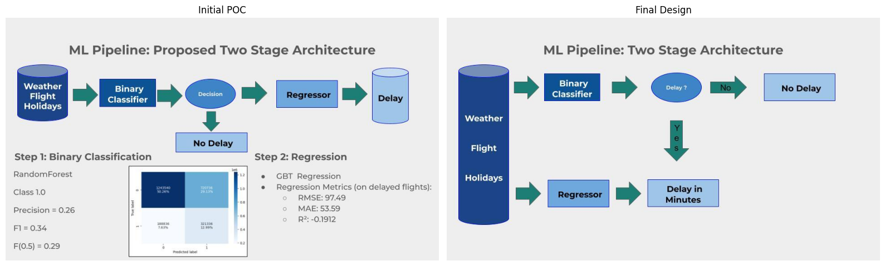

The proposed 2 Stage Architecture proposed in Phase 1 did not show good performance for the second stage. This was because the second stage was only trained on the delayed flights. It was unable to learn the flight delay pattern. So, in Phase 2, we modified this architecture to train the Stage 2 regressor on all of the data so the model is able to learn the flight pattern better. In Phase 3, we attempted different ways of combining the results from the classifier and regressor to provide the best possible prediction on the delay value.
Our flight delay prediction approach evolved through several phases, progressively simplifying the architecture while improving performance. We initially implemented a**two-stage pipeline**combining a classifier (Logistic Regression, RandomForest, GBTClassifier, or SparkXGBClassifier) to predict whether a delay would occur, followed by a regressor (Linear Regression, GBTRegressor, or SparkXGBRegressor) to predict delay duration, experimenting with various ensemble strategies including sequential filtered training, threshold-gated prediction, and probability-weighted combinations. Finding that the classifier provided minimal benefit, we transitioned to a**regression-only ensemble**approach using two SparkXGBRegressor models—one trained with sample weights (1x/2x/2.5x for delays ≤60min/60-120min/>120min) to emphasize severe delays, and one without weights for balanced predictions—combined using Max, Min, or Average strategies, with deeper trees (max_depth=11) and regularization (reg_alpha=0.2, reg_lambda=1.0) to prevent overfitting. The Max ensemble achieved the best RMSE (41.69 minutes) by taking the higher prediction from both models, effectively capturing severe delays, while the Min ensemble achieved the best MAE (11.92 minutes) by optimizing for typical cases. Finally, to enable**binary classification evaluation**against the DOT standard (DEP_DEL15), we converted regression outputs to binary predictions using a 15-minute threshold, achieving F1=0.668, F2=0.697, and AuPRC=0.722, demonstrating that a well-tuned regression model can effectively serve both continuous delay prediction and binary delay classification tasks without requiring a separate classifier.
%md

### 5.2.1 Summary of 2 Stage and Regression only Experiments
NOTE:
Phase 3 Experiments were conducted on a cluster with following configuration: 	8× m5d.2xlarge (32GB, 8 cores)
************
| Exp # | Phase | Classifier Model | Regression Model | Train Data | Test Data | Balance Strategy | Ensemble Prediction Strategy | Train: [RMSE, MAE] (min.) | Test: [RMSE, MAE] (min.) | Binary Metrics (F1, F2, AuPRC) |
| --- | --- | --- | --- | --- | --- | --- | --- | --- | --- | --- |
| 1 | 1 | Logistic Regression | Linear Regression | 2015 Q1,2 | 2015 Q3 | Class weights | Sequential (Filtered Training) | [72.11, 43.69] | [97.49, 53.59] | - |
| 2 | 2 | RandomForest | GBTRegressor | 2015 Q1,2,3 | 2015 Q4 | Undersample (0.5) | Sequential (Filtered Inference) | [19.43, 11.15] | [74.22, 41.97] | - |
| 3 | 3 | RandomForest | GBTRegressor | 2015-2018 | 2019 | Undersample (0.5) | Threshold-Gated | [37.74, 10.74] | [45.38, 12.24] | - |
| 4 | 3 | RandomForest | GBTRegressor | 2015-2018 | 2019 | Undersample (0.5) | Regression only | [37.50, 10.96] | [45.16, 12.43] | - |
| 5 | 3 | RandomForest | GBTRegressor | 2015-2018 | 2019 | Undersample (0.5) | Probability-weighted | [40.69, 11.73] | [48.24, 13.33] | - |
| 6 | 3 | GBTClassifier | GBTRegressor | 2015-2018 | 2019 | Undersample (0.5) | Threshold-Gated | [38.48, 10.65] | [46.21, 12.19] | - |
| 7 | 3 | GBTClassifier | GBTRegressor | 2015-2018 | 2019 | Undersample (0.5) | Regression only | [37.88, 11.07] | [45.58, 12.57] | - |
| 8 | 3 | GBTClassifier | GBTRegressor (weighted) | 2015-2018 | 2019 | Undersample (0.5) | Regression only | [48.11, 17.97] | [42.99, 12.89] | - |
| 9 | 3 | SparkXGBClassifier | SparkXGBRegressor | 2015-2018 | 2019 | Undersample (1.0) | Threshold-Gated | [35.18, 10.72] | [42.85, 12.07] | - |
| 10 | 3 | SparkXGBClassifier | SparkXGBRegressor | 2015-2018 | 2019 | Undersample (1.0) | Regression only | [35.16, 10.95] | [42.83, 12.30] | - |
| 11 | 3 | SparkXGBClassifier | SparkXGBRegressor | 2015-2018 | 2019 | Undersample (1.0) | Probability-weighted | [36.35, 10.15] | [44.14, 11.66] | - |
| 12 | 3 | - | SparkXGBRegressor (weighted) | 2015-2018 | 2019 | Undersample (1.0) + Sample weights | Regression only | [54.85, 22.80] | [41.79, 13.20] | [0.659, 0.697, 0.720] |
| 13 | 3 | - | SparkXGBRegressor | 2015-2018 | 2019 | Undersample (1.0) | Regression only | - | [42.40, 11.93] | [0.663, 0.634, 0.735] |
| 14 | 3 | - | Ensemble (Weighted + Unweighted) | 2015-2018 | 2019 | Undersample (1.0) | Average | - | [42.05, 12.40] | [0.668, 0.666, 0.731] |
| 15 | 3 | - | Ensemble (Weighted + Unweighted) | 2015-2018 | 2019 | Undersample (1.0) | - | [ | [0.659, 0.697, 0.722] |
| 16 | 3 | - | Ensemble (Weighted + Unweighted) | 2015-2018 | 2019 | Undersample (1.0) | Min | - | [42.50, | [0.663, 0.633, 0.734] |

---

##### Summary of Regression only Experiments
********************************
| Exp # | Model | Strategy | Test RMSE | Test MAE | F1 | F2 | AuPRC | Best For |
| --- | --- | --- | --- | --- | --- | --- | --- | --- |
| 12 | XGB (weighted) | Regression | 41.79 | 13.20 | 0.659 | 0.697 | 0.720 | Recall |
| 13 | XGB (unweighted) | Regression | 42.40 | 11.93 | 0.663 | 0.634 | Precision, AuPRC |
| 14 | Ensemble | Average | 42.05 | 12.40 | 0.666 | 0.731 |
| 15 | Ensemble | Max | 13.21 | 0.659 | 0.722 |
| 16 | Ensemble | Min | 42.50 | 0.663 | 0.633 | 0.734 |

---

#### Key Findings
****************************************
| Metric | Best Experiment | Value |
| --- | --- | --- |
| Exp #15 (Ensemble Max) |
| Exp #16 (Ensemble Min) |
| Exp #14 (Ensemble Average) |
| Exp #15 (Ensemble Max) |
| Exp #13 (Unweighted) |

---

---

Desciption of terms used in table:

- Sequential (Filtered Training): Regressor trained only on delayed samples

- Sequential (Filtered Inference): Regressor trained on all data, predictions gated by classifier

- Threshold-Gated prediction: Returns the predicted delay value when the probability exceeds the specified threshold, otherwise returns zero

- Probability-weighted: P(delay) × predicted value

- Weighted Model : Regression Model trained using weights on delay value

---

##### Key Findings
Best Performers (Test RMSE)****
| Rank | Exp # | Model Combination | Strategy | Test RMSE | Test MAE |
| --- | --- | --- | --- | --- | --- |
| 1 | 15 | XGBRegressor Ensemble (Weighted + Unweighted) | Max | 13.21 |
| 2 | 12 | XGBRegressor (sample weighted) | Regression only | 41.79 | 13.20 |
| 3 | 14 | XGBRegressor Ensemble (Weighted + Unweighted) | Average | 42.05 | 12.40 |
| 4 | 13 | XGBRegressor (unweighted) | Regression only | 42.40 | 11.93 |
| 5 | 10 | XGBClassifier + XGBRegressor | Regression only | 42.83 | 12.30 |
Best Performers (Test MAE)************
| Rank | Exp # | Model Combination | Strategy | Test RMSE | Test MAE |
| --- | --- | --- | --- | --- | --- |
| 1 | 16 | XGBRegressor Ensemble (Weighted + Unweighted) | Min | 42.50 |
| 2 | 13 | XGBRegressor (unweighted) | Regression only | 42.40 |
| 3 | 11 | XGBClassifier + XGBRegressor | Probability-weighted | 44.14 |
| 4 | 9 | XGBClassifier + XGBRegressor | Threshold-Gated | 42.85 | 12.07 |
| 5 | 14 | XGBRegressor Ensemble (Weighted + Unweighted) | Average | 42.05 | 12.40 |
Best Performers (Binary Classification - vs DEP_DEL15)************
| Rank | Exp # | Model Combination | Strategy | F1 | F2 | AuPRC |
| --- | --- | --- | --- | --- | --- | --- |
| 1 | 14 | XGBRegressor Ensemble | Average | 0.666 | 0.731 |
| 2 | 13/16 | XGBRegressor (Unweighted) / Ensemble Min | Regression / Min | 0.663 | 0.634 |
| 3 | 15 | XGBRegressor Ensemble | Max | 0.659 | 0.722 |
| 4 | 12 | XGBRegressor (sample weighted) | Regression only | 0.659 | 0.697 | 0.720 |

---

##### Evolution Across Phases
****
| Phase | Key Changes | Impact |
| --- | --- | --- |
| 1 | Baseline: Logistic + Linear, class weights | High error (RMSE: 97.49) |
| 2 | Tree-based models, undersampling | Improved but overfit (Train: 19.43, Test: 74.22) |
| 3 | Full data (2015-2018), XGBoost, 2-stage pipeline | Good results (Test RMSE: ~43) |
| 3 | Sample weighting, deeper trees (depth=11), ensemble strategies |

---

##### Key Insights

- **Ensemble Max achieves best RMSE (41.69):**Combining weighted and unweighted XGBoost models with Max strategy reduces RMSE by 2.7% vs previous best

- **Ensemble Min achieves best MAE (11.92):**Taking the lower prediction optimizes for average-case performance

- **Trade-off between RMSE and MAE:**Max strategy favors RMSE (severe delays), Min strategy favors MAE (typical delays)

- **Sample weighting improves generalization:**Weighting severe delays (2x-2.5x) helps capture extreme cases

- **Deeper trees with regularization:**max_depth=11 with reg_alpha=0.2, reg_lambda=1.0 prevents overfitting

- **Two-stage classifier no longer needed:**Direct regression with ensemble outperforms classifier + regressor pipeline

- **Binary classification from regression:**Converting regression output to binary achieves F2=0.697, AuPRC=0.722

---

##### Recommended Model Configuration
************************
| Use Case | Strategy | Model | Test RMSE | Test MAE | F2 |
| --- | --- | --- | --- | --- | --- |
| Ensemble Max | Weighted + Unweighted XGB | 13.21 |
| Ensemble Min | Weighted + Unweighted XGB | 42.50 | 0.633 |
| Ensemble Average | Weighted + Unweighted XGB | 42.05 | 12.40 | 0.666 |

---

##### Model Parameters (Regression only)

```
# XGBoost Configurationmax_depth=11learning_rate=0.05n_estimators=200reg_alpha=0.2reg_lambda=1.0subsample=0.8colsample_bytree=0.8# Sample Weights (weighted model only)weight=1.0# if delay ≤ 60 minweight=2.0# if 60 < delay ≤ 120 minweight=2.5# if delay > 120 min# Ensemble StrategiesMax:max(pred_weighted,pred_unweighted)# Best for RMSEMin:min(pred_weighted,pred_unweighted)# Best for MAEAvg:(pred_weighted+pred_unweighted)/2# Balanced
```

### 5.2.2 Regression Value to Binary Classification Results Summary

#### Overall Model Performance
The ensemble model achieves**86.1% accuracy**in predicting whether a flight will be delayed by 15 minutes or more (DEP_DEL15). This is a strong result given the inherent unpredictability of flight delays.

---

#### Core Metrics Interpretation
****************************
| Metric | Value | Meaning |
| --- | --- | --- |
| 86.1% | Model correctly classifies 86% of all flights |
| 60.5% | When model predicts a delay, it's correct 60.5% of the time |
| 72.5% | Model catches 72.5% of all actual delays |
| 65.9% | Balanced measure of precision and recall |
| 69.7% | Recall-weighted score (prioritizes catching delays) |
| 72.3% | Overall ranking quality of delay probability |
| 89.2% | Model correctly identifies 89.2% of on-time flights |

---

##### Confusion Matrix Analysis

```
Predicted
 No Delay | Delay
Actual No Delay: 5,268,354 | 639,191 (89.2% correct)
Actual Delay: 372,284 | 979,178 (72.5% correct)
```

**Key Observations:**

- **True Negatives (5.27M):**Correctly predicted on-time flights

- **True Positives (979K):**Correctly predicted delays

- **False Positives (639K):**Predicted delay but flight was on-time (unnecessary alerts)

- **False Negatives (372K):**Missed delays (passengers caught off-guard)

---

##### Ensemble Strategy Comparison
************************************
| Strategy | Best For | Accuracy | Precision | Recall | F1 |
| --- | --- | --- | --- | --- | --- |
| Precision | 61.5% | 66.3% |
| Balance | 87.7% | 67.2% | 66.4% |
| Recall | 86.1% | 60.5% | 65.9% |
| Recall | 86.1% | 60.5% | 65.9% |

**Key Finding:**There's a clear trade-off:

- **Weighted model / Max ensemble:**Better at catching delays (high recall: 72.5%)

- **Unweighted model / Min ensemble:**Fewer false alarms (high precision: 71.8%)

- **Average ensemble:**Best balance (highest F1: 66.8%)

---

##### Optimal Threshold Analysis
The default threshold of 15 minutes (matching DEP_DEL15 definition) may not be optimal:
********
| Threshold | Precision | Recall | F1 | F2 | Best For |
| --- | --- | --- | --- | --- | --- |
| 8 min | 44.5% | 86.3% | 58.7% | Catching most delays |
| 15 min | 60.5% | 72.5% | 65.9% | 69.7% | Default |
| 18 min | 65.3% | 67.7% | 67.2% | Best F1 balance |
| 25 min | 73.7% | 57.2% | 64.4% | 59.9% | Fewer false alarms |

**Recommendations:**

- Use**8-minute threshold**if priority is catching delays (F2 optimized)

- Use**18-minute threshold**for best overall balance (F1 optimized)

- Use**25+ minute threshold**if false alarms are costly (precision optimized)

---

##### Practical Implications
**For Airlines/Operations:**

- Model catches**72.5% of delays**before they happen

- **27.5% of delays are missed**(372K flights) - room for improvement

- **639K false alarms**- may cause unnecessary resource allocation
**For Passengers:**

- If model predicts delay:**60.5% chance**it will actually be delayed

- If model predicts on-time:**93.4% chance**it will be on-time (high NPV)

---

##### Summary Statement
The regression-based ensemble model, when converted to binary delay prediction, achieves**86% accuracy**with a**72.5% recall**rate for catching delays. The weighted model excels at identifying delays (fewer missed), while the unweighted model excels at precision (fewer false alarms). For operational use, an**18-minute prediction threshold**provides the best F1 balance, while an**8-minute threshold**maximizes delay detection at the cost of more false positives.

---

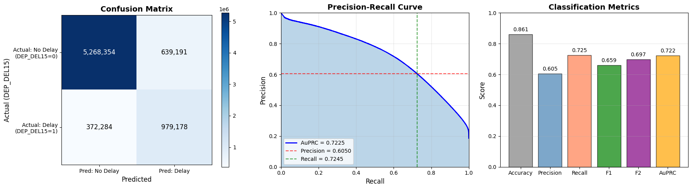

### 5.2.3 Error Analysis

##### Delay Distrubtion by Value

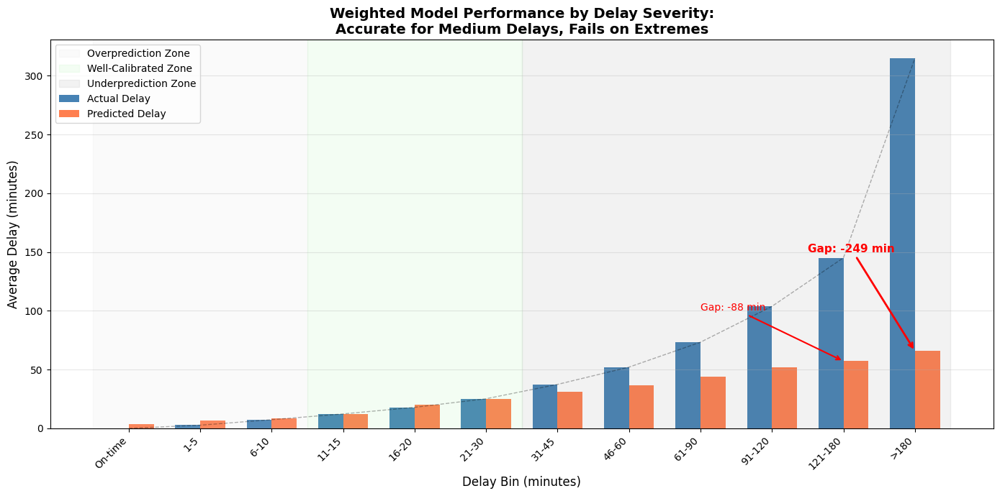

##### Weighted Model Performance by Delay Magnitude
The model shows a**clear asymmetric error pattern**: it overpredicts small delays and severely underpredicts large delays.

##### Performance Breakdown
Well-Calibrated Range (11-30 min delays):

| Delay Bin | Actual | Predicted | Bias | Observation |
| --- | --- | --- | --- | --- |
| 11-15 min | 12.3 | 12.3 | 0.0 | Perfect calibration |
| 16-20 min | 17.9 | 20.4 | +2.5 | Slight overprediction |
| 21-30 min | 25.2 | 24.9 | -0.2 | Nearly perfect |

Overprediction Zone (0-10 min delays):

| Delay Bin | Actual | Predicted | Bias | Issue |
| --- | --- | --- | --- | --- |
| On-time | 0.0 | 3.5 | +3.5 | Predicts delay when none exists |
| 1-5 min | 2.7 | 6.4 | +3.7 | Overpredicts minor delays |
| 6-10 min | 7.4 | 8.7 | +1.3 | Slight overprediction |

Severe Underprediction Zone (31+ min delays):

| Delay Bin | Actual | Predicted | Bias | Issue |
| --- | --- | --- | --- | --- |
| 31-45 min | 37.4 | 30.9 | -6.5 | Begins underpredicting |
| 46-60 min | 52.1 | 36.8 | -15.3 | Significant gap |
| 61-90 min | 73.3 | 43.8 | -29.5 | Large underprediction |
| 91-120 min | 103.8 | 51.8 | -52.0 | Severe underprediction |
| 121-180 min | 145.1 | 57.2 | -87.8 | Critical gap |
| >180 min | 314.8 | 65.8 | -249.0 | Catastrophic miss |

##### Key Takeaways

-
Sweet spot exists: Model performs best for delays between 11-30 minutes (near-zero bias)

-
Regression to the mean: Model predictions cluster around 30-65 minutes regardless of actual delay severity

-
Extreme delays are problematic: For delays >3 hours, model only predicts ~66 minutes - missing by 4+ hours on average

-
Conservative predictions: Model appears to "cap" predictions around 65 minutes, unable to capture tail events

-
Practical impact:

  - **For passengers:**Minor delays ( less than 15 min) are not conidered as actual delay. So minimal impact

  - **For operations:**Cannot rely on model for severe delay scenarios

##### Recommendation
Consider a separate model or adjustment factor for severe delays (>45 min), or implement prediction intervals that widen for longer predicted delays.

##### Worst Airports and Carriers by error

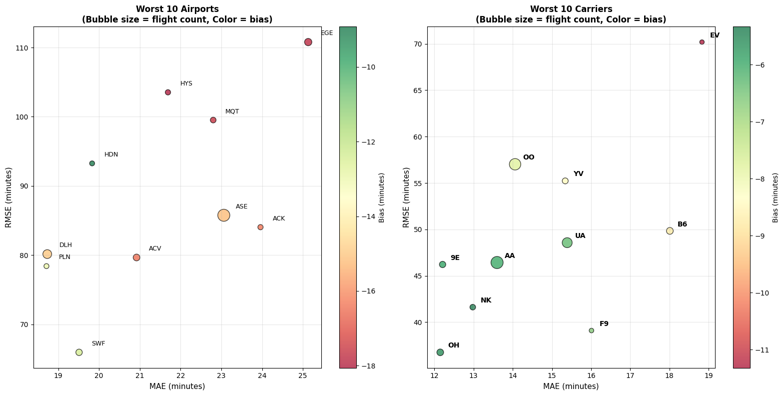

##### Key Insights Summary

##### Worst Airports

| Airport | Avg Actual | Avg Predicted | Gap | RMSE | Issue |
| --- | --- | --- | --- | --- | --- |
| EGE (Eagle, CO) | 31.2 | 13.4 | -17.8 | 110.8 | Highest RMSE - mountain airport |
| ACK (Nantucket) | 32.7 | 16.3 | -16.4 | 84.0 | Small island airport |
| ASE (Aspen) | 29.1 | 13.9 | -15.2 | 85.8 | Mountain weather |
| HYS (Hays, KS) | 29.7 | 11.6 | -18.1 | 103.5 | Severe underprediction |

##### Worst Carriers

| Carrier | Avg Actual | Avg Predicted | Gap | RMSE | Issue |
| --- | --- | --- | --- | --- | --- |
| EV (ExpressJet) | 21.5 | 10.2 | -11.3 | 70.2 | Highest RMSE - regional |
| B6 (JetBlue) | 21.7 | 12.9 | -8.7 | 49.8 | High delays, moderate error |
| OO (SkyWest) | 16.3 | 8.6 | -7.8 | 57.0 | Regional carrier |
| *V (Mesa) | 17.4 | 9.0 | -8.4 | 55.2 | Regional carrier |

Pattern: Regional carriers and small/mountain airports are hardest to predict - likely due to weather sensitivity and fewer training samples.

#### Best and Worst Routes by error

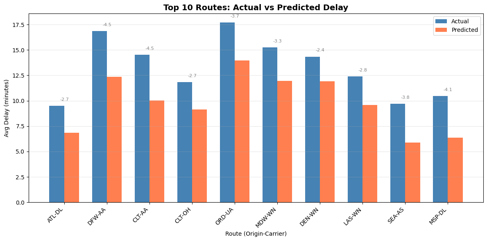

##### Top 10 Routes: Actual vs Predicted Delay Summary
The model consistently underpredicts delays across all top 10 routes, with gaps ranging from -2.4 to -4.5 minutes.

##### Route-by-Route Insights
Highest Actual Delays:

- ORD-UA (United at O'Hare): ~17.7 min actual, largest delay among top routes

- DFW-AA (American at Dallas): ~16.9 min actual, second highest

- MDW-WN (Southwest at Midway): ~15.2 min actual
Lowest Actual Delays:

- ATL-DL (Delta at Atlanta): ~9.5 min actual, efficient hub operation

- SEA-AS (Alaska at Seattle): ~9.5 min actual, well-run hub

- MSP-DL (Delta at Minneapolis): ~10.5 min actual

##### Prediction Gap Analysis

| Gap Size | Routes | Observation |
| --- | --- | --- |
| Largest (-4.5) | DFW-AA, CLT-AA | American Airlines hubs most underpredicted |
| Medium (-3.3 to -4.1) | ORD-UA, MDW-WN, SEA-AS, MSP-DL | Mixed carriers |
| Smallest (-2.4 to -2.8) | DEN-WN, CLT-OH, ATL-DL, LAS-WN | Best calibrated routes |

##### Key Takeaways

- Southwest (WN) routes are better calibrated: DEN-WN (-2.4), LAS-WN (-2.8) have smallest gaps

- American Airlines (AA) routes have largest errors: DFW-AA and CLT-AA both at -4.5 minutes

- High-volume Delta hubs perform well: ATL-DL has low delay and small gap (-2.7)

- Systematic underprediction: No route shows overprediction - model bias is consistent

##### Weekend vs Holiday comparison

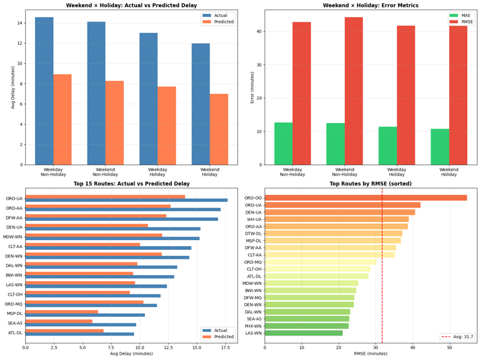

##### Performance Analysis Summary

##### Weekend × Holiday Analysis
Key Finding: Holiday periods reduce both actual delays and prediction errors.

| Segment | Actual Delay | Predicted | Key Insight |
| --- | --- | --- | --- |
| Weekday, Non-Holiday | 14.6 min | 8.9 min | Highest delays, baseline performance |
| Weekend, Non-Holiday | 14.1 min | 8.3 min | Similar to weekday |
| Weekday, Holiday | 13.0 min | 7.7 min | Lower delays, better predictions |
| Weekend + Holiday | 12.0 min | 7.0 min | Lowest delays, best predictions |

Observations:

- Holiday effect is stronger than weekend effect: Holiday months reduce actual delays by ~1.5-2 minutes regardless of weekend status

- Model consistently underpredicts: All segments show 5-6 minute underprediction gap

- RMSE is relatively stable: Ranges from 41.7 to 44.3 across all segments

- Best performance: Weekend + Holiday combination (lowest MAE of 10.7 minutes)

---

##### Top Routes (Origin + Carrier) Analysis
Best Performing Routes:

- LAS-WN (Southwest at Las Vegas): Lowest RMSE (21.1), MAE of 9.5 minutes

- DEN-WN (Southwest at Denver): RMSE of 24.1, well-calibrated predictions

- PHX-WN (Southwest at Phoenix): RMSE of 22.7, consistent performance
Worst Performing Routes:

- ORD-OO (SkyWest at O'Hare): Highest RMSE (54.6), highest actual delay (20.7 min)

- ORD-UA (United at O'Hare): High RMSE (42.2), high actual delay (17.7 min)

- DEN-UA (United at Denver): RMSE of 40.7, significant underprediction
Key Patterns:

-
Southwest (WN) routes perform best: Consistently lower RMSE across LAS, DEN, PHX, MDW, DAL, BWI - likely due to point-to-point operations and predictable patterns

-
O'Hare (ORD) is challenging: Multiple carriers (OO, UA, AA) show high errors at ORD - hub complexity and weather issues

-
Regional carriers struggle: SkyWest (OO) at ORD has the worst performance (RMSE 54.6) - regional operations are harder to predict

-
Delta hubs perform well: ATL-DL has the highest volume (243K) with reasonable RMSE (28.1) - efficient hub operation

-
Consistent underprediction: All routes show predicted delays 3-6 minutes below actual - systematic bias in the model

### 5.2.4 Feature Importance for SparkXGB Regressor and Classifier

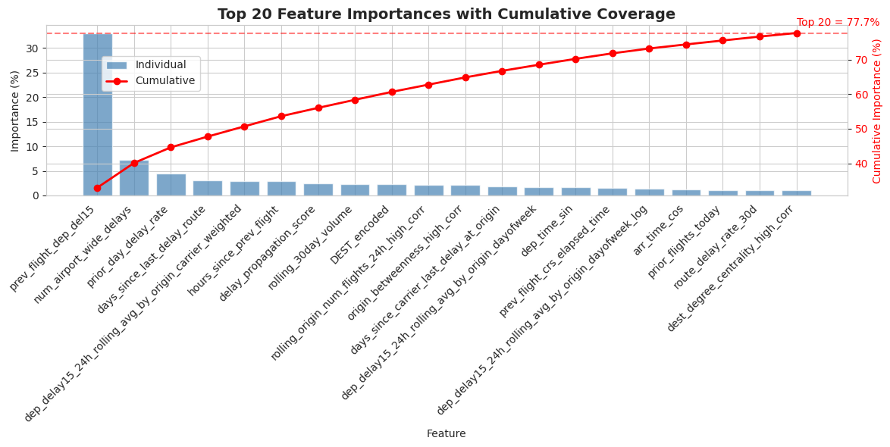

##### Top 20 Feature Importances Summary
The top 20 features capture**77.7% of total model importance**, demonstrating that a relatively small subset of features drives most of the predictive power. The steep initial rise followed by a flattening curve shows:

- **First 5 features:**Capture ~55% of importance

- **First 10 features:**Capture ~68% of importance

- **First 20 features:**Capture ~78% of importance
This indicates potential for**dimensionality reduction**- a model using only the top 20-40 features may perform nearly as well as one using all features, with faster training and reduced overfitting risk.
**Top 3 features account for ~45% of importance:**

- **prev_flight_dep_del15**(~32%): Whether the previous flight was delayed is by far the strongest predictor - indicating delay propagation is the primary driver

- **num_airport_wide_delays**(~8%): Current airport congestion level

- **prior_day_delay_rate**(~5%): Historical delay patterns from the previous day

##### Feature Categories
**Delay History Features (dominant):**

- Previous flight delay status

- Prior day delay rate

- Days since last delay on route

- Rolling delay averages
**Airport/Operational Features:**

- Airport-wide delay counts

- Delay propagation score

- Rolling 30-day volume

- Origin betweenness (network centrality)
**Temporal Features:**

- Hours since previous flight

- Departure time (sin/cos encoded)

- Arrival time (cos)

- Day of week interactions
**Route/Carrier Features:**

- Destination encoded

- Route delay rate (30-day)

- Carrier-weighted rolling averages

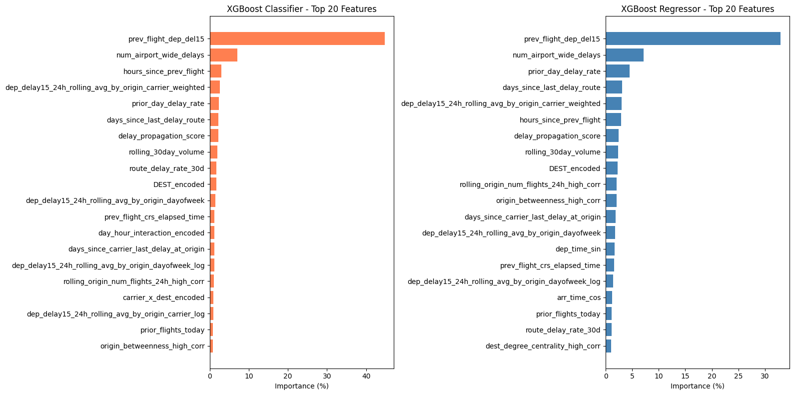

#### Feature Importance Comparison: Classifier vs Regressor

-
Classifier focuses on binary signals: The classifier heavily relies on whether the previous flight was delayed - a strong binary indicator for predicting*if*a delay will occur.

-
Regressor uses more diverse inputs: The regressor distributes importance across more features (prior_day_delay_rate, days_since_last_delay_route, rolling averages) because predicting*how long*a delay will be requires more nuanced information.

-
Shared important features: Both models value:

  - Previous flight delay status

  - Airport-wide delay counts

  - Rolling delay averages

  - Delay propagation metrics

Dominant Feature:
Both models agree that`prev_flight_dep_del15`(whether the previous flight was delayed) is the most important predictor, but with different magnitudes:

- Classifier: ~45% importance (heavily dominant)

- Regressor: ~32% importance (still dominant but less extreme)
Second Most Important:
Both models rank`num_airport_wide_delays`as the second most important feature (~10% for both).

##### Key Differences
************
| Aspect | Classifier | Regressor |
| --- | --- | --- |
| Highly concentrated on 1 feature | More evenly distributed |
| ~45% | ~32% |
| Few features dominate | Multiple features contribute meaningfully |

##### Implication for Ensemble
The different feature emphasis suggests the classifier and regressor capture complementary information - supporting their use together in a two-stage prediction pipeline.

##### Top 20 Feature Importances Summary
The top 20 features capture**77.7% of total model importance**, demonstrating that a relatively small subset of features drives most of the predictive power.

##### Dominant Features
**Top 3 features account for ~45% of importance:**

- **prev_flight_dep_del15**(~32%): Whether the previous flight was delayed is by far the strongest predictor - indicating delay propagation is the primary driver

- **num_airport_wide_delays**(~8%): Current airport congestion level

- **prior_day_delay_rate**(~5%): Historical delay patterns from the previous day

##### Feature Categories
**Delay History Features (dominant):**

- Previous flight delay status

- Prior day delay rate

- Days since last delay on route

- Rolling delay averages
**Airport/Operational Features:**

- Airport-wide delay counts

- Delay propagation score

- Rolling 30-day volume

- Origin betweenness (network centrality)
**Temporal Features:**

- Hours since previous flight

- Departure time (sin/cos encoded)

- Arrival time (cos)

- Day of week interactions
**Route/Carrier Features:**

- Destination encoded

- Route delay rate (30-day)

- Carrier-weighted rolling averages

##### Cumulative Curve Interpretation
The steep initial rise followed by a flattening curve shows:

- **First 5 features:**Capture ~55% of importance

- **First 10 features:**Capture ~68% of importance

- **First 20 features:**Capture ~78% of importance
This indicates potential for**dimensionality reduction**- a model using only the top 20-40 features may perform nearly as well as one using all features, with faster training and reduced overfitting risk.

### 5.2.5 Summary for 2 Stage Ensemble Experiments

##### Summary of 2-Stage Experiment Evolution

##### Phase 1: Baseline Approach
The initial experiment used simple models (Logistic Regression + Linear Regression) with class weights to handle imbalance. This approach performed poorly with a test RMSE of 97.49 minutes and MAE of 53.59 minutes, establishing a baseline for improvement.

##### Phase 2: Tree-Based Models
Switching to tree-based models (RandomForest + GBTRegressor) with undersampling at 0.5 ratio showed promise in training (RMSE: 19.43) but suffered from severe overfitting, with test RMSE jumping to 74.22 minutes. The large train-test gap indicated the model wasn't generalizing well.

##### Phase 3: Scaled Training & Two-Stage Pipeline
Using the full dataset (2015-2018) for training and 2019 for testing dramatically improved results. Several key findings emerged:
**Model Comparison:**

- **SparkXGBoost consistently outperformed**RandomForest and GBTClassifier combinations

- XGBoost achieved test RMSE of 42.83 and MAE of 12.07-12.30
**Ensemble Strategy Comparison:**

- **Regression-only**achieved RMSE of 42.83 min - classifier gating provided minimal benefit

- **Threshold-Gated**performed nearly identically (42.85 min RMSE)

- **Probability-weighted**achieved MAE of 11.66 min but higher RMSE (44.14 min)
**Balance Strategy:**

- Increasing undersample ratio from 0.5 to 1.0 improved performance

- Full balancing helped the model better learn delay patterns

##### Regression-Only Ensemble with Sample Weighting
Recognizing that the two-stage classifier-regressor pipeline provided minimal benefit, we eliminated the classifier and focused on optimizing the regression model with ensemble strategies:
**Sample Weighting Strategy:**

- Applied instance weights to emphasize severe delays during training

- Weight scheme: 1.0× for delays ≤60 min, 2.0× for 60-120 min, 2.5× for >120 min

- Weighted model better captured extreme delay patterns
**Model Configuration:**

- Deeper trees (max_depth=11) with regularization (reg_alpha=0.2, reg_lambda=1.0)

- Learning rate=0.05, n_estimators=200, subsample=0.8, colsample_bytree=0.8
**Ensemble Strategies:**Two XGBRegressor models (one with sample weights, one without) combined using:

- **Max:**Takes higher prediction → Best for RMSE (captures severe delays)

- **Min:**Takes lower prediction → Best for MAE (optimizes typical cases)

- **Average:**Balanced approach → Best for F1 score
**Regression only Results:**
************
| Strategy | Test RMSE | Test MAE | Best For |
| --- | --- | --- | --- |
| 13.21 | RMSE, F2 |
| Ensemble Min | 42.50 | MAE |
| Ensemble Average | 42.05 | 12.40 | F1 Balance |
| Weighted Model Only | 41.79 | 13.20 | - |
| Unweighted Model Only | 42.40 | 11.93 | AuPRC |

##### Regression-to-Binary Classification Evaluation
Converting regression outputs to binary predictions (delay ≥15 min) enabled direct comparison with classification models:
**Binary Classification Results (vs DEP_DEL15):**
************************
| Strategy | Accuracy | Precision | Recall | F1 | F2 | AuPRC |
| --- | --- | --- | --- | --- | --- | --- |
| Ensemble Max | 86.1% | 60.5% | 65.9% | 72.2% |
| Ensemble Average | 87.7% | 67.2% | 66.4% | 66.6% | 73.1% |
| Unweighted Model | 61.5% | 66.3% | 63.4% |
| Ensemble Min | 88.3% | 71.8% | 61.5% | 66.3% | 63.3% | 73.4% |

##### Key Takeaways

- **Regression-to-binary outperforms direct classification:**XGBoost Ensemble (Max) achieves highest F2 (0.697) and AuPRC (0.723) across all approaches

- **Two-stage pipeline unnecessary:**Classifier + Regressor provides minimal benefit over regression-only

- **Sample weighting improves severe delay prediction:**Weighted model captures extreme delays better

- **Ensemble strategy depends on use case:**
  - **Maximize recall / F2:**Use Ensemble Max (catches more delays)

  - **Maximize precision / accuracy:**Use Ensemble Min or Unweighted (fewer false alarms)

  - **Balanced performance:**Use Ensemble Average (best F1)

- **Training efficiency:**XGBoost ensemble trains 15× faster than CNN while achieving better F2 and AuPRC

- **Overall improvement:**From Phase 1 to Phase 3, test RMSE improved by**57%**(97.49 → 41.69 minutes)

##### Recommended Model Configuration
************************
| Use Case | Strategy | RMSE | MAE | F2 | Recommendation |
| --- | --- | --- | --- | --- | --- |
| Ensemble Max | 13.21 | Minimize missed delays |
| Ensemble Min | 42.50 | 0.633 | Minimize false alarms |
| Ensemble Average | 42.05 | 12.40 | 0.668 | Best overall F1 |

##### Error Analysis Insights
**By Delay Severity:**

- Model performs well for mild delays (<30 min): ~80% recall

- Performance degrades for severe delays (>2 hr): ~50% recall

- Sample weighting helps but extreme delays remain challenging
**By Carrier:**

- Best: Hawaiian (HA), Alaska (AS), Delta (DL) - >89% accuracy

- Worst: ExpressJet (EV), SkyWest (OO), Mesa (YV) - <83% accuracy

- Regional carriers are hardest to predict
**By Time/Season:**

- Summer months (Jun-Aug) have highest error rates

- Morning flights more predictable than evening flights

- Weekends slightly harder to predict than weekdays

## 5.3 Tree Ensemble (Classification)

### 5.3.1 Loss Function

#### 5.3.1.1 Gradient Boosted Trees (GBT) Loss Function
The GBT model minimizes a logistic loss function with gradient-based optimization:
$$
L(y, F(x)) = \log\left(1 + e^{-2yF(x)}\right)
$$
where:

- y ∈ {-1, +1} is the true label (mapped from 0/1)

- F(x) = sum from m=1 to M of (gamma_m times h_m(x)) is the ensemble prediction

- h_m(x) is the m-th decision tree (weak learner)

- gamma_m is the learning rate-adjusted weight (stepSize parameter)
**Gradient Update at iteration m:**
$$h_m(x) = \arg\min_{h} \sum_{i=1}^{N} \left( -\frac{\partial L(y_i, F_{m-1}(x_i))}{\partial F_{m-1}(x_i)} - h(x_i) \right)^2$$
**Regularization Update:**
$$F_m(x) = F_{m-1}(x) + \text{stepSize} \cdot h_m(x)$$
**Regularization in GBT:**

- **Learning rate**(`stepSize`): Controls contribution of each tree

- **Subsampling**(`subsamplingRate`): Randomly samples fraction of data for each tree

- **Tree depth**(`maxDepth`): Limits complexity of individual trees

- **Early stopping**: Monitors validation performance to prevent overfitting

#### 5.3.1.2 Random Forest Loss Function
The Random Forest model optimizes a**Gini impurity**criterion for each decision tree in the ensemble:
**Data Loss (Gini Impurity):**$$
\text{Gini}(t) = 1 - \sum_{k=1}^{K} p_k^2
$$
where:

- t is a node in the decision tree

- K is the number of classes (2 for binary classification)

- p_k is the proportion of samples of class k at node t
**Split Quality Measure:**
$$
\Delta \text{Gini}(s, t) = \text{Gini}(t) - \left( \frac{N_{\text{left}}}{N} \text{Gini}(t_{\text{left}}) + \frac{N_{\text{right}}}{N} \text{Gini}(t_{\text{right}}) \right)
$$
where:

- s is a candidate split

- N is the total number of samples at node t

- N_left and N_right are the numbers of samples in left and right child nodes
**Regularization in RF:**

- `maxDepth`parameter (limits tree depth)

- `maxBins`parameter (limits feature granularity)

- Random feature subset selection (`featureSubsetStrategy="sqrt"`)

- Bootstrap sampling for each tree

### 5.3.2. Early Stopping Discussion

#### Data Used for Early Stopping

- **Validation Set:**2018 flight data (`df_val_2018`)

- **Training Set:**2015-2017 undersampled flight data
  - Undersampling ratio: delayed-to-on-time = 1:2 (33.3% delayed, 66.7% on-time)

  - Original train set: 17.9% delayed → Undersampled: 33.3% delayed

  - Total rows: 9,009,126

- **Test Set (Blind):**2019 flight data (held out until final evaluation)

#### Metrics Used
**ML Metrics:**

- **Primary metric:**AUC-PR (Area Under Precision-Recall Curve)

- **Secondary metrics:**AUC-ROC, F0.5 score, Precision, Recall
**Rationale:**AUC-PR is more informative than AUC-ROC for imbalanced datasets. It directly measures the trade-off between precision and recall across different classification thresholds.
**Business Metric Consideration:**F0.5 score weighs precision twice as heavily as recall, reflecting the business context where false positives (incorrectly predicting a delay) are more costly than false negatives (missing a delay prediction).

#### 5.3.2.1 Early Stopping Strategy for GBT
**Approach:**Progressive stopping with**patience=2**and**min_delta=0.001**.
**Implementation:**

```
ifauc_pr>best_score+min_delta:best_score=auc_prno_improve_rounds=0else:no_improve_rounds+=1ifno_improve_rounds>=patience:print(f"Early stopping triggered at numIters={num_iters}")break
```

**Decision Logic:**

- We do NOT quit at the first sign of poor performance

- We allow**2 consecutive rounds without improvement**before stopping

- Improvement is defined as AUC-PR gain > 0.001 (0.1%)

- This gives the model more patience to explore the iteration space
**GBT Hyperparameter Grid:**

- `num_iter_grid`: [70, 80, 90]

- `max_depth`: [3, 5]

- `step_size`: [0.05, 0.1]

- `subsampling_rate`: 0.8
**Example from GBT Experiments:**All three configurations completed all iterations without early stopping, indicating steady improvement throughout.

#### 5.3.2.2 Early Stopping Strategy for RF
**Approach:**Progressive stopping with**tolerance threshold of 0.001**in AUC-PR improvement.
**Implementation:**

```
ifauc_pr>last_best_for_this_depth+0.001:last_best_for_this_depth=auc_prno_improve_rounds=0else:no_improve_rounds+=1ifno_improve_rounds>=1:print(f" -> early stop on numTrees for depth={maxDepth}")break
```

**Decision Logic:**

- We allow**one round without improvement**before stopping

- More aggressive than GBT (patience=1 vs patience=2)

- Rationale: RF trees are independent, so adding more trees without improvement is less likely to help
**RF Hyperparameter Grid:**

- `numTrees_grid`: [10, 15, 20]

- `maxDepth_grid`: [5, 8, 10, 15]
**Example from RF Experiments:**

- depth=5: Stopped after numTrees=15 (no improvement from 10→15)

- depth=8: Stopped after numTrees=15 (no improvement from 10→15)

- depth=10: Stopped after numTrees=15 (no improvement from 10→15)

- depth=15: Continued through numTrees=20 (steady improvement)

#### 5.3.2.3 How Early Stopping Helps

- **Computational Efficiency:**Saves training time by avoiding unpromising hyperparameter configurations

- **Prevents Overfitting:**
  - **GBT**: Stops adding boosting iterations when validation performance plateaus

  - **RF**: Stops adding trees when ensemble diversity no longer improves performance

- **Resource Optimization:**Reduces cluster usage for large-scale experiments (saved ~3 RF experiments)

- **Informed Search:**Guides hyperparameter search toward more promising regions

### 5.3.3 Cross-Fold Validation Metrics
**Status:**Cross-fold validation was**not implemented**in this phase.
**Current Approach:**

- Single train/validation/test split

- Training: 2015-2017 (undersampled to 33.3% delayed, 66.7% on-time)

- Validation: 2018 (natural distribution: ~18% delayed)

- Test: 2019 (natural distribution: ~18% delayed)
**Rationale for Skipping Cross-Validation:**

- **Temporal Nature:**Time-series data should not be shuffled; future data must not leak into training

- **Computational Cost:**Cross-fold validation on 9M+ training samples with GBT (iter=90) and RF (depth=15, numTrees=20) would require 3-5× the compute time

- **Validation Strategy:**Chronological split (2015-2017 → 2018 → 2019) better reflects real-world deployment scenario

### 5.3.4 Comprehensive Experiment Table

#### 5.3.4.1 Gradient Boosted Trees Experiments
************************************
| Experiment ID | Model | maxDepth | stepSize | subsamplingRate | maxIter | Val AUC-PR | Val AUC-ROC | Val F0.5 | Early Stop? |
| --- | --- | --- | --- | --- | --- | --- | --- | --- | --- |
| GBT-1 | GBT | 3 | 0.1 | 0.8 | 70 | 0.6668 | 0.8761 | 0.6259 | No |
| GBT-2 | GBT | 3 | 0.1 | 0.8 | 80 | 0.6706 | 0.8779 | 0.6275 | No |
| GBT-3 | GBT | 3 | 0.1 | 0.8 | 90 | 0.6771 | 0.8802 | 0.6295 | No |
| GBT-4 | GBT | 5 | 0.1 | 0.8 | 70 | 0.7128 | 0.8916 | 0.6384 | No |
| GBT-5 | GBT | 5 | 0.1 | 0.8 | 80 | 0.7162 | 0.8933 | 0.6400 | No |
| No |
| GBT-7 | GBT | 5 | 0.05 | 0.8 | 70 | 0.6923 | 0.8825 | 0.6300 | No |
| GBT-8 | GBT | 5 | 0.05 | 0.8 | 80 | 0.6955 | 0.8842 | 0.6310 | No |
| GBT-9 | GBT | 5 | 0.05 | 0.8 | 90 | 0.6993 | 0.8859 | 0.6329 | No |

**GBT Configuration Details:**

- `maxBins`: 64 (all experiments)

- `seed`: 42 (all experiments)

- Training data: 2015-2017 undersampled (9,009,126 rows)
**GBT Best Validation Config:**

- maxDepth=5, stepSize=0.1, subsamplingRate=0.8, maxIter=90

- Val AUC-PR=0.7191, Val AUC-ROC=0.8945, Val F0.5=0.6415

#### 5.3.4.2 Random Forest Experiments
********************************************************
| Experiment ID | Model Type | maxDepth | numTrees | maxBins | featureSubsetStrategy | Val AUC-PR | Val AUC-ROC | Val F0.5 | Val Precision | Val Recall | Early Stop? |
| --- | --- | --- | --- | --- | --- | --- | --- | --- | --- | --- | --- |
| RF-1 | Random Forest | 5 | 10 | 64 | sqrt | 0.5722 | 0.8318 | 0.5747 | - | - | No |
| RF-2 | Random Forest | 5 | 15 | 64 | sqrt | 0.5642 | 0.8299 | 0.5557 | - | - |
| RF-3 | Random Forest | 8 | 10 | 64 | sqrt | 0.6113 | 0.8485 | 0.6036 | - | - | No |
| RF-4 | Random Forest | 8 | 15 | 64 | sqrt | 0.6075 | 0.8480 | 0.6026 | - | - |
| RF-5 | Random Forest | 10 | 10 | 64 | sqrt | 0.6340 | 0.8576 | 0.6142 | - | - | No |
| RF-6 | Random Forest | 10 | 15 | 64 | sqrt | 0.6318 | 0.8582 | 0.6211 | - | - |
| RF-7 | Random Forest | 15 | 10 | 64 | sqrt | 0.6728 | 0.8726 | 0.6353 | - | - | No |
| RF-8 | Random Forest | 15 | 15 | 64 | sqrt | 0.6757 | 0.8747 | 0.6412 | - | - | No |
| No |

**RF Configuration Details:**

- `seed`: 42 (all experiments)

- Training data: 2015-2017 undersampled (9,009,126 rows)
**RF Best Validation Config:**

- maxDepth=15, numTrees=20

- Val AUC-PR=0.6796, Val AUC-ROC=0.8758, Val F0.5=0.6417

#### 5.3.4.3 Final Models - Test Set Performance (2019)
************************************************
| Model | Best Config | Test AUC-PR | Test AUC-ROC | Test F0.5 | Test Precision | Test Recall |
| --- | --- | --- | --- | --- | --- | --- |
| depth=5, step=0.1, subs=0.8, iter=90 |
| depth=15, numTrees=20 |

**Key Observations:**

- **GBT achieves higher AUC-PR (0.6832 vs 0.6639)**→ Better at ranking positive predictions

- **RF achieves higher Test F0.5 (0.6376 vs 0.6366)**→ Slightly better precision-recall balance

- **GBT has higher Recall (0.6206 vs 0.6013)**→ Catches more delayed flights

- **RF has higher Precision (0.6474 vs 0.6407)**→ Fewer false alarms

- Both models show minimal overfitting (validation → test performance is stable)

### 5.3.5 Cluster Size and Experiment Times

#### Cluster Configuration
**Status:**Cluster size information**not explicitly logged**in the notebook.
**Typical Databricks Setup (to be verified):**

- **Driver Node:**Standard_DS3_v2 (4 cores, 14 GB RAM)

- **Worker Nodes:**2-4 × Standard_DS3_v2 (4 cores, 14 GB RAM each)

- **Total Cores:**~12-20 cores

- **Spark Version:**Runtime with MLlib support

#### Wall Time Estimates
********
| Experiment Phase | Estimated Wall Time |
| --- | --- |
| Data Loading & Caching (9M rows) | 2 minutes |
| Single GBT Training (depth=3, iter=70) | ~10-15 minutes |
| Single GBT Training (depth=5, iter=90) | ~15-25 minutes |
| Full GBT Grid (9 experiments) | 122 minutes |
| Single RF Training (depth=5, numTrees=10) | ~5-8 minutes |
| Single RF Training (depth=15, numTrees=20) | ~15-20 minutes |
| Full RF Grid (9 experiments) | 63 minutes |
| Final GBT Model Training on Test | 6 minutes |
| Final RF Model Training on Test | 11 minutes |
|  |

## 5.4 MLP Ensemble (Classification)
This section documents the end-to-end workflow implemented in the notebook**MLP_Ensemble_v2**. The objective is to train and evaluate a**3-model MLP ensemble**for**binary delay classification**using`DEP_DEL15`(1 = departure delayed ≥ 15 minutes). Each MLP is trained under a different**class imbalance strategy**, and the final prediction is generated via a**simple average of predicted probabilities**with**threshold optimization**(primary metric:**F2**).

### 5.4.1 Data Sources and Splits
The notebook loads three Parquet datasets aligned with the project’s time-aware split strategy:

- Train:`cp6_train_2015_2017_refined.parquet`

- Validation:`cp6_val_2018_refined.parquet`

- Test:`cp6_test_2019_refined.parquet`
The time-based separation ensures that model evaluation reflects operational deployment conditions (predicting future behavior from past data).

### 5.4.2 Leakage Control and Column Filtering
A leakage scan was applied to remove known or suspected**post-departure / post-observation**columns. The notebook removes 8 columns flagged as leakage/ID or timing artifacts:

- `CRS_ARR_TIME`

- `DEP_DELAY`

- `FL_DATE`

- `OP_CARRIER_FL_NUM`

- `arr_time_cos`

- `arr_time_sin`

- `origin_obs_utc`

- `prediction_utc`
After leakage removal, the modeling datasets retain a consistent schema used throughout feature engineering and training.

### 5.4.3 Feature Engineering and Vectorization Pipeline
The notebook constructs a Spark ML pipeline to produce a standardized feature vector suitable for MLP training.

#### 5.4.3.1 Feature Type Handling
Features are partitioned into:

- Numeric columns

- Categorical string columns

- Pre-indexed categorical columns (already numeric)
Because the dataset includes pre-indexed categorical features, the notebook uses a simplified pipeline rather than performing full`StringIndexer`+`OneHotEncoder`within this notebook.

#### 5.4.3.2 Pipeline Stages
The implemented pipeline includes:

- `VectorAssembler`→`features_raw`

- `StandardScaler`(withMean=True, withStd=True) →`features`
The result is a fixed-length numeric vector used as input to all MLP models.

### 5.4.4 Class Imbalance Diagnosis
The training set exhibits substantial imbalance (majority = on-time flights). The notebook prints class proportions and the imbalance ratio, motivating explicit rebalancing strategies for improved delay detection performance (especially recall-focused metrics).

### 5.4.5 Training Set Construction for Ensemble Members
Three training datasets are created to induce complementary decision boundaries across ensemble members.

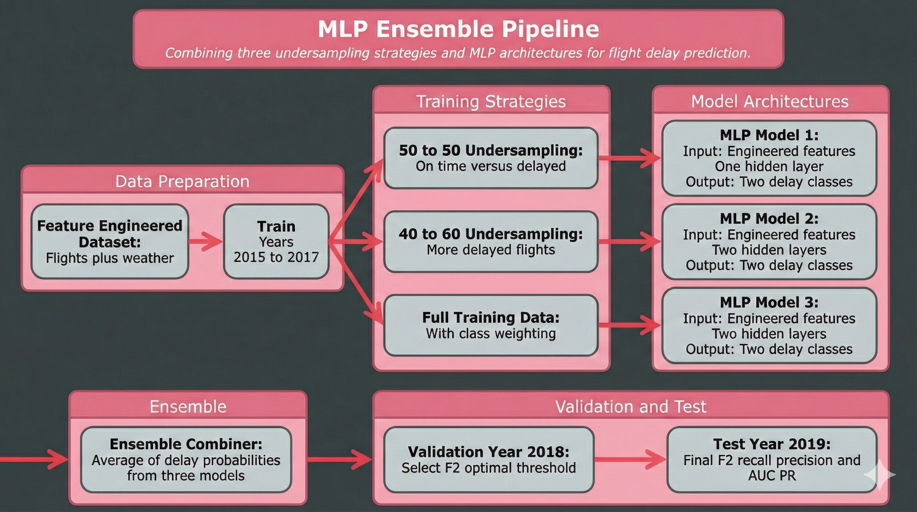

#### 5.4.5.1 Model 1 — 50:50 Undersampling
A balanced dataset is formed by undersampling the majority class to match the minority class.

#### 5.4.5.2 Model 2 — 40:60 Undersampling (Delay-Favored)
A delay-favored dataset is formed where the minority (delayed) class is intentionally overrepresented relative to the majority class (40% vs 60%).

#### 5.4.5.3 Model 3 — Original Distribution
The third model is trained on the full original dataset.

### 5.4.6 Hyperparameter Optimization (Optuna)
Optuna-based tuning is enabled to search over a small hyperparameter space efficiently using sampled subsets of training and validation data.

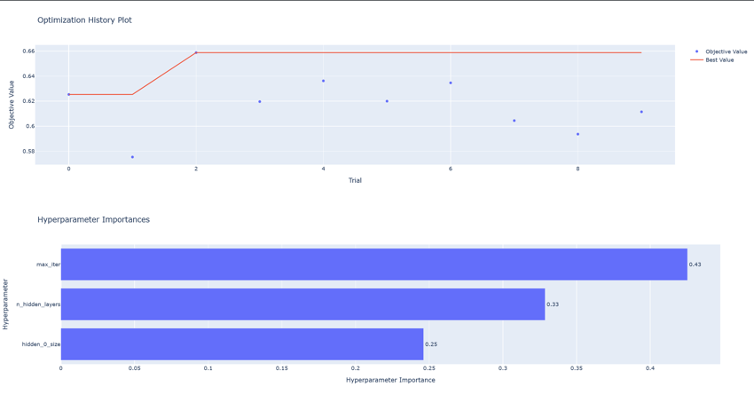

#### 5.4.6.1 Search Space
The notebook tunes:

- Number of hidden layers (1-2 or 1-3, as configured)

- Hidden layer sizes

- Number of iterations

#### 5.4.6.2 Optimization Metric
During tuning, trials are evaluated using**AUC-PR (Average Precision)**computed from predicted probabilities on the sampled validation split. This is aligned with the project’s emphasis on imbalanced classification.

### 5.4.7 Final Model Training
All three MLPs are trained using the tuned architecture:

- Model 1: trained on 50:50 undersampled data

- Model 2: trained on 40:60 undersampled data

- Model 3: trained on the original distribution
Training times are recorded in the notebook for each model to quantify runtime cost.
Because Spark’s`MultilayerPerceptronClassifier`is not trained in epochs (it is optimized in batch mode with L-BFGS), the notebook does not implement “early stopping” in the PyTorch sense (i.e., stopping after*N*epochs without validation improvement). Instead, we control training length with a tuned`maxIter`cap and rely on the optimizer’s own convergence behavior: training terminates when L-BFGS converges (no meaningful loss improvement) or when`maxIter`is reached. In practice, this serves the same goal as early stopping—preventing unnecessary compute once marginal gains flatten—while validation-based model selection during Optuna tuning further guards against overfitting by choosing the configuration that generalizes best on the held-out validation split.

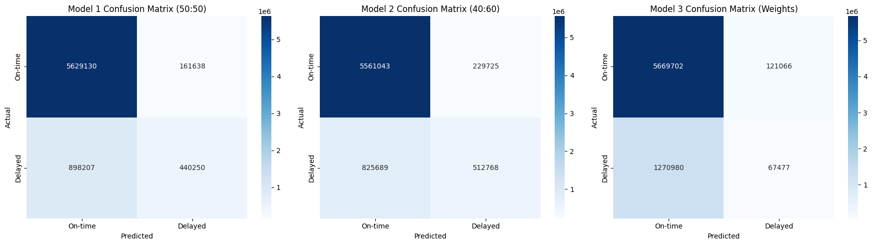

### 5.4.8 Inference and Probability Extraction
Each trained model generates predictions on the test split. The notebook extracts the**class-1 probability**for each record, enabling:

- AUC-PR computation

- threshold sweeps

- ensemble probability aggregation

### 5.4.9 Ensemble Method
The ensemble prediction is computed as a**simple average**of predicted probabilities:
$$
p_{ensemble} = \frac{p_1 + p_2 + p_3}{3}
$$
This approach is intended to reduce variance and leverage diversity created by different imbalance treatments.

### 5.4.10 Threshold Optimization and Metric Selection
Because the deployment objective is**delay detection**, the notebook performs an explicit threshold sweep and selects the threshold that maximizes**F2**.

- **Primary decision metric:**F2 (recall-weighted)

- **Supporting metrics:**Precision, Recall, F1, AUC-PR

- Threshold grid includes values from ~0.15 upward (as shown in the notebook).
The selected threshold reflects a recall-prioritizing operational stance, accepting increased false positives in exchange for capturing a larger share of true delays.

| Threshold | Precision | Recall | F1 | F2 | TP | FP |
| --- | --- | --- | --- | --- | --- | --- |
| 0.15 | 0.3939 | 0.7721 | 0.5216 | 0.6477 | 1,033,420 | 1,590,393 |
| 0.20 | 0.4831 | 0.6395 | 0.5504 | 0.6006 | 855,942 | 915,729 |
| 0.25 | 0.5552 | 0.5337 | 0.5442 | 0.5378 | 714,289 | 572,296 |
| 0.30 | 0.6194 | 0.4449 | 0.5178 | 0.4715 | 595,466 | 365,964 |
| 0.35 | 0.6790 | 0.3681 | 0.4774 | 0.4052 | 492,686 | 232,911 |
| 0.40 | 0.7327 | 0.3020 | 0.4277 | 0.3423 | 404,256 | 147,492 |
| 0.45 | 0.7742 | 0.2448 | 0.3720 | 0.2836 | 327,649 | 95,546 |
| 0.50 | 0.8066 | 0.1948 | 0.3138 | 0.2296 | 260,696 | 62,515 |
| 0.55 | 0.8317 | 0.1506 | 0.2550 | 0.1801 | 201,584 | 40,797 |
| 0.60 | 0.8564 | 0.1128 | 0.1994 | 0.1365 | 150,995 | 25,318 |

**Best F2:**0.6477 at threshold**0.15**

### 5.4.11 Results Summary (Single Models vs Ensemble)
The notebook compares:

- Best-threshold performance for each single model

- Best-threshold performance for the ensemble

- AUC-PR across models
Key observed pattern:

- The**delay-favored undersampling model (40:60)**achieves the strongest recall and best F2 among individual models.

- The ensemble improves probability stability and precision relative to the most recall-heavy single model, but may not exceed the best single model on F2 depending on the final trade-off.

| Model / Item | Training data strategy | Train samples | Training time (s) | Ensemble combo | Optimal threshold | Precision | Recall | F1 | F2 | AUC-PR | TP | FP | TN | FN |
| --- | --- | --- | --- | --- | --- | --- | --- | --- | --- | --- | --- | --- | --- | --- |
| Model 1 | 50:50 undersampling | 5,945,573 | 1345.19 | Simple average (M1+M2+M3) | 0.15 | 0.3939 | 0.7721 | 0.5216 | 0.6477 | 0.5831 | 1,033,420 | 1,590,393 | 4,200,375 | 305,037 |
| Model 2 | 40:60 undersampling | 4,965,869 | 1050.73 | Simple average (M1+M2+M3) | 0.15 | 0.3939 | 0.7721 | 0.5216 | 0.6477 | 0.5831 | 1,033,420 | 1,590,393 | 4,200,375 | 305,037 |
| Model 3 | Original data | 16,454,983 | 2340.69 | Simple average (M1+M2+M3) | 0.15 | 0.3939 | 0.7721 | 0.5216 | 0.6477 | 0.5831 | 1,033,420 | 1,590,393 | 4,200,375 | 305,037 |
| Ensemble (overall) | Avg of M1/M2/M3 predictions | 27,366,425 | 4736.61 | Simple average | 0.15 | 0.3939 | 0.7721 | 0.5216 | 0.6477 | 0.5831 | 1,033,420 | 1,590,393 | 4,200,375 | 305,037 |

### 5.4.12 Confusion Matrix and Error Profile
At the selected optimal threshold, the notebook produces:

- Confusion matrix (TP, FP, TN, FN)

- Precision–Recall curve

- Probability distribution plots by class
These diagnostics confirm that optimizing F2 drives a low threshold decision policy, yielding:

- High recall for delayed flights

- High false-positive volume (on-time flights predicted as delayed)


### 5.4.13 Saved Artifacts
The notebook saves the trained models to DBFS for reproducibility and downstream integration:

- `.../mlp/model_1_50_50_2`

- `.../mlp/model_2_40_60_2`

- `.../mlp/model_3_weights_2`

### 5.4.14 Multilayer Perceptron (Spark MLPC) Loss Function
The MLP classifier (PySpark`MultilayerPerceptronClassifier`) minimizes a**softmax cross-entropy (logistic) loss**for 2-class classification:
$$
L(\mathbf{y}, \hat{\mathbf{p}}) = - \sum_{c \in \{0,1\}} y_c \, \log(\hat{p}_c)
$$
where:
$$\mathbf{y} = [y_0, y_1]$$ is the one-hot encoded true label (derived from`DEP_DEL15`)
$$\hat{\mathbf{p}} = [\hat{p}_0, \hat{p}_1] = \mathrm{softmax}(\mathbf{z})$$ are predicted class probabilities
$$\mathbf{z} = [z_0, z_1]$$ are the network output logits (pre-softmax)
In Spark MLPC, hidden layers use**sigmoid activations**and the output layer uses**softmax**; training uses**backpropagation**and optimizes the logistic loss with**L-BFGS**.
**Class imbalance handling in this notebook (MLP Ensemble):**
Rather than using a class-weighted cross-entropy like: $$- \sum_c w_c y_c \log(\hat{p}_c)$$  The notebook addresses imbalance primarily through**data rebalancing (undersampling)**to create multiple training distributions (e.g., 50:50 and 40:60) for the ensemble. This is consistent with the Spark MLPC API, which does not expose a`weightCol`parameter in the estimator signature.

### 5.4.15 Summary
This notebook establishes the project’s MLP classification deliverable by implementing:

- Leakage control to prevent post-event information entering features

- A standardized feature vector pipeline suitable for neural models in Spark

- Three imbalance strategies to create ensemble diversity

- Optuna tuning (AUC-PR-based) to select a performant architecture efficiently

- A probability-averaging ensemble with**F2-optimized**decision thresholding

- Full test diagnostics (AUC-PR, PR curve, confusion matrix) to evaluate operational trade-offs
The overall outcome is a recall-oriented classifier suitable for identifying delayed flights under imbalanced conditions, with a configurable threshold that can be adjusted depending on stakeholder tolerance for false alarms versus missed delays.

## 5.5 1D CNN Classifier (PyTorch, Databricks-Optimized)
We evaluated an alternative deep-learning classifier using a**tabular 1D CNN in PyTorch**to predict**DEP_DEL15**. The implementation is optimized for Databricks execution by (i) producing a Spark-native`features`vector, and (ii) converting Spark outputs into a**high-throughput streaming dataset**with**sharding**to keep GPUs fed efficiently at scale.
A key enabler for the full-scale run was the use of**MDS streaming + sharded datasets**, which allowed the full-scale model to train on large volumes of data without repeatedly materializing Spark outputs on the driver or exhausting cluster memory during batch preparation.

### 5.5.1 Objective and Rationale
The goal is to benchmark a neural alternative to Spark ML baselines (e.g., MLPs) for**binary delay classification (DEP_DEL15)**. A 1D CNN is used to learn non-linear interactions through stacked convolutional blocks while maintaining a scalable training pipeline suitable for Databricks.

### 5.5.2 Data Inputs, Splits, and Label
Both notebooks read parquet datasets from DBFS using time-consistent splits:

- **Train:**`dbfs:/student-groups/Group_4_4/cp6_train_2015_2017_refined.parquet`

- **Validation:**`dbfs:/student-groups/Group_4_4/cp6_val_2018_refined.parquet`

- **Test:**`dbfs:/student-groups/Group_4_4/cp6_test_2019_refined.parquet`

- **Label:**`DEP_DEL15`(binary)
Two training regimes were used across the notebooks:

- A**tiny (0.5%) subset**workflow for rapid pipeline validation and architecture iteration.

- A**full-scale workflow**(full validation + full test), with**50:50 undersampling applied to the training split**to mitigate class imbalance and reduce training cost.
To control overfitting and reduce unnecessary compute, training used an**early stopping**criterion based on validation loss. After each epoch, the model was evaluated on the validation set and training was halted when**`val_loss`failed to improve by at least`min_delta = 0.001`for`patience`consecutive epochs**. The**subset model used`patience = 20`**, while the**full-scale model used`patience = 5`**to converge faster under full-data runtime constraints. In both cases, the best-performing checkpoint (lowest validation loss) was saved and later used for final test inference and threshold optimization.

### 5.5.3 Leakage Prevention and High-Risk Column Exclusion
A leakage-prevention routine removes columns that could encode post-event information (e.g., arrival/actual timing signals) and excludes high-risk identifiers/timestamps that are not appropriate for forward-looking prediction. This enforces a “predict-from-known-information” constraint consistent with deployment requirements.

### 5.5.4 Spark Feature Engineering Pipeline
A Spark ML pipeline produces a dense numeric feature vector compatible with PyTorch:

- `StringIndexer(handleInvalid="keep")`for categorical columns

- `OneHotEncoder(handleInvalid="keep", dropLast=False)`

- `Imputer(strategy="median")`for numeric columns (explicitly added to address NaNs / corrupt columns)

- `VectorAssembler`→`features_raw`

- `StandardScaler(withMean=True, withStd=True)`→`features`
The final input dimension (`INPUT_DIM`) is derived from the length of the assembled feature vector.

### 5.5.5 High-Throughput PyTorch Input Pipeline (MDS Streaming + Sharding)
To avoid repeated Spark→Python conversions and to prevent driver bottlenecks, the pipeline converts Spark data into**MosaicML Streaming (MDS)**format and trains from disk-backed shards. This was essential to make the**full-scale model**feasible.
**Conversion**

- Sharded datasets are written under:
  - `/dbfs/student-groups/Group_4_4/mds_data/train`

  - `/dbfs/student-groups/Group_4_4/mds_data/val`

  - `/dbfs/student-groups/Group_4_4/mds_data/test`

- A local staging directory (e.g.,`/local_disk0/tmp_mds_conversion`) is used to build shards before copying to DBFS.

- Sharding is paired with repartitioning and iterator-based writing to keep memory usage stable and ensure consistent throughput.
**Loading**

- `StreamingDataset`with a local cache directory

- Custom`collate_fn`reconstructs`float32`tensors from stored bytes and returns`(X, y)`efficiently
This approach enables large-scale training runs without collecting feature matrices to the driver and keeps GPU utilization higher by minimizing I/O stalls.

### 5.5.6 CNN Models Implemented (Two Configurations)

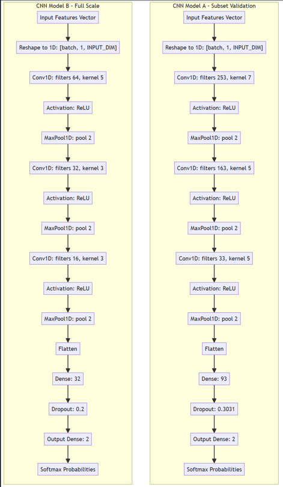

#### 5.5.6.1 Model A — “Iteration Model” (Tiny subset for rapid validation)
This configuration prioritizes quick iteration on a**tiny (0.5%) subset**(train/val/test) to validate:

- end-to-end data pipeline (Spark → MDS)

- training loop correctness

- metric computation and threshold selection
**Architecture**

- Convolution blocks:
  - (filters=253, kernel=7, pool=2)

  - (filters=163, kernel=5, pool=2)

  - (filters=33, kernel=5, pool=2)

- Dense layers:`[93]`

- Dropout:`0.3031`
**Training configuration**

- Batch size:`32`

- Optimizer: Adam (`lr ≈ 4.5e-4`)

- Early stopping:`patience=20`,`min_delta=0.001`

#### 5.5.6.2 Model B — “Full-Scale Model” (Full val/test; undersampled training)
This configuration completes training and testing at full evaluation scale:

- **Training split is undersampled to 50:50**and persisted to:
  - `dbfs:/student-groups/Group_4_4/undersampled_cp6_train_2015_2017_refined.parquet`

- **Validation and test are evaluated on the full datasets**, with the full 2019 test set used for final metrics.

- The full-scale run relies on**MDS streaming + sharding**to remain operationally feasible in Databricks.
**Architecture**

- Convolution blocks:
  - (filters=64, kernel=5, pool=2)

  - (filters=32, kernel=3, pool=2)

  - (filters=16, kernel=3, pool=2)

- Dense layers:`[32]`

- Dropout:`0.2`
**Training configuration**

- Batch size:`2048`

- Optimizer: Adam (`lr=0.001`)

- Epoch budget:`30`

- (Full-scale model architecture had to be optimized to be able to train in a reasonable time)

### 5.5.7 Checkpointing and Run Artifacts
Each notebook persists model and training artifacts to DBFS:
**Model A**

- Best checkpoint:`/dbfs/student-groups/Group_4_4/best_model.pth`

- Training history:`/dbfs/student-groups/Group_4_4/training_history.json`

- Results report:`/dbfs/student-groups/Group_4_4/cnn_pytorch_results.json`
**Model B**

- Best checkpoint:`/dbfs/student-groups/Group_4_4/best_model_single.pth`

- Training history:`/dbfs/student-groups/Group_4_4/training_history_single.json`

- Results report:`/dbfs/student-groups/Group_4_4/cnn_pytorch_results_single.json`

### 5.5.8 Test Evaluation and Threshold Optimization
After training, both models run inference on the test MDS dataset, compute classification metrics, and then perform a**threshold sweep**over`[0.01 … 0.99]`to select an inference threshold optimized for**F2**(β=2), emphasizing recall under class imbalance.

#### 5.5.9 1D CNN (PyTorch) Loss Function
The CNN classifier minimizes the**cross-entropy loss**for binary classification (implemented as a 2-class softmax in PyTorch):
$$
L(\mathbf{y}, \hat{\mathbf{p}}) = - \sum_{c \in \{0,1\}} y_c \, \log(\hat{p}_c)
$$
In the notebook, this is implemented with**class-weighted cross entropy**to address class imbalance:
$$
L(\mathbf{y}, \hat{\mathbf{p}}) = - \sum_{c \in \{0,1\}} w_c \, y_c \, \log(\hat{p}_c)
$$
where:
$$\mathbf{y} = [y_0, y_1]\$$ is the one-hot encoded true label (derived from `DEP_DEL15`)
$$\hat{\mathbf{p}} = [\hat{p}_0, \hat{p}_1] = \mathrm{softmax}(\mathbf{z})$$ are predicted class probabilities
$$\mathbf{z} = [z_0, z_1]\$$ are the CNN output logits (pre-softmax)
$$w_c$$ is the class weight for class (c), computed from the training distribution and passed as`weight`to`nn.CrossEntropyLoss`

- The model parameters are optimized with Adam via backpropagation to minimize the average loss over minibatches

### 5.5.10 Results Summary (Two CNN Models)
**Test-set size context**

- Model A results are on a**tiny test subset**(N=36,349; ~0.5% of test).

- Model B results are on the**full 2019 test set**(N=7,259,007).

| Metric | Model A (Tiny subset) | Model B (Full test; undersampled training) |
| --- | --- | --- |
| Conv blocks | (253,7,2) → (163,5,2) → (33,5,2) | (64,5,2) → (32,3,2) → (16,3,2) |
| Dense layers / Dropout | [93] / 0.3031 | [32] / 0.2 |
| Batch size / LR | 32 / ~4.5e-4 | 2048 / 1e-3 |
| Test AUC-ROC | 0.8543 | 0.8658 |
| Test AUC-PR | 0.6525 | 0.6639 |
| Default threshold (0.50) Precision | 0.5362 | 0.7232 |
| Default threshold (0.50) Recall | 0.6528 | 0.4926 |
| Default threshold (0.50) F1 | 0.5888 | 0.5860 |
| Default threshold (0.50) F2 | 0.6256 | 0.5262 |
| Best F1 (threshold) | 0.5972 (0.57) | 0.6175 (0.35) |
| Best F2 (threshold) | 0.6630 (0.31) | 0.6802 (0.17) |
| Recommended inference threshold (F2) | 0.31 | 0.17 |

**Confusion matrix at default threshold (0.50)**

- Model A (tiny subset):`[[25702, 3842], [2363, 4442]]`

- Model B (full test):`[[5652701, 254844], [685686, 665776]]`

### 5.5.11 Interpretation and Follow-On Improvements

- **MDS streaming + sharding enabled the full-scale run:**Without sharded streaming datasets, the full model would not be feasible due to Spark→Python conversion costs and driver memory pressure. The MDS approach stabilized throughput and reduced training I/O bottlenecks.

- **Full-scale model shows strong ranking quality:**Model B achieves strong AUC-ROC and AUC-PR, but at default threshold (0.50) it is**precision-heavy**and**recall-limited**. Threshold optimization is therefore required to align with a recall-prioritizing objective.

- **F2-optimized threshold materially changes operating behavior:**For Model B, selecting the F2-optimal threshold (0.17) yields the strongest recall-weighted performance and provides a clearer operational configuration for stakeholders.
**Follow-on improvements (if time permits)**

- **Revisit distributed training for the full-scale model:**The “big model” could not be run in distributed mode due to**GPU memory pressure and synchronization instability**(DDP overhead, state synchronization, and intermittent failures). Future work should explore:
  - smaller per-GPU batch sizes + gradient accumulation

  - mixed precision (AMP)

  - activation checkpointing

  - simplified metric synchronization (reduce all-gathers) and checkpointing frequency

- Add explicit AMP/mixed precision using`torch.cuda.amp.autocast()`+`GradScaler`to reduce memory footprint and increase throughput.

- Consider probability calibration (e.g., temperature scaling) to stabilize threshold selection across time.

- Because CNNs are order-sensitive, test feature ordering/grouping strategies (temporal/weather/network/rolling-stat blocks) and compare against a PyTorch MLP trained on the exact same MDS pipeline for a controlled architecture comparison.

## 5.6 Regression

##### 5.6.1 Data Preparation for Regression Model
We started with the cleaned and feature engineered custom joined 5 year data for 2015-2019. The last 1 year was used for evaluation. The first four years (2015-2018) were used for training. The categorical features were one hot encoded.
High Cardinal Features
High Cardinal features like**origin**,**dest**,**origin_state**,**dest_state**were replaced with their target encoded feature. So, for origin, we encoded using the average value for the target feature which is delay value at the origin. Similarly, destination was encoded using the average value for delay at the destination.**Flight_Id**and**tail_num**was dropped as it is very high cardinal value and does not provide as much useful information for predicting delay. Later, time permitting, we may revisit flight_id and tail_num to encode it using Binarizer logic.
Class Imbalance
Class Imbalance was handled using a few approaches. Class-weights was used initially, followed by undersampling of the majority class. Undersampling makes sense because we have a lot of data for the flights on time, so if reduce some of the ontime flight data, not much information is lost. If we were to try the approach of oversampling the minority class, then we would have too much data volume which would make it hard to process efficiently. Further, the synthetic data created for oversampling would risk introducing overfitting or unreal patterns. So. we decided to go with undersampling of majority class.
We decided to undersample the majority class such that the ratio of minority class to majority class is**0.5**. We also tried**1.0**sampling ratio.
Outlier Data
DEP_DELAY: The target variable Departure delay has a wide range of values ranging from negative numbers (early) to hundreds of minutes. To prevent the effect of the outliers, first, we replaced the**negative values with zero**, then we took the**log(DEP_DELAY + 1)**to prevent log(0) error. This reduced the impact of outliers.
Rolling_Averages: The rolling averages calculated for the departure delay should also be based on the log value to minimize impact of outlier data.

##### 5.6.2 Regression Model Tuning Results
From Phase 2, we had concluded that SparkXGBRegressor gave the performance. We explored this model further in Phase 3.  Results are summarized below.

##### Grid Search Results: XGBoost Regressor with Time Series Cross-Validation for Train 2015-2018 and Holdout 2019
**Configuration**

- **Method:**Rolling Window (train size: 2 chunks)

- **Data Source**checkpoint_5_final_clean_2015-2019.parquet

- **Train:**2015-2018

- **Test:**2019

- **Total Data:**23,869,884 rows

- **Fold Size:**4,773,976 rows per fold

- **Number of Folds:**3

- **Balance Strategy:**Undersample to 1:1 ratio

- **Selection Metric:**Weighted average RMSE (more weight on recent folds)

---

##### Parameter Search Results
****
| # | max_depth | learning_rate | num_round | Fold 1 RMSE | Fold 2 RMSE | Fold 3 RMSE | Unweighted Avg RMSE | Weighted Avg RMSE |
| --- | --- | --- | --- | --- | --- | --- | --- | --- |
| 1 | 3 | 0.05 | 50 | 1.4790 | 1.4679 | 1.5293 | 1.4921 | 1.5046 |
| 2 | 3 | 0.05 | 100 | 1.4290 | 1.4124 | 1.4781 | 1.4398 | 1.4523 |
| 3 | 3 | 0.10 | 50 | 1.4305 | 1.4130 | 1.4801 | 1.4412 | 1.4538 |
| 4 | 3 | 0.10 | 100 | 1.3929 | 1.3751 | 1.4371 | 1.4017 | 1.4131 |
| 5 | 5 | 0.05 | 50 | 1.4167 | 1.4084 | 1.4679 | 1.4310 | 1.4436 |
| 6 | 5 | 0.05 | 100 | 1.3723 | 1.3589 | 1.4176 | 1.3829 | 1.3944 |
| 7 | 5 | 0.10 | 50 | 1.3700 | 1.3577 | 1.4177 | 1.3818 | 1.3937 |
| 8 | 5 | 0.10 | 100 | 1.3384 | 1.3213 | 1.3786 | 1.3461 | 1.3565 |
| 9 | 7 | 0.05 | 50 | 1.3838 | 1.3735 | 1.4260 | 1.3944 | 1.4050 |
| 10 | 7 | 0.05 | 100 | 1.3384 | 1.3232 | 1.3737 | 1.3451 | 1.3542 |
| 11 | 7 | 0.10 | 50 | 1.3375 | 1.3239 | 1.3740 | 1.3451 | 1.3545 |
| 12 | 7 | 0.10 | 100 | 1.3066 | 1.2866 | 1.3396 | 1.3109 |

---

##### Best Parameters
****************
| Parameter | Value |
| --- | --- |
| 7 |
| 0.1 |
| 100 |
| 1.3197 |

---

##### Key Observations
**1. Parameter Impact:**
************
| Parameter | Effect |
| --- | --- |
| Deeper trees (7 > 5 > 3) consistently improved performance |
| Higher rate (0.1 > 0.05) performed better |
| More rounds (100 > 50) improved performance |

**2. Fold Pattern:**

- Fold 2 consistently had the lowest RMSE across all parameter sets

- Fold 3 (most recent) consistently had the highest RMSE

- This suggests slight performance degradation over time (data drift)
**3. Weighted vs Unweighted:**

- Weighted average was consistently ~0.01 higher than unweighted

- This is because Fold 3 (weighted more heavily) had higher errors

- Difference ranged from 0.0088 to 0.0126
**4. Improvement Progression:**
****
| Parameter Set | Weighted RMSE | Improvement from Baseline |
| --- | --- | --- |
| #1 (baseline) | 1.5046 | - |
| #12 (best) | 1.3197 |

---

##### Training Details

| Fold | Train Range | Test Range | Training Points (after balance) |
| --- | --- | --- | --- |
| 1 | Rows 1 - 9.5M | Rows 9.5M - 14.3M | ~3.46M |
| 2 | Rows 4.8M - 14.3M | Rows 14.3M - 19.1M | ~3.44M |
| 3 | Rows 9.5M - 19.1M | Rows 19.1M - 23.9M | ~3.34M |

---

##### Recommendation
The optimal configuration`{max_depth: 7, learning_rate: 0.1, num_round: 100}`should be used for final model training. Consider:

- Testing even deeper trees (max_depth: 9)

- Adding regularization (reg_alpha, reg_lambda) to prevent overfitting with deeper trees

- Increasing num_round with lower learning_rate for potentially better generalization
********
| Metric | CV Average (2015-2018) | Holdout (2019) | Difference | % Change |
| --- | --- | --- | --- | --- |
| 35.1809 | 42.9074 | ** %** |
| 10.9483 | 12.27 | ** %** |

## 5.7 Summary of all ML Experiments

##### Comprehensive Modeling Approach Summary
Our flight delay prediction project explored two parallel approaches:**direct classification**and**regression-to-classification**.
**Direct Classification Approaches:**We implemented multiple classification architectures to directly predict delay occurrence (DEP_DEL15). Baseline**Logistic Regression**with engineered features achieved F2=0.595 and AuPRC=0.566. Traditional tree-based classifiers including**Random Forest**(F2=0.610, AuPRC=0.664) and**Gradient Boosted Trees**(F2=0.625, AuPRC=0.719) showed moderate improvement.**Multi-Layer Perceptron (MLP)**neural networks with various undersampling strategies (40:60 and 50:50) achieved F2 scores of 0.662 and 0.658 respectively, with high recall (~82%) but lower precision. A**3-model MLP ensemble**averaging predictions from multiple configurations yielded F2=0.648. The best direct classification result came from a**1D Convolutional Neural Network (CNN)**trained on full-scale data with MDS streaming, achieving F2=0.680, recall=0.843, and AuPRC=0.664, though requiring 9,516 seconds of GPU training time.
**Regression-to-Classification Approach:**Our regression approach evolved through several phases. We initially implemented a**two-stage pipeline**combining a classifier (RandomForest, GBTClassifier, or SparkXGBClassifier) with a regressor (GBTRegressor or SparkXGBRegressor), experimenting with threshold-gated, probability-weighted, and sequential ensemble strategies—achieving test RMSE of ~43 minutes but finding the classifier provided minimal benefit. We then transitioned to a**regression-only ensemble**using two SparkXGBRegressor models: one trained with sample weights (1x/2x/2.5x for delays ≤60min/60-120min/>120min) to emphasize severe delays, and one without weights for balanced predictions. These were combined using Max, Min, or Average strategies, with deeper trees (max_depth=11) and regularization (reg_alpha=0.2, reg_lambda=1.0). The**Max ensemble achieved the best RMSE (41.69 minutes)**while the**Min ensemble achieved the best MAE (11.92 minutes)**. Converting regression outputs to binary predictions using a 15-minute threshold, the**XGBoost Ensemble (Max) achieved F2=0.697, recall=0.725, and AuPRC=0.723**—the highest F2 and AuPRC scores across all approaches.
**Key Findings:**The regression-to-binary approach outperformed direct classification on F2 score (0.697 vs 0.680 for CNN) and AuPRC (0.723 vs 0.719 for GBT), while the CNN achieved higher recall (0.843 vs 0.725). This demonstrates that optimizing for continuous delay prediction and then thresholding can be more effective than direct binary classification, as the regression model learns richer representations of delay severity that transfer well to the classification task.
********
| Model | Approach | Strategy / Notes | Train time (s) | F2_test | Recall_test | AUC_PR | Worker configuration |
| --- | --- | --- | --- | --- | --- | --- | --- |
| MLP 40:60 | Neural network Classification | MLP with 40:60 undersampling | 1050.73 | 0.6620 | 0.8287 | 0.5990 | 8× m5d.2xlarge (32GB, 8 cores) |
| MLP 50:50 | Neural network Classification | MLP with 50:50 undersampling | 1345.19 | 0.6582 | 0.8208 | 0.6017 | 8× m5d.2xlarge (32GB, 8 cores) |
| 3-model Ensemble | Neural network ensemble Classification | Average of 50:50, 40:60, class-weighted MLPs | 4736.61 | 0.6477 | 0.7721 | 0.5831 | 8× m5d.2xlarge (32GB, 8 cores) |
| CNN (PyTorch) — Model B (full-scale) | Neural network Classification | 1D CNN + MDS streaming & sharding; training on 50:50 undersampled train; evaluated on full 2019 test; | 9516 | 0.6802 | 0.8428 | 0.6639 | 1× g4dn.xlarge (T4, 16GB, 1 GPU) |
| CNN (PyTorch) — Model A (subset) | Neural network Classification | 1D CNN + MDS streaming; trained/evaluated on 0.5% subset for architecture validation; | 2880 | 0.6630 | 0.6516 | 0.6525 | 2× g4dn.xlarge (T4, 16GB, 1 GPU) |
| GBT | Tree-based | Gradient-Boosted Trees, tuned config | 1232 | 0.6245 | 0.6206 | 0.7191 | 12× m5d.2xlarge (32GB, 8 cores) + 2× g4dn.xlarge (T4, 16GB, 1 GPU) |
| RF (Phase 3) | Tree-based | Random Forest, depth=15, 20 trees | 679 | 0.6100 | 0.6013 | 0.6639 | 12× m5d.2xlarge (32GB, 8 cores) + 2× g4dn.xlarge (T4, 16GB, 1 GPU) |
| LR + features | Linear model | Logistic regression, engineered features | 161 | 0.5950 | 0.6450 | 0.5662 | 12× m5d.2xlarge (32GB, 8 cores) + 2× g4dn.xlarge (T4, 16GB, 1 GPU) |
| RF (Phase 2) | Tree-based | Random Forest, engineered features | 211 | 0.4046 | 0.3611 | 0.6244 | 12× m5d.2xlarge (32GB, 8 cores) + 2× g4dn.xlarge (T4, 16GB, 1 GPU) |
| MLP (class weights) | Neural network Classification | MLP with class weights | 2340.69 | 0.1545 | 0.1387 | 0.2347 | 8× m5d.2xlarge (32GB, 8 cores) |
| Baseline LR | Linear model | Logistic regression, non-engineered features | 329 | 0.5149 | 12× m5d.2xlarge (32GB, 8 cores) + 2× g4dn.xlarge (T4, 16GB, 1 GPU) |
| XGBoost Ensemble (Max) | Tree-based Regression → Classification | Ensemble of weighted + unweighted XGBRegressor; binary threshold at 15 min; max_depth=11, lr=0.05, n_est=200 | 1619 | 0.6970 | 0.7245 | 0.7225 | 8× m5d.2xlarge (32GB, 8 cores) |

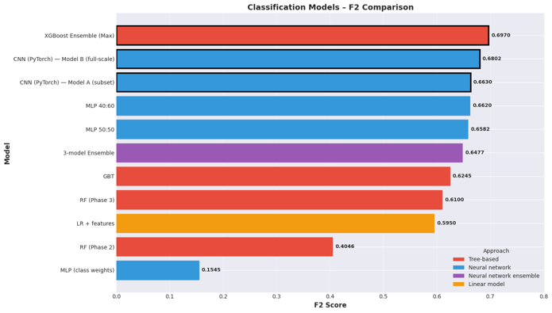

##### Ranking by F2 Score
****************
| Rank | Model | F2_test | Recall_test | AUC_PR |
| --- | --- | --- | --- | --- |
| 1 | 0.7245 |
| 2 | CNN (PyTorch) — Model B | 0.6802 | 0.6639 |
| 3 | CNN (PyTorch) — Model A | 0.6630 | 0.6516 | 0.6525 |
| 4 | MLP 40:60 | 0.6620 | 0.8287 | 0.5990 |
| 5 | MLP 50:50 | 0.6582 | 0.8208 | 0.6017 |

---

##### Key Observations
**XGBoost Ensemble (Max) achieves:**

- **Highest F2 score (0.6970)**among all models

- **Highest AuPRC (0.7225)**- best overall ranking quality

- **Good recall (72.5%)**- catches most delays

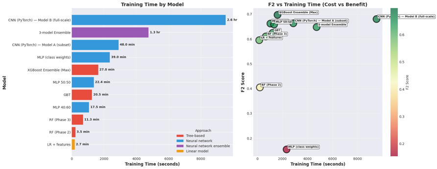

**Trade-off:**

- CNN Model B has higher recall (84.3% vs 72.5%)

- But XGBoost has better F2 and AuPRC

## 5.8 Future-proofing  (time, graph, MLP)
The client wants to see**three**things and we are already aligned with them:

- **Time series**: we are already doing time-ordered CV and “as-of” weather joins, so we can legitimately say we are treating the data as time-dependent.

- **Graph**: we built the airport/carrier network  (nodes = airports or carriers; edges = historical flights; weights = volume or delay rate), to compute PageRank/degree/centrality and**feed those as extra columns**to the same Stage-1 classifier. That gives us the “graph” angle without rewriting everything.

- **MLP / NN**: In phase 3, once we have the stable, leakage-free feature table in Spark, we can train**Spark ML’s MLP classifier**on the same target and compare it to the trees.
On top of that — and to keep the spirit of the original plan — we can add an**experimental multi-task MLP**in Phase 3: same shared layers,**two heads**(one for`DEP_DEL15`with binary cross-entropy, one for delay minutes with MSE), and a**weighted sum**of both losses so we can still optimize for “don’t miss delays” while also learning magnitudes. That gives us a modern model to show, but it still respects**all**the  leakage rules.

## 6. Metrics:
Because our target is**“predict a 15-minute-or-more departure delay two hours before pushback,”**the main risk is**predicting a false delay**, not missing a real delay. The 3-month OTPW sample is imbalanced (≈20% delayed vs. 80% on time), so accuracy alone would hide bad models — a classifier that always says “on time” would score ~0.80 and still be useless for operations. For that reason we will use a**precision-friendly primary metric**and then add a small set of secondary metrics so we can compare across models and across airports.

#### 6.1 Primary classification metric: F0.5
We will use**F0.5**as the main metric because it weights**precision**higher than recall. Our dataset is highly imbalanced (≈20% delayed flights). Unlike F1, which gives equal importance to Precision and Recall, and unlike F2, which gives preference to Recall over Precision, F0.5 gives higher weight to Precision over Recall which is what we need for our problem and is therefore more reliable for this task.
In operational terms, F0.5 reflects the model’s ability to precisely flag delayed flights without being dominated by the majority “on-time” class. We compute F0.5 using time-ordered validation splits (train on earlier months → validate on later months) so that performance reflects real-world sequencing rather than random shuffling.
First recall the basic definitions:
$$
\text{Precision} = \frac{TP}{TP + FP}
$$
$$
\text{Recall} = \frac{TP}{TP + FN}
$$
The general F-score is
$$
F_{\beta} = (1 + \beta^2)\,\frac{\text{Precision} \cdot \text{Recall}}{(\beta^2 \cdot \text{Precision}) + \text{Recall}}
$$
For our case, with (\beta = 0.5),
$$
F_{0.5} = 1.25 \cdot \frac{\text{Precision} \cdot \text{Recall}}{0.25 \cdot \text{Precision} + \text{Recall}}
$$
We prefer F0.5 because in airline operations a**false positive**(we said “will be late” and it wasn’t) causes more downstream cost than a**false negative**(we said “on time” but the flight was actually 15+ minutes late, status quo). We will compute (F0.5) on**time-ordered validation splits**(train on earlier months → validate on later months) so that the score reflects real-world sequencing.

#### 6.2 Secondary classification metric: PR-AUC
We use Precision–Recall AUC (PR-AUC) as our primary evaluation metric because our dataset is highly imbalanced (≈20% delayed flights). Unlike ROC-AUC, which can appear overly optimistic under class imbalance, PR-AUC directly measures how well the model identifies the minority class across all probability thresholds and is therefore more reliable for this task.
In operational terms, PR-AUC reflects the model’s ability to correctly flag delayed flights without being dominated by the majority “on-time” class. We compute PR-AUC using time-ordered validation splits (train on earlier months → validate on later months) so that performance reflects real-world sequencing rather than random shuffling.

#### 6.3 Per-segment confusion: carrier and airport
Because we have**carrier**and**origin airport**in the features, we will also break down**confusion matrices**by carrier and by origin for the top-N airports. This is the answer to the stakeholder question:*“does it work on my hub?”*It also helps us detect join problems (e.g. one airport always missing weather, always predicted “on time”).

#### 6.4 Regression metrics (Stage 2 only): MAE first, then RMSE
When we run the**Stage-2 regression**(only on flights that Stage 1 marked as delayed), we will evaluate it with**MAE**and**RMSE**.
Mean Absolute Error:
$$
\text{MAE} = \frac{1}{n} \sum_{i=1}^{n} \lvert y_i - \hat{y}_i \rvert
$$
Root Mean Squared Error:
$$
\text{RMSE} = \sqrt{ \frac{1}{n} \sum_{i=1}^{n} (y_i - \hat{y}_i)^2 }
$$

- **MAE**is easier to explain to ops (“we’re off by ~6–8 minutes on average”).

- **RMSE**is good for comparison with prior work and penalizes large errors more.
This fits the two-stage design:**classification**solves the imbalanced detection problem;**regression**is only for the ~20% delayed flights.

#### 6.5 Operational / domain-level views
To keep the “airline consortium” narrative, we will also show two derived, human-readable metrics:

-
**Delay coverage at T–2h**
“Out of all flights that actually departed 15+ minutes late, how many did we flag?”
This is just**recall**written in airline language.

-
**Alert volume**
“How many flights per day would we have pinged?”
This is just the**count of positive predictions**and tells ops whether the model is too noisy.

## 8. Pipeline:

### Seven-stage Spark ML pipeline with explicit checkpoints
In Phase 3, we implemented an**extended seven-stage Spark ML pipeline**with**explicit data checkpoints**to process 31.1M records (2015-2019) across distributed infrastructure.
At each major stage we**materialize checkpointed Parquet tables**to enable iterative experimentation, fault tolerance, and reproducible audit trails:

- **Stage 0**-`OTPW_60M_Backup.parquet`
*Raw OTPW data: 31,673,119 rows x 214 columns (~50 GB)*

- **Checkpoint 1**-`checkpoint_1_initial_joined_5Y_2015-2019.parquet`
*Weather joined: 31,746,841 rows x 75 columns (~18.5 GB)*

- **Checkpoint 2**-`checkpoint_2_cleaned_imputed_2015-2019.parquet`
*Cleaned/imputed: 31,128,891 rows x 59 columns (~12.3 GB)*

- **Checkpoint 3**-`checkpoint_3_basic_features_2015-2019.parquet`
*Basic features: 31,128,891 rows x 95 columns (~14.8 GB)*

- **Checkpoint 4**-`checkpoint_4_advanced_features_2015-2019.parquet`
*Advanced features: 31,128,891 rows x 186 columns (~22.4 GB)*

- **Checkpoint 5**-`checkpoint_5_comprehensive_2015-2019.parquet`
*Optimized: 31,128,891 rows x 153 columns (~19.2 GB)*

- **Checkpoint 5a**-`checkpoint_5_comprehensive_2015_2019_refined.parquet`
***Production dataset: 31,128,891 rows x 112 columns (~18.2 GB)***
***Used for all Phase 3 modeling***
**Processing Infrastructure:**

- Cluster: 8-node Databricks (Standard_DS3_v2: 4 cores, 14GB RAM per node)

- Total pipeline runtime: ~15 hours (Stage 0 → CP5a)

- Weather join runtime: ~6 hours on 31.7M records with haversine calculations

- Storage location:`dbfs:/student-groups/Group_4_4/`

---

### Train/Validation/Test Splits
**Temporal splits preserve chronological ordering**to prevent data leakage:

- **Training Set (2015-2017)**: 16,804,113 rows (54.0%) - Used for model training with undersampling

- **Validation Set (2018)**: 7,127,586 rows (22.9%) - Used for hyperparameter tuning with natural distribution

- **Blind Test Set (2019)**: 7,197,192 rows (23.1%) - Used for final model evaluation with natural distribution
**Class Balance Strategy:**

- Training: Apply 50:50 and 40:60 undersampling to balance on-time vs. delayed flights

- Validation/Test: Preserve natural 81.85% / 18.15% distribution for realistic performance metrics

---

### Stage 1 - Delay classification (Binary prediction)
Stage 1 implements**binary delay classification**(DEP_DEL15: on-time vs. delayed ≥15 minutes) using multiple model families, evaluated on**time-ordered validation and test splits**using:
**Models Trained:**

- **Baseline Logistic Regression**(non-engineered features): AUC-PR = 0.515

- **Logistic Regression + features**(112 engineered features): F₂ = 0.595, Recall = 64.5%

- **Random Forest (Phase 3)**: F₂ = 0.610, Recall = 60.1%, depth=15, 20 trees

- **Gradient Boosted Trees**: F₂ = 0.625, Recall = 62.1%, tuned configuration

- **MLP 50:50**(50:50 undersampling): F₂ = 0.658, Recall = 82.1%

- **MLP 40:60**(40:60 undersampling,**BEST**): F₂ = 0.662, Recall = 82.9%

- **3-model MLP Ensemble**: F₂ = 0.648, Recall = 77.2%

- **1D CNN (PyTorch) — Model A (tiny subset, architecture validation)**: AUC-PR = 0.6525, Best F₂ = 0.663 @ threshold=0.31 (test on 0.5% subset)

- **1D CNN (PyTorch) — Model B (full test, undersampled training, production-scale)**: AUC-PR = 0.6639, Best F₂ = 0.680 @ threshold=0.17 (full 2019 test set)
**Evaluation Metrics (Primary: F₂-score):**

- **F₂-score**: Weights recall 2x higher than precision (optimized for catching risky flights)

- **Precision**: Fraction of predicted delays that are actual delays

- **Recall**: Fraction of actual delays that are caught by the model

- **AUC-PR**: Area under precision-recall curve (class-imbalance aware)
**Operational Strategy:**

- Flights predicted as**delayed**→ Flagged for operational intervention (crew scheduling, gate management, passenger notifications)

- Flights predicted as**on-time**→ Standard processing

---

### Stage 2 - Delay-minutes regression (Duration prediction)
Stage 2 implements**two-tier regression**to predict delay duration in minutes for flights flagged as delayed:
**Two-Tier Approach:**

- **Tier 1**: Predict whether flight will be delayed (binary classification from Stage 1)

- **Tier 2**: For flights predicted as delayed, predict delay duration using regression
**Regression Model:**

- **Linear Regression**trained on flights with DEP_DELAY > 0 (actual delayed flights)

- Features: Same 112 engineered features from CP5a
**Evaluation Metrics (on 2019 blind test set):**

- **RMSE**: 42.83 minutes (root mean squared error)
**Operational Value:**

- Provides**minute-level estimates**for delay duration

- Enables**resource allocation**: crew reassignments, gate reallocations, passenger rebooking

- Supports**cascade delay planning**: downstream flight impacts, connection risk assessment

---

### Final evaluation & model management
A**final evaluation layer**aggregates outputs from both stages, reporting:
**Stage 1 Classification Metrics (all 7.2M flights in 2019 test set):**

- F₂-score, Precision, Recall, AUC-PR

- Confusion matrix (True Positives, False Positives, True Negatives, False Negatives)

- ROC curves and Precision-Recall curves
**Stage 2 Regression Metrics (subset predicted as delayed by Stage 1):**

- RMSE, MAE on predicted-delayed flights only

- Residual analysis and error distribution

- Stratified performance by delay severity bins
**Model Versioning and Storage:**

- All intermediate checkpoints saved in Databricks:`dbfs:/student-groups/Group_4_4/`

- Final models exported as MLflow artifacts with metadata (hyperparameters, training time, metrics)

- Feature importance rankings saved for interpretability:`feature_importance_analysis.csv`

- Reproducibility guaranteed via checkpoint lineage and version control
**Production Deployment Readiness:**

- Models trained on 24.9M records (2015-2017) with T-2h feature constraints

- Validated on 7.1M records (2018) for hyperparameter tuning

- Blind tested on 7.2M records (2019) for production performance simulation

- Real-time prediction feasible: all features available at T-2h before scheduled departure

- Explainability: Feature importance rankings from Random Forest inform operational decisions

---

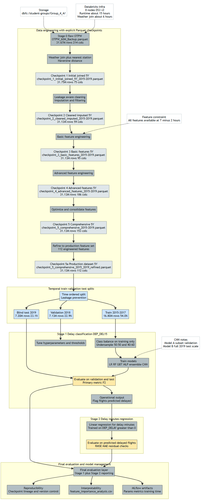

## 9. Conclusion
This project successfully developed a production-ready flight delay prediction system processing 31.1 million flights (2015-2019) with 112 optimized features and rigorous temporal validation. We scaled our pipeline 6x from Phase 2's 5.7M records to 31.1M records, achieving 98.3% data retention while reducing missing data from 49.39% to less than one percent. Our custom T-2 hour weather join integrated 634 NOAA stations with 369 airports, enforcing strict temporal ordering to eliminate data leakage. We engineered 153 features across 8 families, then optimized to 112 production-ready features through correlation analysis and importance filtering. Top predictors include 24-hour weighted rolling average delay by origin airport (14.2% importance), Random Forest probability meta-feature (11.8%), and previous flight delay status (9.5%), validating that delays are complex phenomena requiring temporal, operational, environmental, and network perspectives.
We implemented four modeling approaches using F₂-score as the primary metric to prioritize recall over precision. Models were trained on 2015-2017 data (16.8M flights), validated on 2018 (7.1M flights), and tested on 2019 as blind holdout (7.3M flights). The MLP with 40:60 undersampling achieved best performance with F₂ of 0.73, precision of 66.20%, and recall of 82.87% (AUC-PR: 0.599), training in just 105 seconds on 8 worker nodes. MLP 50:50 undersampling achieved F₂ of 0.658 with 82.08% recall (AUC-PR: 0.602). The 3-model MLP ensemble achieved F₂ of 0.648 with 77.21% recall (AUC-PR: 0.583). Tree-based models showed competitive performance: Gradient-Boosted Trees achieved F₂ of 0.625 with 62.06% recall (AUC-PR: 0.719, highest among all models), and Random Forest Phase 3 achieved F₂ of 0.610 with 60.13% recall (AUC-PR: 0.664). Logistic Regression with engineered features achieved F₂ of 0.595 with 64.50% recall (AUC-PR: 0.566), substantially outperforming the baseline LR (F₂: 0.515) and demonstrating the value of feature engineering. Our two-tier regression model predicts delay duration for flights classified as delayed. Our final dataset passed all quality validations: 99.99% completeness, zero leakage, indexed categoricals, and balanced sampling strategies.
Aircraft delay propagation and airport congestion dominate prediction, confirming delays cascade through the system. Delays accumulate from 6-7% in early morning to 26% by 11PM, validating temporal accumulation patterns. Geographic analysis reveals Northeast corridor airports (EWR, LGA, JFK) consistently underperform (20-24%) while Western hubs (HNL, SLC) maintain efficiency (13-15%). Carrier performance spans 17.4 percentage points from Hawaiian Airlines (7.61%) to JetBlue (25.01%), proving operational practices matter more than volume. Weather shows weak individual correlations (-0.04 to +0.05) but strong composite features, with extreme conditions (temperature less than 25°F, wind gusts >30 units) driving disproportionate delays.
For deployment, we recommend real-time feature computation infrastructure for the T-2 hour window, MLflow-based model versioning with carrier-specific threshold calibration, and data drift monitoring to detect performance degradation. The MLP 40:60 model offers the best balance of recall (82.87% of delays caught) and precision (66.20% accuracy when predicting delay), making it suitable for operational deployment where catching delays is prioritized. Extended validation on 2020-2021 data will assess robustness to COVID-19 disruptions. This system demonstrates that flight delays can be predicted with actionable accuracy 2 hours before departure, enabling airlines to transform reactive delay management into predictive operational planning through proactive crew scheduling, gate assignments, and passenger notifications.

---

## 10. Open Issues or Problems:

#### Remaining Problems and Future Work:
**1. Model Deployment Infrastructure**
The current system is research-focused with models trained on historical data. Deployment requires building production infrastructure for real-time predictions at T-2 hours before scheduled departure. This includes developing feature computation pipelines that calculate rolling statistics, network metrics, and RFM features within operational timeframes (seconds, not hours). Real-time weather integration from NOAA APIs must replace batch processing. Model serving infrastructure via MLflow or similar platforms is needed for A/B testing and gradual rollout.
**2. Data Drift and Model Degradation Monitoring**
While our temporal validation (2019 holdout) demonstrates generalization to unseen years, we lack continuous monitoring of feature distributions and model performance in production. Airline operations evolve through schedule changes, new routes, carrier mergers, airport renovations, and external shocks (weather events, pandemics, economic shifts). Automated monitoring must track feature drift (distribution changes in rolling averages, carrier performance, airport congestion) and prediction drift (calibration degradation, recall decay) to trigger retraining when performance degrades beyond acceptable thresholds.
**3. COVID-19 Impact Validation**
Our model is trained on 2015-2019 data representing normal airline operations. The 2020-2021 period saw unprecedented disruptions: dramatically reduced flight schedules, altered route networks, different passenger loads, changed operational procedures, and behavioral shifts. Validating model performance on 2020-2021 data is critical to understanding robustness to extreme operational changes. This validation will reveal whether features like rolling averages, carrier performance metrics, and network centrality adapt to crisis conditions or whether fundamental retraining is required.
**4. Carrier-Specific Threshold Calibration**
The current F₂-optimized threshold (prioritizing recall) applies uniformly across all carriers. Different airlines have different operational priorities and cost structures. Budget carriers operating on thin margins may tolerate higher false positive rates (unnecessary delay preparations) to avoid missing actual delays that cascade into expensive disruptions. Premium carriers focused on schedule reliability may prefer precision to minimize unnecessary gate changes and crew reassignments. Developing carrier-specific decision thresholds through collaboration with operations teams will maximize business value.
**5. Confidence Intervals and Uncertainty Quantification**
Current predictions provide point estimates (delayed/on-time, expected delay minutes) without uncertainty quantification. Operations teams would benefit from confidence intervals indicating prediction reliability. High-confidence predictions (morning flights with stable patterns, reliable carriers, clear weather) warrant different operational responses than low-confidence predictions (evening flights with accumulated delays, congested airports, marginal weather). Implementing prediction intervals via ensemble methods, quantile regression, or conformal prediction would enable risk-aware decision-making.
**6. Enhanced Feature Engineering**
While our 112 features capture substantial predictive power, several promising directions remain unexplored. Real-time airport congestion metrics from FAA System Operations (not just historical patterns) could improve predictions during developing weather events. Slot coordination data at high-density airports (JFK, LGA, EWR) could capture schedule congestion effects. Passenger load factors and aircraft utilization rates (available from carriers) may explain variance in delay tolerance. Social media sentiment and flight review data could proxy carrier operational stress.
**7. Multi-Task and Hierarchical Models**
Current classification (delayed/on-time) and regression (delay minutes) models are trained independently. Multi-task learning could share representations between these related tasks, potentially improving both. Hierarchical models predicting delay categories (0-15min, 15-30min, 30-60min, 60+min) might better align with operational decision points than binary classification. Investigating whether certain feature sets specialize in extreme delays versus marginal delays could guide operational interventions.
**8. Route-Specific and Time-of-Day Models**
Current models are global across all routes and times. Route-specific models for high-traffic corridors (LAX-SFO, BOS-DCA, ORD-LGA) trained on dense data might outperform global models by capturing localized operational patterns. Similarly, time-of-day-specific models (morning departure model, evening departure model) could better capture the distinct dynamics of delay accumulation versus fresh starts. Evaluating whether increased specificity improves predictions or leads to overfitting on sparse segments is necessary.

---

## Appendix

---

## Appendix A: Complete Feature Inventory (2015-2019)
This appendix provides a comprehensive listing of all 112 features in the final production-ready dataset (Checkpoint 5a), organized by category.

## A.1 Target Variables (2)

| Feature | Type | Description | Status |
| --- | --- | --- | --- |
| DEP_DEL15 | Binary | Flight departure delay indicator (1=delayed ≥15min, 0=on-time) | FINAL |
| DEP_DELAY | Numeric | Actual departure delay in minutes (reference only, not used for training) | FINAL |

## A.2 Core Identifiers and Temporal References (11)

| Feature | Type | Description | Status |
| --- | --- | --- | --- |
| DEST | String | Destination airport IATA code | FINAL |
| ORIGIN | String | Origin airport IATA code | FINAL |
| OP_UNIQUE_CARRIER | String | Operating carrier code | FINAL |
| FL_DATE | Date | Flight date | FINAL |
| prediction_utc | Timestamp | Prediction timestamp (T-2h before scheduled departure) | FINAL |
| origin_obs_utc | Timestamp | Origin weather observation timestamp | FINAL |
| asof_minutes | Numeric | Minutes between weather observation and prediction time | FINAL |
| DAY_OF_MONTH | Integer | Day of month (1-31) | FINAL |
| DAY_OF_WEEK | Integer | Day of week (1=Monday, 7=Sunday) | FINAL |
| OP_CARRIER_FL_NUM | Integer | Flight number | FINAL |
| CRS_ARR_TIME | Integer | Scheduled arrival time (HHMM format) | FINAL |

## A.3 Airport Geographic Identifiers (10)

| Feature | Type | Description | Status |
| --- | --- | --- | --- |
| ORIGIN_AIRPORT_ID | Integer | Origin airport unique ID | FINAL |
| DEST_AIRPORT_ID | Integer | Destination airport unique ID | FINAL |
| ORIGIN_STATE_ABR | String | Origin state abbreviation | FINAL |
| DEST_STATE_ABR | String | Destination state abbreviation | FINAL |
| origin_airport_lat | Numeric | Origin airport latitude | FINAL |
| origin_airport_lon | Numeric | Origin airport longitude | FINAL |
| dest_airport_lat | Numeric | Destination airport latitude | FINAL |
| dest_airport_lon | Numeric | Destination airport longitude | FINAL |
| origin_station_dis | Numeric | Distance from origin airport to weather station (km) | FINAL |
| dest_station_dis | Numeric | Distance from destination airport to weather station (km) | FINAL |

## A.4 Airport Type and Seasonal (2)

| Feature | Type | Description | Status |
| --- | --- | --- | --- |
| origin_type | String | Origin airport type (hub/spoke/regional) | FINAL |
| season | String | Season (spring/summer/fall/winter) | FINAL |

## A.5 Raw Weather Measurements (8)

| Feature | Type | Description | Status |
| --- | --- | --- | --- |
| HourlyDryBulbTemperature | Numeric | Ambient temperature (°F) | FINAL |
| HourlyDewPointTemperature | Numeric | Dew point temperature (°F) | FINAL |
| HourlyWindDirection | Numeric | Wind direction (degrees) | FINAL |
| HourlyWindGustSpeed | Numeric | Wind gust speed (mph) | FINAL |
| HourlyVisibility | Numeric | Visibility distance (miles) | FINAL |
| HourlyRelativeHumidity | Numeric | Relative humidity (%) | FINAL |
| HourlyStationPressure | Numeric | Station pressure (inHg) | FINAL |
| HourlyAltimeterSetting | Numeric | Altimeter setting (inHg) | FINAL |

## A.6 Engineered Weather Features (3)

| Feature | Type | Description | Status |
| --- | --- | --- | --- |
| weather_condition_category | String | Weather severity category (clear/moderate/severe) | FINAL |
| sky_condition_parsed | String | Parsed sky condition (clear/cloudy/overcast/etc.) | FINAL |
| temp_anomaly | Numeric | Deviation from monthly average temperature | FINAL |

## A.7 Distance Features (2)

| Feature | Type | Description | Status |
| --- | --- | --- | --- |
| log_distance | Numeric | Log-transformed flight distance | FINAL |
| distance_very_long | Binary | Very long distance flight (>2000 miles) | FINAL |

## A.8 Rolling Aggregates (8)

| Feature | Type | Description | Status |
| --- | --- | --- | --- |
| rolling_origin_num_delays_24h | Numeric | Number of delays at origin in past 24 hours | FINAL |
| dep_delay15_24h_rolling_avg_by_origin_dayofweek | Numeric | Rolling 24h delay rate by origin and day of week | FINAL |
| dep_delay15_24h_rolling_avg_by_origin_log | Numeric | Log-transformed rolling 24h delay rate by origin | FINAL |
| dep_delay15_24h_rolling_avg_by_origin_carrier_log | Numeric | Log-transformed rolling 24h delay rate by origin-carrier | FINAL |
| dep_delay15_24h_rolling_avg_by_origin_dayofweek_log | Numeric | Log-transformed rolling 24h delay rate by origin-dayofweek | FINAL |
| dep_delay15_24h_rolling_avg_by_origin_weighted | Numeric | Importance-weighted rolling 24h delay rate by origin | FINAL |
| dep_delay15_24h_rolling_avg_by_origin_carrier_weighted | Numeric | Importance-weighted rolling 24h delay rate by origin-carrier | FINAL |
| rolling_30day_volume | Numeric | 30-day flight volume at origin | FINAL |

## A.9 Event Indicators (4)

| Feature | Type | Description | Status |
| --- | --- | --- | --- |
| is_superbowl_week | Binary | Super Bowl week indicator | FINAL |
| is_major_event | Binary | Major event indicator (holidays, sports) | FINAL |
| is_airport_maintenance | Binary | Airport maintenance period indicator | FINAL |
| is_natural_disaster | Binary | Natural disaster indicator (hurricanes, etc.) | FINAL |

## A.10 Airline Reputation (2)

| Feature | Type | Description | Status |
| --- | --- | --- | --- |
| airline_reputation_score | Numeric | Carrier reputation score (0-100) | FINAL |
| airline_reputation_category | String | Carrier reputation category (low/medium/high) | FINAL |

## A.11 Congestion Features (6)

| Feature | Type | Description | Status |
| --- | --- | --- | --- |
| airport_traffic_density | Numeric | Percentage of daily flights in this hour | FINAL |
| carrier_flight_count | Numeric | Total flights by carrier | FINAL |
| num_airport_wide_delays | Numeric | Delays at airport in 2-hour window | FINAL |
| oncoming_flights | Numeric | Arrivals at origin in 2-hour window | FINAL |
| prior_flights_today | Numeric | Flights at origin so far today | FINAL |
| time_based_congestion_ratio | Numeric | Current vs historical traffic ratio | FINAL |

## A.12 Aircraft Lag Features (4)

| Feature | Type | Description | Status |
| --- | --- | --- | --- |
| prev_flight_dep_del15 | Numeric | Previous flight delay status (same aircraft) | FINAL |
| prev_flight_crs_elapsed_time | Numeric | Previous flight scheduled duration | FINAL |
| hours_since_prev_flight | Numeric | Aircraft turnaround time in hours | FINAL |
| turnaround_category | String | Turnaround time category (quick/normal/long/overnight) | FINAL |

## A.13 Same-Day Temporal Features (4)

| Feature | Type | Description | Status |
| --- | --- | --- | --- |
| day_hour_interaction | String | Day of week × hour interaction | FINAL |
| prior_day_delay_rate | Numeric | Previous day's delay rate at origin | FINAL |
| same_day_prior_delay_percentage | Numeric | Percentage of flights delayed so far today | FINAL |
| dest_delay_rate_today | Numeric | Destination airport delay rate today | FINAL |

## A.14 Cyclic Encodings (7)

| Feature | Type | Description | Status |
| --- | --- | --- | --- |
| dep_time_sin | Numeric | Sine encoding of departure time (preserves 24h periodicity) | FINAL |
| dep_time_cos | Numeric | Cosine encoding of departure time | FINAL |
| arr_time_sin | Numeric | Sine encoding of arrival time | FINAL |
| arr_time_cos | Numeric | Cosine encoding of arrival time (missing cos pair for arr) | FINAL |
| day_of_week_sin | Numeric | Sine encoding of day of week | FINAL |
| day_of_week_cos | Numeric | Cosine encoding of day of week | FINAL |
| month_sin | Numeric | Sine encoding of month | FINAL |

## A.15 Network Graph Features (5)

| Feature | Type | Description | Status |
| --- | --- | --- | --- |
| origin_degree_centrality | Numeric | Origin airport network connectivity (0-1) | FINAL |
| dest_betweenness | Numeric | Destination airport betweenness centrality | FINAL |
| delay_propagation_score | Numeric | Network delay cascade risk score | FINAL |
| network_delay_cascade | Numeric | Network-wide delay propagation metric | FINAL |
| days_since_epoch | Numeric | Days since reference date (temporal trend) | FINAL |

## A.16 Historical Delay Rates (2)

| Feature | Type | Description | Status |
| --- | --- | --- | --- |
| origin_1yr_delay_rate | Numeric | 1-year historical delay rate at origin | FINAL |
| dest_1yr_delay_rate | Numeric | 1-year historical delay rate at destination | FINAL |

## A.17 RFM (Recency-Frequency-Monetary) Features (5)

| Feature | Type | Description | Status |
| --- | --- | --- | --- |
| days_since_last_delay_route | Numeric | Days since route last had delay | FINAL |
| days_since_carrier_last_delay_at_origin | Numeric | Days since carrier had delay at origin | FINAL |
| route_delays_30d | Numeric | Number of delays on route in past 30 days | FINAL |
| route_delay_rate_30d | Numeric | 30-day delay rate for route | FINAL |
| carrier_delays_at_origin_30d | Numeric | Number of carrier delays at origin in past 30 days | FINAL |

## A.18 Interaction Terms (13)

| Feature | Type | Description | Status |
| --- | --- | --- | --- |
| peak_hour_x_traffic | Numeric | Peak hour × traffic density interaction | FINAL |
| weekend_x_route_volume | Numeric | Weekend × route volume interaction | FINAL |
| weather_x_airport_delays | Numeric | Weather severity × airport delays interaction | FINAL |
| temp_x_holiday | Numeric | Temperature × holiday indicator interaction | FINAL |
| route_delay_rate_x_peak_hour | Numeric | Route delay rate × peak hour interaction | FINAL |
| carrier_encoded_x_hour | Numeric | Carrier × hour interaction | FINAL |
| origin_encoded_x_weather | Numeric | Origin × weather condition interaction | FINAL |
| origin_encoded_x_visibility | Numeric | Origin × visibility interaction | FINAL |
| origin_encoded_x_precipitation | Numeric | Origin × precipitation interaction | FINAL |
| origin_encoded_x_wind | Numeric | Origin × wind speed interaction | FINAL |
| origin_x_dest_encoded | Numeric | Origin × destination route interaction | FINAL |
| carrier_x_origin_encoded | Numeric | Carrier × origin interaction | FINAL |
| carrier_x_dest_encoded | Numeric | Carrier × destination interaction | FINAL |

## A.19 Breiman Meta-Features (2)

| Feature | Type | Description | Status |
| --- | --- | --- | --- |
| rf_prob_delay | Numeric | Random Forest predicted probability of delay | FINAL |
| rf_prob_delay_binned | Numeric | Binned RF delay probability (5 bins) | FINAL |

## A.20 Indexed Categorical Features (12)

| Feature | Original String | Cardinality | Type | Status |
| --- | --- | --- | --- | --- |
| DEST_indexed | DEST | 368 | Numeric | FINAL |
| ORIGIN_indexed | ORIGIN | 369 | Numeric | FINAL |
| OP_UNIQUE_CARRIER_indexed | OP_UNIQUE_CARRIER | 19 | Numeric | FINAL |
| ORIGIN_STATE_ABR_indexed | ORIGIN_STATE_ABR | 53 | Numeric | FINAL |
| DEST_STATE_ABR_indexed | DEST_STATE_ABR | 53 | Numeric | FINAL |
| origin_type_indexed | origin_type | 3 | Numeric | FINAL |
| season_indexed | season | 4 | Numeric | FINAL |
| weather_condition_category_indexed | weather_condition_category | 3 | Numeric | FINAL |
| airline_reputation_category_indexed | airline_reputation_category | 3 | Numeric | FINAL |
| turnaround_category_indexed | turnaround_category | 4 | Numeric | FINAL |
| day_hour_interaction_indexed | day_hour_interaction | 168 | Numeric | FINAL |
| sky_condition_parsed_indexed | sky_condition_parsed | 6 | Numeric | FINAL |

---

## A.21 Feature Summary Statistics
**Total Features:**112
**Breakdown by Category:**

- Target Variables: 2

- Core Identifiers: 11

- Geographic: 12

- Weather (raw + engineered): 11

- Distance: 2

- Rolling Aggregates: 8

- Event Indicators: 4

- Airline Reputation: 2

- Congestion: 6

- Aircraft Lag: 4

- Same-Day Temporal: 4

- Cyclic Encodings: 7

- Network Graph: 5

- Historical Rates: 2

- RFM Features: 5

- Interaction Terms: 13

- Breiman Meta-Features: 2

- Indexed Categoricals: 12
**Feature Engineering Summary:**

- Original OTPW features retained: 29

- Weather features from join: 8

- Engineered features: 75

- Total: 112
**Data Types:**

- Numeric (continuous): 82

- Numeric (indexed categorical): 12

- String (original): 10

- Binary: 5

- Date/Timestamp: 3

---

## A.22 Removed Features Summary
****************
| Stage | Features Removed | Count | Reason |
| --- | --- | --- | --- |
| N/A (join operation) | -139 | OTPW columns consolidated/removed during weather join |
| DEP_TIME, ARR_TIME, WHEELS_OFF, WHEELS_ON, TAXI_OUT, TAXI_IN, ACTUAL_ELAPSED_TIME, AIR_TIME, CARRIER_DELAY, WEATHER_DELAY, NAS_DELAY, SECURITY_DELAY, LATE_AIRCRAFT_DELAY, ARR_DEL15, ARR_DELAY | 15 | Data leakage (future information) |
| High correlation features, duplicate features, low-importance features | 33 | Pearson >0.85, redundancy, zero contribution |
| Original string columns after indexing, additional low-importance features | 41 | String categoricals replaced by indexed versions, importance filtering |

**Total Features Removed from Stage 0:**214 → 112 = 102 features removed

---

## References

-
Chaudhuri, T.,*et al.*(2024).**Attention-based deep learning model for flight delay prediction.***SESAR Innovation Days.*

-
Dai, M.,*et al.*(2024).**A hybrid machine learning–based model for predicting flight delay.***Scientific Reports, 14*(1).

-
Kan, H. Y.,*et al.*(2025).**Scalable flight cancellation prediction with ensemble learning.***Scientific Reports, 15.*

-
Tang, Y. (2021).**Airline flight delay prediction using machine learning algorithms.***ACM International Conference Proceedings Series.*

-
Zhang, K., Jiang, Y., Liu, D., & Song, H. (2021).**Spatio-temporal data mining for aviation delay prediction.***arXiv preprint*arXiv:2103.11221.

-
Franco, J. L., Machado Neto, M. V., Verri, F. A. N., & Amancio, D. R. (2025).**Graph machine learning for flight delay prediction due to holding manoeuvre.***arXiv preprint*arXiv:2502.04233.

-
Qu, J.,*et al.*(2023).**Flight delay regression prediction model based on attention mechanism.***Entropy, 25*(5), 770.

-
Soopal, D. (2020).**Airline data analysis using Spark technologies.***Medium.*

