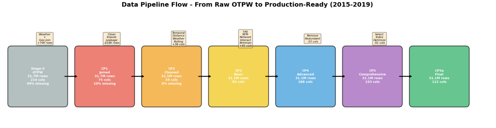
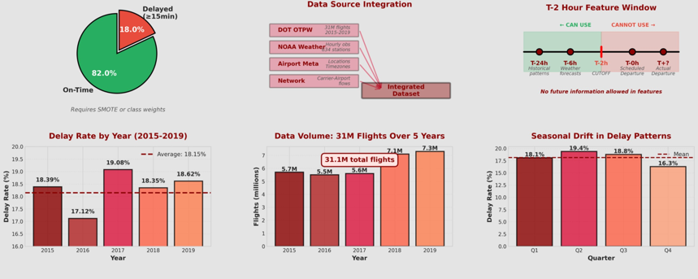
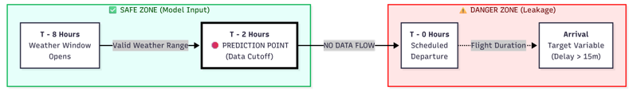
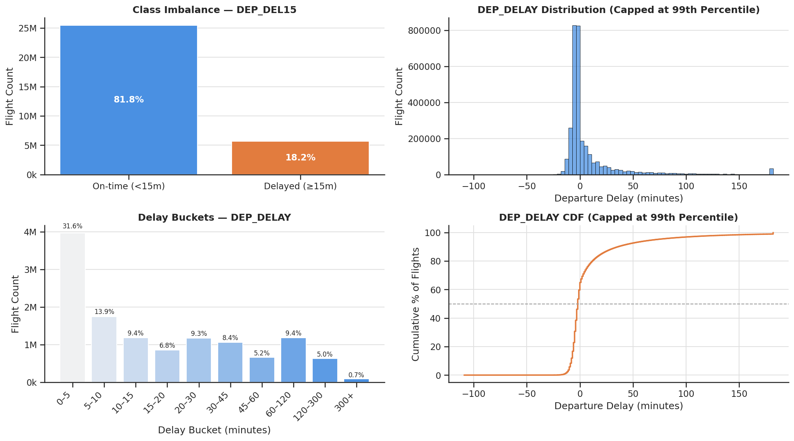
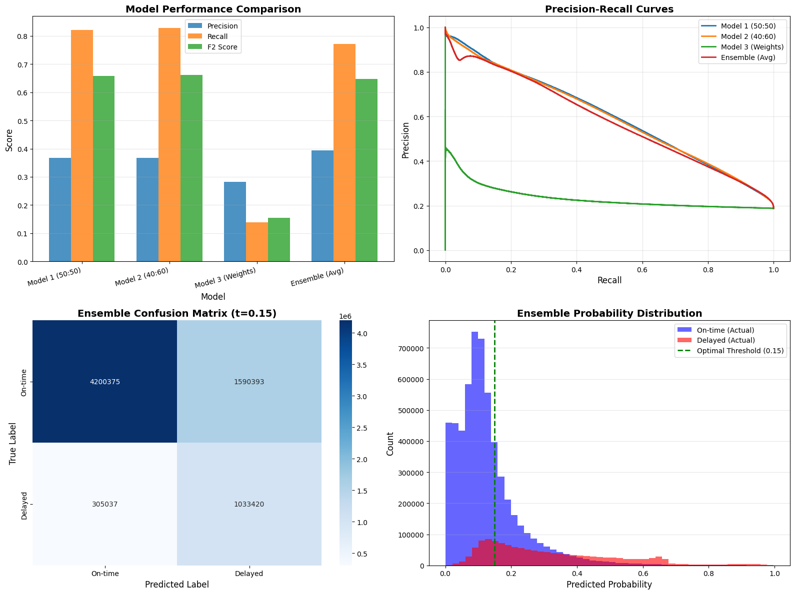

# Flight Sentry

**Portfolio summary • ML + data engineering • time-aware validation**

Early-warning model for **flight departure delays** (≥ 15 minutes), using only signals available **2 hours before scheduled departure (T-2h)**.

**Tech stack and skills demonstrated:** PySpark • Spark SQL • Leakage prevention • Time-series split/CV • Feature engineering • XGBoost • Optuna • PyTorch • AUC‑PR • F2 optimization

> **What this demonstrates:** leakage-safe feature engineering at large scale (31.1M rows), time-aware evaluation, and comparing multiple modeling strategies (classification vs regression-to-binary) with metrics aligned to operational decision-making.
>
> Want the full technical report export? Open [index.html](index.html).

## Quick Facts

- **Dataset:** 31.1M U.S. domestic flights (2015–2019 • DOT on-time + NOAA weather)
- **Prediction:** DEP_DEL15 (≥ 15 min late) — Features strictly cut off at T-2h
- **Best headline result:** F2 ≈ 0.697 • AUC‑PR ≈ 0.723 (XGBoost ensemble — regression → threshold)
- **Stack (high-level):** Spark / PySpark • XGBoost • PyTorch (Optuna tuning • Parquet checkpoints)

---

## Table of Contents

- [Problem](#problem)
- [Data + Leakage Control](#data--leakage-control)
- [Features](#features)
- [Modeling](#modeling)
- [Results](#results)
- [Engineering](#engineering)
- [Next Steps](#next-steps)
- [Credits](#credits)

---

## Problem (and why it matters)

Flight delays often emerge from multiple interacting factors and can cascade once they begin. The goal of Flight Sentry is to provide an **early risk signal** while there is still time to act (crew, gate, and passenger communications).

### Prediction target

We predict `DEP_DEL15`: whether a flight departs at least 15 minutes late (a common DOT operational threshold).

### Metric choice

We prioritize **F2 score** (recall-weighted) and **AUC‑PR** because the data is imbalanced (~82:18 on-time vs delayed) and missing a delay can be operationally costlier than a false alarm.

---

## Data + leakage control (T-2h realism)

A central requirement is realism: every feature must be computable using information available **2 hours before scheduled departure**. This avoids "look-ahead" bias and better matches how an operations team would use the model.

### Primary data sources

- **DOT BTS On-Time Performance:** schedules, outcomes, and delay labels
- **NOAA Integrated Surface Database:** hourly weather observations
- **Airport + station metadata:** identifiers, coordinates, timezone alignment

The pipeline processes 2015–2019 at full scale (31.1M flights) and enforces temporal ordering at every stage.

### Leakage prevention (concrete examples)

- Exclude post-departure timestamps and outcome-derived fields.
- Align weather "as-of" T-2h rather than using observations after departure.
- Compute rolling aggregates only from prior history.

*Checkpointed, multi-stage data pipeline (Spark) used to convert raw flight + weather data into a modeling-ready dataset at 31M-row scale.*

*"As-of" join concept: weather is aligned to the flight at a strict pre-departure cutoff (T-2h).*

*Leakage prevention strategy applied across joins and feature engineering.*

---

## Feature engineering (what signals matter)

The final dataset contains **112 leakage-free features** built from only pre-departure data. The design goal was to capture multiple delay mechanisms: short-horizon operational buildup, airport-level congestion, network propagation, and weather impact.

### Feature families (examples)

- **Temporal:** hour/day/seasonality encodings
- **Rolling delay history:** origin 24h weighted delay averages
- **Aircraft rotation:** prior-leg delay signals (when available pre-departure)
- **Weather:** severity proxies derived from hourly observations
- **Network (graph):** airport centrality features (degree/PageRank-style signals)

### Interpretability takeaway

Feature importance analyses highlighted that delay risk is multi-causal: rolling origin delay rates, "previous flight" status, and network centrality all contributed meaningfully—supporting the idea that delays propagate through operational networks rather than occurring independently.

Example top drivers reported in the full report include a 24h rolling average delay by origin and prior-flight delay indicators.

*Class imbalance for DEP_DEL15 (on-time vs delayed), motivating AUC‑PR and recall-aware tuning.*

---

## Modeling strategy (and time-aware validation)

We evaluated two complementary approaches: **direct classification** and **regression-to-classification** (predict minutes late, then threshold at 15 minutes).

### Direct classifiers

- **Logistic Regression** baseline for interpretability
- **Tree-based** models (RF/GBT) for non-linear interactions
- **Neural** models (MLP and 1D CNN) for higher recall

### Regression → threshold

- **XGBoost regression ensemble** tuned for delay magnitude
- Convert to binary via the 15-minute threshold for apples-to-apples comparison
- Best overall F2/AUC‑PR in the experiment summary

How time-aware validation was handled

Time ordering is preserved via time-based splits (train on earlier periods, evaluate on later periods). Cross-validation is performed in a rolling-window style to better approximate forecasting conditions and avoid leakage from future months/years.

---

## Results (headline)

The strongest overall approach in the project summary is the **XGBoost regression ensemble** converted to a binary prediction using the 15-minute threshold.

| Model | Approach | Notes | F2 | Recall | AUC‑PR |
|-------|----------|-------|----|--------|--------|
| **XGBoost Ensemble (Max)** | Regression → threshold | Best overall F2/AUC‑PR in summary | 0.697 | 0.725 | 0.723 |
| **CNN (PyTorch) — full-scale** | Classification | Best recall in summary; higher compute cost | 0.680 | 0.843 | 0.664 |
| GBT | Classification | Strong AUC‑PR among classical models | 0.625 | 0.621 | 0.719 |
| MLP (40:60 undersampling) | Classification | High recall with simpler architecture | 0.662 | 0.829 | 0.599 |
| Logistic Regression + engineered features | Classification | Interpretable baseline | 0.595 | 0.645 | 0.566 |

Note: training time depends on hardware and cluster configuration; metric values above are from the project's consolidated summary table in [index.html#5.7-Summary-of-all-ML-Experiments](index.html#5.7-Summary-of-all-ML-Experiments).

Show full experiment summary table (all rows)

| Model | Approach | Strategy / Notes | Train time (s) | F2_test | Recall_test | AUC_PR |
|-------|----------|------------------|----------------|---------|-------------|--------|
| MLP 40:60 | Neural network classification | MLP with 40:60 undersampling | 1050.73 | 0.6620 | 0.8287 | 0.5990 |
| MLP 50:50 | Neural network classification | MLP with 50:50 undersampling | 1345.19 | 0.6582 | 0.8208 | 0.6017 |
| 3-model Ensemble | Neural network ensemble | Average of 50:50, 40:60, class-weighted MLPs | 4736.61 | 0.6477 | 0.7721 | 0.5831 |
| CNN (PyTorch) — Model B (full-scale) | Neural network classification | 1D CNN + MDS streaming & sharding; trained on 50:50 undersampled train; evaluated on full 2019 test; F2-optimal threshold=0.17 | 9516 | 0.6802 | 0.8428 | 0.6639 |
| CNN (PyTorch) — Model A (subset) | Neural network classification | 1D CNN + MDS streaming; 0.5% subset for architecture validation; F2-optimal threshold=0.31 | 2880 | 0.6630 | 0.6516 | 0.6525 |
| GBT | Tree-based | Gradient-Boosted Trees, tuned config | 1232 | 0.6245 | 0.6206 | 0.7191 |
| RF (Phase 3) | Tree-based | Random Forest, depth=15, 20 trees | 679 | 0.6100 | 0.6013 | 0.6639 |
| LR + features | Linear model | Logistic regression, engineered features | 161 | 0.5950 | 0.6450 | 0.5662 |
| RF (Phase 2) | Tree-based | Random Forest, engineered features | 211 | 0.4046 | 0.3611 | 0.6244 |
| MLP (class weights) | Neural network classification | MLP with class weights | 2340.69 | 0.1545 | 0.1387 | 0.2347 |
| Baseline LR | Linear model | Logistic regression, non-engineered features | 329 | — | — | 0.5149 |
| **XGBoost Ensemble (Max)** | Regression → threshold | Two-regressor ensemble (weighted/unweighted) with Max strategy | 1619 | 0.6970 | 0.7245 | 0.7225 |

*Example error profile from the modeling section (confusion matrix + distribution of mistakes). In the full report, these views are used to understand operational tradeoffs at different thresholds.*

---

## Engineering highlights (what made this production-like)

- **Checkpointed pipeline** to support reproducibility, debugging, and iterative scaling.
- **Leakage-safe joins** and strict time ordering enforced end-to-end (T-2h cutoff).
- **Large-scale feature computation** (rolling aggregates, joins, graph signals) on 31M rows in Spark.
- **Model comparison discipline:** consistent time-based evaluation and metric-driven threshold selection.

The full report includes additional details on storage (Parquet), performance considerations (caching / persistence strategy), and cluster benchmarking.

---

## Next steps (if productizing)

- **Real-time feature computation:** reliable T-2h weather + operational signals ingestion.
- **Monitoring:** drift detection, performance degradation, and retraining triggers.
- **Threshold calibration:** tailor decision thresholds by airport/carrier context.
- **Robustness checks:** evaluate on later years / regime shifts (e.g., post-2019 dynamics).

---

## Credits

Team project (Fall 2025). Update this section to reflect your personal contribution and link to code / slides as appropriate.

### Team

- Anabel Basualdo
- Carlos Schrupp
- Arun Agarwal
- Shikha Sharma
- Nicole Zhang

### Your role (edit)

- Replace with 3–6 bullets describing what *you* owned (data pipeline, modeling, evaluation, etc.).
- Add links: GitHub repo, slides, write-up, notebook, or demo video.

---

**Files in this repo:** [portfolio.html](portfolio.html) • [index.html](index.html) • [context.md](context.md)

*Tip: host the folder on GitHub Pages / Netlify for a shareable link.*
